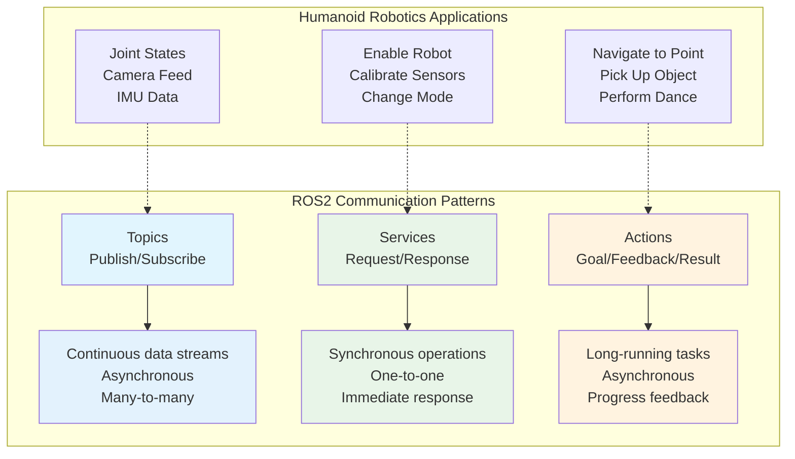
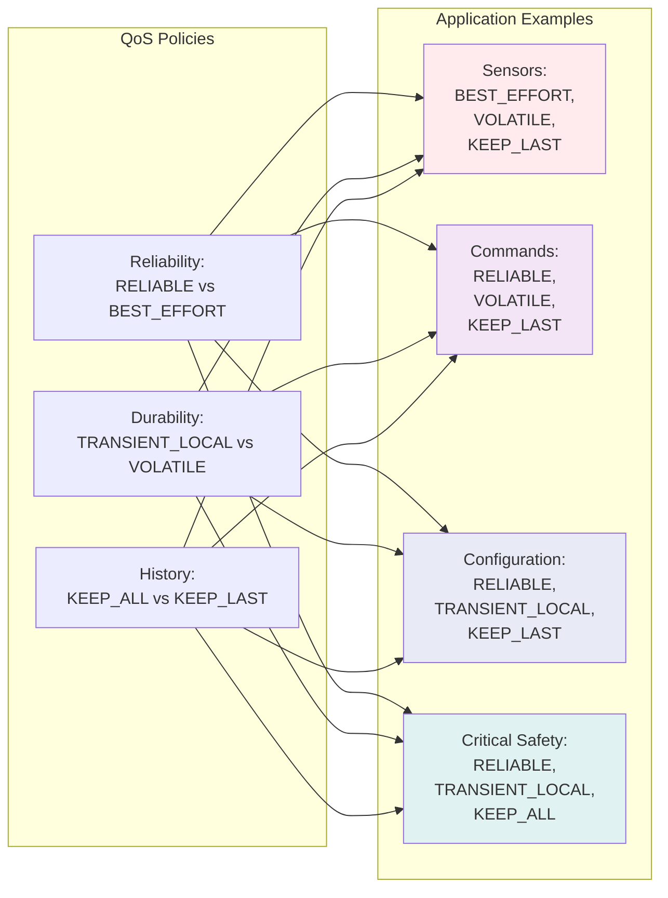

# ROS2 Communication Models

This chapter delves deep into the communication models that form the backbone of ROS2-based humanoid robotics systems. Understanding these communication patterns is essential for creating robust, efficient, and maintainable robotic applications. We'll explore topics, services, and actions in detail, along with Quality of Service (QoS) settings and advanced messaging concepts.

## Understanding Communication in Humanoid Robotics

Humanoid robots present unique communication challenges due to their complex nature involving multiple sensors, actuators, and control systems. Effective communication is critical for coordinating the numerous subsystems that make up a humanoid robot, including perception, planning, control, and interaction modules.

Unlike simpler robotic systems, humanoid robots require sophisticated communication patterns to handle:

- **Multi-modal sensory integration**: Combining data from cameras, IMUs, force/torque sensors, and other modalities
- **Distributed control**: Managing multiple control loops for balance, locomotion, and manipulation
- **Real-time requirements**: Meeting strict timing constraints for stability and safety
- **Complex task orchestration**: Coordinating high-level behaviors with low-level control

The choice of communication pattern significantly impacts system performance, reliability, and maintainability. Selecting the appropriate pattern for each interaction is crucial for developing effective humanoid robotics applications.

### Why Communication Architecture Matters

The communication architecture in a humanoid robot system affects several critical aspects:

**Performance**: Efficient communication minimizes latency and maximizes throughput, which is essential for real-time control and responsiveness.

**Reliability**: Robust communication ensures that critical information reaches its destination even in the presence of network issues or node failures.

**Maintainability**: Well-designed communication patterns make the system easier to understand, debug, and extend.

**Scalability**: Good architecture allows the system to grow without becoming overly complex or suffering from communication bottlenecks.

### Communication Requirements in Humanoid Systems

Different aspects of humanoid robots have varying communication requirements:

**High-Frequency Data Streams** (100Hz+):
- Joint position and velocity feedback
- IMU data for balance control
- Camera feeds for perception
- Force/torque sensor readings

**Medium-Frequency Updates** (10-50Hz):
- Robot state information
- Planning updates
- Trajectory commands
- Sensor fusion results

**Low-Frequency Operations** (1Hz and below):
- Configuration changes
- Mode switching
- Long-term planning
- Diagnostic information

Understanding these requirements helps in selecting appropriate QoS settings and communication patterns for each use case.

## Learning Objectives

By the end of this chapter, you will be able to:
- Design appropriate communication patterns for different robotic scenarios
- Implement publishers, subscribers, clients, and servers effectively
- Configure Quality of Service settings for optimal performance
- Apply advanced communication patterns for humanoid robotics

## Introduction to ROS2 Communication

ROS2 provides three primary communication patterns that serve different purposes in robotic systems:

1. **Topics (Publish/Subscribe)**: Asynchronous, one-way communication for continuous data streams
2. **Services (Request/Response)**: Synchronous, two-way communication for discrete operations
3. **Actions (Goal/Feedback/Result)**: Asynchronous, goal-oriented communication with status updates

Each pattern has specific use cases in humanoid robotics:

- **Topics**: Sensor data streams, robot state, joint positions, camera feeds
- **Services**: Configuration changes, calibration, mode switching, one-time commands
- **Actions**: Navigation goals, manipulation tasks, complex behaviors

### Communication Patterns Overview



This diagram shows the three main communication patterns in ROS2 and their typical applications in humanoid robotics.

## Topic-Based Communication

Topics form the foundation of ROS2 communication, enabling asynchronous data flow between nodes. This pattern is ideal for continuous data streams where the publisher doesn't need to know about specific subscribers.

### When to Use Topic Communication

Topic-based communication is most appropriate for scenarios involving:

**Sensor Data Broadcasting**: Continuously streaming sensor readings like camera images, LiDAR scans, IMU data, and joint encoders to multiple consumers simultaneously.

**State Information Sharing**: Broadcasting robot state information such as joint positions, velocities, and efforts to monitoring, visualization, and control nodes.

**Event Notifications**: Broadcasting events like button presses, obstacle detections, or system status changes to interested parties.

**Control Command Streaming**: Sending continuous control commands to actuators or control systems.

### Topic Communication Characteristics

**Asynchronous Nature**: Publishers and subscribers operate independently. Publishers produce data without waiting for acknowledgment, and subscribers consume data at their own pace.

**Loose Coupling**: Publishers don't need to know which or how many subscribers exist, promoting system modularity and flexibility.

**One-to-Many Capability**: A single publisher can serve multiple subscribers, enabling efficient data distribution.

**Buffering**: Messages are temporarily stored in queues to handle timing differences between publishers and subscribers.

### Topic Implementation Considerations

When implementing topic-based communication in humanoid robotics, consider the following factors:

**Message Frequency**: Balance the need for up-to-date information with computational overhead. Higher frequencies provide more responsive behavior but consume more CPU and bandwidth.

**Queue Size**: Appropriate queue sizing prevents message loss while managing memory consumption. For real-time control, smaller queues may be preferred to reduce latency.

**Message Size**: Large messages can impact performance. Consider compressing or subsampling data when appropriate, especially for high-frequency topics.

**Connection Callbacks**: Use connection callbacks to optimize resource usage by starting data publishing only when subscribers are connected.

### Advanced Topic Concepts

**Transient Local Durability**: For static configuration data that late-joining subscribers should receive immediately, use transient local durability settings.

**Reliable vs Best Effort**: Choose reliable delivery for critical data and best-effort for high-frequency data where occasional packet loss is acceptable.

**Deadline and Lifespan**: Configure deadline and lifespan settings for time-sensitive data to ensure freshness requirements are met.

### Publisher-Subscriber Example

Here's a simple example of a publisher-subscriber pair:

```python
# Publisher
import rclpy
from std_msgs.msg import String

def publisher_example():
    rclpy.init()
    node = rclpy.create_node('publisher_node')
    publisher = node.create_publisher(String, 'topic_name', 10)

    msg = String()
    msg.data = 'Hello from publisher'
    publisher.publish(msg)
    node.destroy_node()
    rclpy.shutdown()

# Subscriber
def subscription_callback(msg):
    print(f'Received: {msg.data}')

def subscriber_example():
    rclpy.init()
    node = rclpy.create_node('subscriber_node')
    subscription = node.create_subscription(
        String, 'topic_name', subscription_callback, 10)
    rclpy.spin(node)
    node.destroy_node()
    rclpy.shutdown()
```

## Quality of Service (QoS) Settings

QoS settings allow fine-tuning of communication behavior to match the requirements of different data types. Understanding QoS is crucial for humanoid robotics applications where timing and reliability requirements vary significantly.

### QoS Components

**Reliability Policy**:
- `RELIABLE`: All messages are guaranteed to be delivered (use for critical data)
- `BEST_EFFORT`: Messages may be dropped if network conditions are poor (use for sensor data)

**Durability Policy**:
- `TRANSIENT_LOCAL`: Late-joining subscribers receive previous messages (use for configuration data)
- `VOLATILE`: Only new messages are sent to subscribers (use for continuous streams)

**History Policy**:
- `KEEP_ALL`: Store all messages (memory intensive)
- `KEEP_LAST`: Store only the most recent messages (memory efficient)

### QoS Configuration Matrix



This diagram illustrates how different QoS policies are applied to different types of data in humanoid robotics.

## Service-Based Communication

Services provide synchronous request-response communication, ideal for operations that require immediate confirmation or return specific results.

### When to Use Service Communication

Service-based communication is most appropriate for scenarios involving:

**Configuration Changes**: Setting parameters, enabling/disabling subsystems, or changing operational modes where immediate confirmation is required.

**Calibration Procedures**: Running calibration routines that return success/failure status and possibly calibration data.

**One-time Operations**: Operations that have a definite start and end, such as taking a single sensor reading or executing a specific action.

**Synchronization Points**: Situations where a process needs to wait for a specific operation to complete before continuing.

### Service Communication Characteristics

**Synchronous Operation**: The client blocks until the server responds, ensuring operation completion before proceeding.

**Point-to-Point**: Each service request is handled by exactly one service server, preventing conflicts in response handling.

**Request-Response Pattern**: Clear separation between request parameters and response data, making interfaces explicit.

**Error Handling**: Services can return detailed error information, allowing clients to handle different failure modes appropriately.

### Service Implementation Considerations

When implementing service-based communication in humanoid robotics, consider the following factors:

**Timeout Management**: Always implement timeouts to prevent indefinite blocking if the service server becomes unavailable.

**Failure Recovery**: Design clients to handle service call failures gracefully, potentially retrying or falling back to alternative approaches.

**Resource Locking**: Be cautious of services that may hold resources for extended periods, as this can block other requests.

**Concurrent Access**: Consider whether your service needs to handle multiple simultaneous requests and implement appropriate locking mechanisms.

### Service vs. Topic Decision Framework

Choose services over topics when:
- You need guaranteed delivery and response
- The operation has a clear start and end
- You need to return computed results
- The frequency of requests is relatively low
- Synchronous behavior is required for system state management

Choose topics over services when:
- You need to broadcast information to multiple receivers
- Continuous data streaming is required
- Asynchronous operation is acceptable
- High-frequency updates are needed
- Loose coupling between sender and receiver is desired

## Action-Based Communication

Actions provide goal-oriented communication with feedback and status updates, perfect for long-running operations like navigation or manipulation.

### When to Use Action Communication

Action-based communication is most appropriate for scenarios involving:

**Long-running Tasks**: Operations that take significant time to complete, such as navigating to a distant location or performing complex manipulations.

**Progress Monitoring**: Tasks where the client needs to monitor progress and potentially cancel the operation.

**State Machine Operations**: Complex tasks with multiple stages or states that need to be tracked.

**Coordinated Multi-step Processes**: Operations that involve multiple subsystems and require coordination and monitoring.

### Action Communication Characteristics

**Goal-Feedback-Result Pattern**: Clear separation between the initial goal, ongoing feedback, and final result.

**Cancelable Operations**: Clients can request cancellation of ongoing actions, providing better user experience.

**Multiple Outcome States**: Actions can succeed, fail, or be canceled, with detailed status information for each.

**Built-in Status Tracking**: Automatic tracking of action state (pending, active, succeeded, failed, canceled).

### Action Implementation Considerations

When implementing action-based communication in humanoid robotics, consider the following factors:

**Feedback Frequency**: Balance the need for timely feedback with system overhead. Too frequent feedback can overwhelm the system.

**Goal Preemption**: Decide whether new goals should preempt active goals or be queued for execution.

**Recovery Strategies**: Plan for graceful recovery from action failures, including potential state restoration.

**Resource Management**: Ensure that resources allocated for actions are properly released regardless of outcome.

### Communication Pattern Selection Guide

Choosing the right communication pattern is crucial for system performance and maintainability. Here's a comprehensive guide:

**Use Topics When**:
- Broadcasting sensor data or robot state
- Publishing continuous control commands
- Implementing event-driven architectures
- Need loose coupling between components
- High-frequency data transmission is required

**Use Services When**:
- Need synchronous request-response behavior
- Implementing configuration or calibration procedures
- Performing one-time operations with clear results
- Need guaranteed delivery and processing
- Implementing command-and-control interfaces

**Use Actions When**:
- Implementing long-running behavioral primitives
- Need progress feedback during execution
- Operations may need cancellation
- Complex tasks with multiple stages are involved
- Coordinating multi-step processes with status reporting

### Performance Implications

Different communication patterns have distinct performance characteristics that impact humanoid robotics applications:

**Latency Considerations**: Services introduce synchronous blocking which can impact system responsiveness. Topics provide asynchronous communication with lower perceived latency.

**Throughput Analysis**: Topics typically offer higher throughput for data streaming, while services may become bottlenecks for high-frequency requests.

**Resource Utilization**: Actions maintain persistent connections and state, potentially consuming more resources than stateless topics or services.

**Network Efficiency**: Topics with appropriate QoS settings can optimize network utilization, while services may create more overhead for frequent calls.

### Service Example

A simple service for robot control:

```python
# Service definition would be in .srv file
# Request: bool enable
# Response: bool success, string message

# In practice, services are used for operations like:
# - Enabling/disabling robot systems
# - Calibration routines
# - Mode switching
# - One-time configuration changes
```

## Action-Based Communication

Actions provide goal-oriented communication with feedback and status updates, perfect for long-running operations like navigation or manipulation.

### Action Characteristics

Actions are ideal for tasks that:
- Take a long time to complete
- Require periodic feedback on progress
- Need the ability to be canceled
- Have complex state transitions

Examples in humanoid robotics:
- Walking to a location
- Manipulating objects
- Performing complex behaviors
- Executing choreographed movements

## Advanced Communication Concepts

### Advanced QoS Settings

Beyond the basic QoS policies, ROS2 offers several advanced settings for fine-grained control:

**Deadline**: Defines the maximum duration between consecutive messages. If exceeded, the system can take specific actions like notifying listeners or switching to backup systems.

**Lifespan**: Specifies how long messages remain valid after publication. This is useful for time-sensitive data where old values become irrelevant.

**Liveliness**: Monitors participant availability and can trigger actions when nodes become unreachable, important for safety-critical humanoid applications.

**History Depth**: Controls how many samples to keep in the queue, balancing memory usage with data availability.

### Communication Security

Security considerations are paramount in humanoid robotics, especially for commercial applications:

**Transport Encryption**: Encrypting data in transit between nodes to prevent eavesdropping or tampering.

**Authentication**: Verifying the identity of nodes joining the system to prevent unauthorized access.

**Authorization**: Controlling which nodes can access specific topics, services, or actions.

**Secure Communication Patterns**: Implementing security at the application level, such as signing important commands or implementing challenge-response protocols.

### Communication Monitoring and Diagnostics

Effective communication systems require monitoring and diagnostic capabilities:

**Bandwidth Monitoring**: Tracking data rates to identify potential bottlenecks or misconfigured nodes.

**Latency Measurement**: Monitoring message delivery times to ensure real-time performance requirements are met.

**Connection Status**: Tracking which nodes are communicating and detecting failures or disruptions.

**Message Statistics**: Collecting metrics on message rates, drop rates, and processing times.

### Integration with Middleware

ROS2's DDS-based architecture allows for integration with other middleware systems:

**Bridge Technologies**: Connecting ROS2 systems to other robotics frameworks or enterprise systems.

**Custom DDS Plugins**: Extending ROS2's communication capabilities with specialized plugins.

**Interoperability**: Ensuring humanoid robots can work with existing systems and protocols.

## Communication Patterns in Practice

### Real-world Humanoid Communication Architecture

A typical humanoid robot communication system involves multiple interconnected layers:

**Sensor Layer**: High-frequency sensor data flowing from hardware drivers to perception systems.

**Control Layer**: Low-latency control commands traveling from controllers to actuators.

**Planning Layer**: Medium-frequency planning updates and trajectory commands.

**Behavior Layer**: High-level behavior commands and status updates.

**Interface Layer**: Human-robot interaction commands and feedback.

### Performance Optimization Strategies

**Message Aggregation**: Combining multiple related values into single messages to reduce overhead.

**Selective Publishing**: Publishing only when values change significantly, rather than at fixed rates.

**Efficient Serialization**: Using compact message formats and avoiding unnecessary data copying.

**Connection Management**: Optimizing the number and type of connections to reduce overhead.

### Troubleshooting Communication Issues

### Common Problems and Solutions

**Topic Not Receiving Messages**:
- Check topic names match exactly (case-sensitive)
- Verify nodes are in the same `ROS_DOMAIN_ID`
- Ensure QoS settings are compatible between publisher and subscriber

**High Latency**:
- Check network bandwidth for remote nodes
- Review QoS settings (reliability vs. performance trade-offs)
- Monitor system resources (CPU, memory, disk I/O)

**Message Loss**:
- Increase queue sizes for high-frequency topics
- Use appropriate reliability settings
- Check system resources and optimize message processing

**Node Discovery Issues**:
- Verify network configuration and multicast settings
- Check firewall settings that might block discovery traffic
- Consider using static IP configuration for critical nodes

**Memory Issues**:
- Monitor queue depths and adjust accordingly
- Implement proper cleanup for dynamic subscriptions
- Use appropriate durability settings to avoid storing unnecessary historical data

### Debugging Tools

ROS2 provides several tools for diagnosing communication issues:

**ros2 topic**: Commands for inspecting topic information, listing available topics, and echoing messages.

**ros2 service**: Tools for discovering services and calling them manually for testing.

**ros2 node**: Utilities for examining node connections and communication relationships.

**ros2 doctor**: A diagnostic tool that checks for common configuration issues.

### Performance Monitoring

Regular performance monitoring helps maintain optimal communication:

**ros2 topic hz**: Measure the publication rate of topics.

**ros2 topic bw**: Monitor bandwidth usage of topics.

**ros2 run plotjuggler plotjuggler**: Visualize real-time data streams for analysis.

## Advanced Communication Patterns

### Latching Topics

For configuration or static data that new subscribers should receive immediately:

```python
from rclpy.qos import QoSProfile, DurabilityPolicy

# Create a latching publisher for static transforms
latching_qos = QoSProfile(
    depth=1,
    durability=DurabilityPolicy.TRANSIENT_LOCAL
)
```

## Communication Best Practices for Humanoid Robotics

### Message Design

1. **Efficient Message Sizes**: Minimize message sizes for high-frequency topics
2. **Appropriate Update Rates**: Match update rates to actual system needs
3. **Standard Message Types**: Use standard ROS2 message types when possible
4. **Clear Naming Conventions**: Use descriptive and consistent names

### Performance Optimization

1. **QoS Matching**: Ensure publisher and subscriber QoS settings are compatible
2. **Connection Monitoring**: Monitor connection status and message rates
3. **Resource Management**: Monitor CPU and memory usage of communication nodes

### Safety Considerations

1. **Timeout Handling**: Implement timeouts for blocking operations
2. **Graceful Degradation**: Design systems that can operate with reduced functionality
3. **Error Recovery**: Implement mechanisms to recover from communication failures

## Troubleshooting Communication Issues

### Common Problems and Solutions

**Topic Not Receiving Messages**:
- Check topic names match exactly (case-sensitive)
- Verify nodes are in the same `ROS_DOMAIN_ID`
- Ensure QoS settings are compatible between publisher and subscriber

**High Latency**:
- Check network bandwidth for remote nodes
- Review QoS settings (reliability vs. performance trade-offs)
- Monitor system resources (CPU, memory, disk I/O)

**Message Loss**:
- Increase queue sizes for high-frequency topics
- Use appropriate reliability settings
- Check system resources and optimize message processing

## Chapter Summary

This chapter has covered the essential ROS2 communication models:

- **Topics**: Asynchronous publish-subscribe for continuous data streams
- **Services**: Synchronous request-response for discrete operations
- **Actions**: Goal-oriented communication with feedback for long-running tasks
- **QoS Settings**: Fine-tuning communication behavior for different requirements
- **Best practices**: Designing efficient and safe communication patterns

Understanding these communication models is crucial for building robust humanoid robotics systems that can handle the complex interactions required for autonomous operation.

## Further Reading

To deepen your understanding of ROS2 communication:

- **ROS2 Design Documents**: Study the design documents for each communication pattern
- **DDS Specification**: Learn more about the underlying Data Distribution Service
- **Performance Optimization**: Research techniques for optimizing ROS2 communication
- **Security Considerations**: Explore secure communication patterns for ROS2

In the next chapter, we'll explore Python control agents for humanoid robots, building on these communication foundations to create sophisticated control systems.