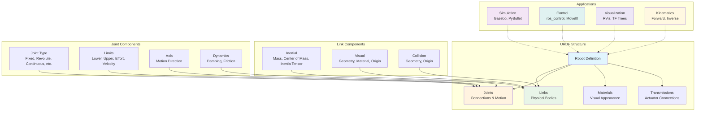
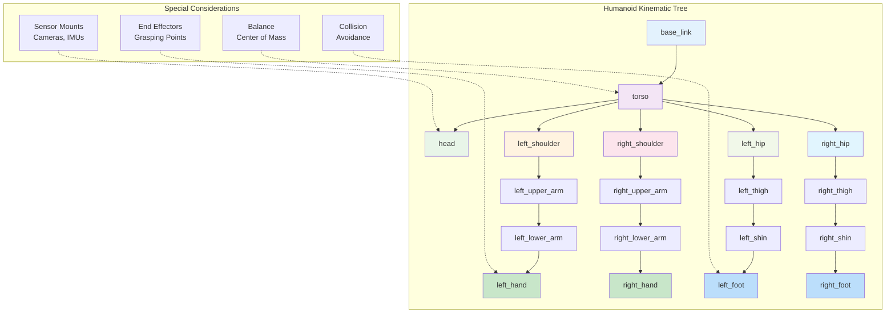

# Humanoid URDF Design

This chapter provides a comprehensive guide to creating Unified Robot Description Format (URDF) files for humanoid robots. URDF is the standard format for describing robot models in ROS, encompassing kinematics, dynamics, visual appearance, and collision properties. Proper URDF design is fundamental to successful simulation, visualization, and control of humanoid robots.

## Learning Objectives

By the end of this chapter, you will be able to:
- Create complete URDF models for humanoid robots with proper kinematic chains
- Define joint limits, dynamics properties, and visual/collision geometries
- Implement complex humanoid kinematic structures with multiple limbs
- Validate URDF models for correctness and performance
- Optimize URDF files for simulation and real-time control

## Introduction to URDF for Humanoid Robots

Unified Robot Description Format (URDF) is an XML-based format that describes robot models in ROS. For humanoid robots, URDF files define the physical structure, kinematic relationships, dynamic properties, and visual representations of the robot. A well-designed URDF is essential for simulation, motion planning, control, and visualization.

Humanoid robots present unique challenges in URDF design due to their complex kinematic structure:

- **Multi-limb systems**: Multiple arms and legs with complex joint arrangements
- **Balance requirements**: Center of mass considerations for stable simulation
- **Collision complexity**: Many potential self-collision pairs to consider
- **Dynamic properties**: Complex mass distributions requiring accurate inertial parameters

### URDF Components Overview



This diagram shows the main components of a URDF file and how they relate to different applications in robotics.

### Humanoid Robot Kinematic Structure



This diagram illustrates the typical kinematic structure of a humanoid robot and highlights special considerations for balance, collision detection, and end-effectors.

### URDF vs. SDF Comparison

While URDF is widely used in ROS, it's worth noting that Gazebo (often used with ROS) uses SDF (Simulation Description Format). For humanoid robots, the relationship is:

- **URDF**: Used by ROS for kinematic and dynamic computations
- **SDF**: Used by Gazebo for physics simulation
- **Conversion**: ROS tools can automatically convert URDF to SDF for simulation

### URDF Structure Overview

A typical humanoid URDF file contains:

**Links**: Represent rigid bodies with mass, visual, and collision properties
**Joints**: Define connections between links with kinematic and dynamic properties
**Materials**: Define visual appearance properties
**Transmissions**: Define how actuators connect to joints (for control)
**Gazebo plugins**: Simulation-specific configurations

## Link Definition for Humanoid Robots

Links represent the rigid bodies of the robot. For humanoid robots, links correspond to body segments like torso, limbs, and joints. Each link must define mass properties, visual geometry, and collision geometry.

### Basic Link Structure

```xml
<link name="link_name">
  <!-- Inertial properties -->
  <inertial>
    <origin xyz="0 0 0" rpy="0 0 0"/>
    <mass value="1.0"/>
    <inertia ixx="0.01" ixy="0" ixz="0" iyy="0.01" iyz="0" izz="0.01"/>
  </inertial>

  <!-- Visual properties -->
  <visual>
    <origin xyz="0 0 0" rpy="0 0 0"/>
    <geometry>
      <box size="0.1 0.1 0.1"/>
    </geometry>
    <material name="blue">
      <color rgba="0 0 1 1"/>
    </material>
  </visual>

  <!-- Collision properties -->
  <collision>
    <origin xyz="0 0 0" rpy="0 0 0"/>
    <geometry>
      <box size="0.1 0.1 0.1"/>
    </geometry>
  </collision>
</link>
```

### Inertial Properties

Accurate inertial properties are crucial for realistic simulation. The inertia tensor describes how mass is distributed around the center of mass:

```xml
<inertial>
  <origin xyz="0.0 0.0 0.05" rpy="0 0 0"/>
  <mass value="2.0"/>
  <!-- Inertia values for a rectangular box: m/12 * (h²+w², l²+w², l²+h²) -->
  <inertia ixx="0.00833" ixy="0" ixz="0" iyy="0.00833" iyz="0" izz="0.00167"/>
</inertial>
```

For complex shapes, inertial properties can be approximated using primitive shapes or calculated using CAD software.

### Visual and Collision Geometries

Visual and collision geometries can differ to optimize performance and appearance:

```xml
<!-- Detailed visual mesh for realistic appearance -->
<visual>
  <origin xyz="0 0 0" rpy="0 0 0"/>
  <geometry>
    <mesh filename="package://humanoid_description/meshes/upper_arm.dae" scale="1 1 1"/>
  </geometry>
</visual>

<!-- Simplified collision geometry for performance -->
<collision>
  <origin xyz="0 0 0" rpy="0 0 0"/>
  <geometry>
    <cylinder length="0.3" radius="0.05"/>
  </geometry>
</collision>
```

## Joint Definition for Humanoid Robots

Joints define the connections between links and specify the allowed motion. Humanoid robots typically use revolute joints for articulation, though continuous joints (for unlimited rotation) and prismatic joints (for linear motion) may also be used.

### Joint Types for Humanoid Robots

**Revolute Joints**: Most common for humanoid robots, allowing rotation around a single axis:
```xml
<joint name="shoulder_pitch" type="revolute">
  <parent link="torso"/>
  <child link="upper_arm"/>
  <origin xyz="0.1 0 0.2" rpy="0 0 0"/>
  <axis xyz="0 1 0"/>
  <limit lower="-2.0" upper="1.5" effort="100" velocity="3.0"/>
  <dynamics damping="0.1" friction="0.0"/>
</joint>
```

**Continuous Joints**: Allow unlimited rotation, useful for wheels or joints that don't have limits:
```xml
<joint name="head_yaw" type="continuous">
  <parent link="torso"/>
  <child link="head"/>
  <origin xyz="0 0 0.4" rpy="0 0 0"/>
  <axis xyz="0 0 1"/>
  <dynamics damping="0.05"/>
</joint>
```

**Fixed Joints**: Connect links with no relative motion, useful for mounting sensors or attaching accessories:
```xml
<joint name="camera_mount" type="fixed">
  <parent link="head"/>
  <child link="camera_frame"/>
  <origin xyz="0.05 0 0.05" rpy="0 0 0"/>
</joint>
```

### Joint Limits and Safety

Proper joint limits are essential for preventing damage to real robots and ensuring realistic simulation:

```xml
<!-- Shoulder joint with realistic limits -->
<joint name="left_shoulder_roll" type="revolute">
  <parent link="torso"/>
  <child link="left_upper_arm"/>
  <origin xyz="0.15 0.15 0.3" rpy="0 0 0"/>
  <axis xyz="1 0 0"/>
  <!-- Conservative limits to prevent self-collision -->
  <limit lower="-1.57" upper="2.35" effort="50.0" velocity="2.0"/>
  <safety_controller k_position="20" k_velocity="400" soft_lower_limit="-1.5" soft_upper_limit="2.3"/>
</joint>
```

## Humanoid Robot Kinematic Structure

Humanoid robots typically follow a tree-like structure with a central torso and multiple limbs. The kinematic structure must be carefully designed to allow for natural movement while maintaining computational efficiency.

### Typical Humanoid Structure

```
base_link
├── torso
│   ├── head
│   │   ├── left_eye_camera
│   │   └── right_eye_camera
│   ├── left_shoulder
│   │   ├── left_upper_arm
│   │   │   ├── left_lower_arm
│   │   │   │   └── left_hand
│   │   │   └── left_elbow_flex_sensor
│   │   └── left_shoulder_flex_sensor
│   ├── right_shoulder
│   │   ├── right_upper_arm
│   │   │   ├── right_lower_arm
│   │   │   │   └── right_hand
│   │   │   └── right_elbow_flex_sensor
│   │   └── right_shoulder_flex_sensor
│   ├── left_hip
│   │   ├── left_thigh
│   │   │   ├── left_shin
│   │   │   │   └── left_foot
│   │   │   └── left_knee_sensor
│   │   └── left_hip_sensor
│   └── right_hip
│       ├── right_thigh
│       │   ├── right_shin
│       │   │   └── right_foot
│       │   └── right_knee_sensor
│       └── right_hip_sensor
```

### Complete Humanoid URDF Example

Here's a simplified example of a humanoid robot URDF:

```xml
<?xml version="1.0"?>
<robot name="simple_humanoid">

  <!-- Base link -->
  <link name="base_link">
    <inertial>
      <origin xyz="0 0 0" rpy="0 0 0"/>
      <mass value="0.001"/>
      <inertia ixx="0.0001" ixy="0" ixz="0" iyy="0.0001" iyz="0" izz="0.0001"/>
    </inertial>
  </link>

  <!-- Torso -->
  <link name="torso">
    <inertial>
      <origin xyz="0 0 0.2" rpy="0 0 0"/>
      <mass value="10.0"/>
      <inertia ixx="0.5" ixy="0" ixz="0" iyy="0.5" iyz="0" izz="0.2"/>
    </inertial>
    <visual>
      <origin xyz="0 0 0.2" rpy="0 0 0"/>
      <geometry>
        <capsule length="0.3" radius="0.15"/>
      </geometry>
      <material name="gray">
        <color rgba="0.5 0.5 0.5 1"/>
      </material>
    </visual>
    <collision>
      <origin xyz="0 0 0.2" rpy="0 0 0"/>
      <geometry>
        <capsule length="0.3" radius="0.15"/>
      </geometry>
    </collision>
  </link>

  <joint name="torso_joint" type="fixed">
    <parent link="base_link"/>
    <child link="torso"/>
    <origin xyz="0 0 0" rpy="0 0 0"/>
  </joint>

  <!-- Head -->
  <link name="head">
    <inertial>
      <origin xyz="0 0 0.1" rpy="0 0 0"/>
      <mass value="2.0"/>
      <inertia ixx="0.02" ixy="0" ixz="0" iyy="0.02" iyz="0" izz="0.02"/>
    </inertial>
    <visual>
      <origin xyz="0 0 0.1" rpy="0 0 0"/>
      <geometry>
        <sphere radius="0.1"/>
      </geometry>
      <material name="skin">
        <color rgba="0.8 0.6 0.4 1"/>
      </material>
    </visual>
    <collision>
      <origin xyz="0 0 0.1" rpy="0 0 0"/>
      <geometry>
        <sphere radius="0.1"/>
      </geometry>
    </collision>
  </link>

  <joint name="neck_joint" type="revolute">
    <parent link="torso"/>
    <child link="head"/>
    <origin xyz="0 0 0.4" rpy="0 0 0"/>
    <axis xyz="0 0 1"/>
    <limit lower="-1.0" upper="1.0" effort="10" velocity="2"/>
  </joint>

  <!-- Left arm -->
  <link name="left_upper_arm">
    <inertial>
      <origin xyz="0 0 -0.1" rpy="0 0 0"/>
      <mass value="1.5"/>
      <inertia ixx="0.01" ixy="0" ixz="0" iyy="0.01" iyz="0" izz="0.005"/>
    </inertial>
    <visual>
      <origin xyz="0 0 -0.1" rpy="0 0 0"/>
      <geometry>
        <capsule length="0.2" radius="0.05"/>
      </geometry>
      <material name="blue">
        <color rgba="0 0 1 1"/>
      </material>
    </visual>
    <collision>
      <origin xyz="0 0 -0.1" rpy="0 0 0"/>
      <geometry>
        <capsule length="0.2" radius="0.05"/>
      </geometry>
    </collision>
  </link>

  <joint name="left_shoulder_joint" type="revolute">
    <parent link="torso"/>
    <child link="left_upper_arm"/>
    <origin xyz="0.15 0.1 0.3" rpy="0 0 0"/>
    <axis xyz="0 1 0"/>
    <limit lower="-1.57" upper="1.57" effort="50" velocity="2"/>
  </joint>

  <!-- Additional links and joints would continue similarly -->

</robot>
```

## URDF Validation and Debugging

Proper validation of URDF files is essential for successful simulation and control.

### URDF Validation Tools

ROS provides several tools for validating URDF files:

```bash
# Check if URDF is syntactically correct
check_urdf /path/to/robot.urdf

# Display URDF information
urdf_to_graphiz /path/to/robot.urdf

# Visualize robot in RViz
roslaunch urdf_tutorial display.launch model:=/path/to/robot.urdf
```

### Common URDF Issues

**Floating Point Precision**: Use appropriate precision for transformations to avoid numerical errors in inverse kinematics.

**Self-Collisions**: Ensure that collision geometries don't overlap when the robot is in neutral positions.

**Chain Consistency**: Verify that all joints connect to existing links and that there are no disconnected components.

**Inertial Issues**: Ensure that inertial tensors are physically valid (positive definite) and mass values are positive.

## Materials and Appearance

Materials define the visual appearance of robot parts. While not essential for kinematic calculations, they improve visualization and simulation.

### Material Definition

```xml
<material name="red">
  <color rgba="1 0 0 1"/>
</material>

<material name="blue">
  <color rgba="0 0 1 1"/>
</material>

<material name="white">
  <color rgba="1 1 1 1"/>
</material>

<!-- Textured material -->
<material name="metal">
  <color rgba="0.7 0.7 0.7 1"/>
  <texture filename="package://humanoid_description/materials/textures/metal.jpg"/>
</material>
```

## Transmissions for Control

Transmissions define how actuators connect to joints, essential for control systems:

```xml
<transmission name="left_shoulder_trans">
  <type>transmission_interface/SimpleTransmission</type>
  <joint name="left_shoulder_joint">
    <hardwareInterface>hardware_interface/PositionJointInterface</hardwareInterface>
  </joint>
  <actuator name="left_shoulder_motor">
    <hardwareInterface>hardware_interface/PositionJointInterface</hardwareInterface>
    <mechanicalReduction>1</mechanicalReduction>
  </actuator>
</transmission>
```

## Gazebo-Specific Elements

When using Gazebo for simulation, additional elements can be included:

```xml
<gazebo reference="left_foot">
  <mu1>0.8</mu1>
  <mu2>0.8</mu2>
  <kp>1000000.0</kp>
  <kd>100.0</kd>
  <material>Gazebo/Orange</material>
</gazebo>

<!-- Gazebo plugin for ros_control -->
<gazebo>
  <plugin name="gazebo_ros_control" filename="libgazebo_ros_control.so">
    <robotNamespace>/humanoid</robotNamespace>
  </plugin>
</gazebo>
```

## Advanced URDF Concepts

### Xacro for Complex Descriptions

Xacro (XML Macros) allows for parameterized and modular URDF descriptions:

```xml
<?xml version="1.0"?>
<robot xmlns:xacro="http://www.ros.org/wiki/xacro" name="humanoid">

  <!-- Define properties -->
  <xacro:property name="M_PI" value="3.14159"/>

  <!-- Macro for creating limbs -->
  <xacro:macro name="arm_segment" params="prefix parent_link x y z roll pitch yaw length radius mass">
    <link name="${prefix}_link">
      <inertial>
        <origin xyz="0 0 ${length/2}" rpy="0 0 0"/>
        <mass value="${mass}"/>
        <inertia ixx="${mass*radius*radius/2}" ixy="0" ixz="0"
                 iyy="${mass*(3*radius*radius + length*length)/12}" iyz="0"
                 izz="${mass*(3*radius*radius + length*length)/12}"/>
      </inertial>
      <visual>
        <origin xyz="0 0 ${length/2}" rpy="0 0 0"/>
        <geometry>
          <cylinder length="${length}" radius="${radius}"/>
        </geometry>
      </visual>
      <collision>
        <origin xyz="0 0 ${length/2}" rpy="0 0 0"/>
        <geometry>
          <cylinder length="${length}" radius="${radius}"/>
        </geometry>
      </collision>
    </link>

    <joint name="${prefix}_joint" type="revolute">
      <parent link="${parent_link}"/>
      <child link="${prefix}_link"/>
      <origin xyz="${x} ${y} ${z}" rpy="${roll} ${pitch} ${yaw}"/>
      <axis xyz="0 0 1"/>
      <limit lower="-${M_PI/2}" upper="${M_PI/2}" effort="100" velocity="3"/>
    </joint>
  </xacro:macro>

  <!-- Use the macro to create robot segments -->
  <xacro:arm_segment prefix="left_upper_arm" parent_link="torso"
                     x="0.1" y="0.1" z="0.2" roll="0" pitch="0" yaw="0"
                     length="0.3" radius="0.05" mass="1.5"/>

</robot>
```

### Mesh Handling Best Practices

For humanoid robots with complex geometries:

- **LOD (Level of Detail)**: Use different mesh complexities for visual and collision models
- **Texture Coordinates**: Ensure proper texture mapping for visual appearance
- **Mesh Optimization**: Reduce triangle count for performance while maintaining appearance
- **Coordinate Systems**: Ensure consistent coordinate systems across all meshes

## Performance Optimization

Large humanoid URDFs can impact performance. Consider these optimizations:

**Collision Simplification**: Use simpler geometric shapes for collision detection than for visual representation.

**Link Reduction**: Combine multiple small links into single links where kinematics allow.

**Joint Limit Optimization**: Use realistic joint limits to reduce computational load in planning algorithms.

**Inertial Simplification**: Approximate complex inertial properties with simpler shapes when sufficient accuracy is maintained.

## Troubleshooting Common Issues

### Self-Collision Problems

Humanoid robots have many potential self-collision pairs. To address this:

- **Disable unnecessary collisions**: Use `<disable_collisions>` tags for links that shouldn't collide
- **Adjust collision geometries**: Make collision meshes slightly smaller to avoid false positives
- **Tune physics parameters**: Adjust contact stiffness and damping in Gazebo

### Kinematic Chain Issues

- **Missing connections**: Ensure every link is connected to the kinematic tree
- **Incorrect joint types**: Verify that joint types match intended motion
- **Wrong axis orientations**: Double-check joint axis directions

### Dynamic Simulation Instabilities

- **Unrealistic inertial parameters**: Use CAD software or estimation methods for accurate inertias
- **High joint limits**: Set conservative joint limits to prevent unstable configurations
- **Insufficient damping**: Add appropriate damping to joints to prevent oscillation

## Validation and Testing

### URDF Validation Checklist

- [ ] All links are connected to the kinematic tree
- [ ] Joint limits are realistic and safe
- [ ] Inertial parameters are physically valid
- [ ] Collision geometries don't overlap in neutral pose
- [ ] Visual and collision meshes are properly oriented
- [ ] Transmission definitions match controller interfaces
- [ ] All mesh and texture files exist and are accessible

### Testing Procedures

1. **Static validation**: Use `check_urdf` to verify syntax
2. **Kinematic validation**: Test forward and inverse kinematics
3. **Collision validation**: Check for unwanted self-collisions
4. **Dynamic validation**: Test simulation stability
5. **Control validation**: Verify that control interfaces work correctly

## Chapter Summary

This chapter covered the essential aspects of URDF design for humanoid robots:

- Link definition with proper inertial, visual, and collision properties
- Joint definition with appropriate types, limits, and dynamics
- Kinematic structure design for multi-limb humanoid robots
- Validation and debugging techniques
- Advanced concepts like Xacro and performance optimization
- Troubleshooting common issues

Proper URDF design is fundamental to successful humanoid robot development, affecting everything from simulation accuracy to control performance. Taking time to create accurate, efficient URDF models pays dividends throughout the robot development process.

## Further Reading

To deepen your understanding of URDF and humanoid robot modeling:

- **URDF Documentation**: Official ROS URDF tutorials and specifications
- **Xacro Tutorials**: Learn advanced parameterization techniques
- **Robotics Textbooks**: Study kinematics and dynamics for proper parameter selection
- **Simulation Guides**: Explore Gazebo integration and physics tuning
- **CAD Integration**: Learn techniques for exporting accurate robot models from CAD software

In the next chapter, we'll explore the complete integration of these concepts into functional humanoid robot systems, combining URDF models with control systems and perception capabilities.