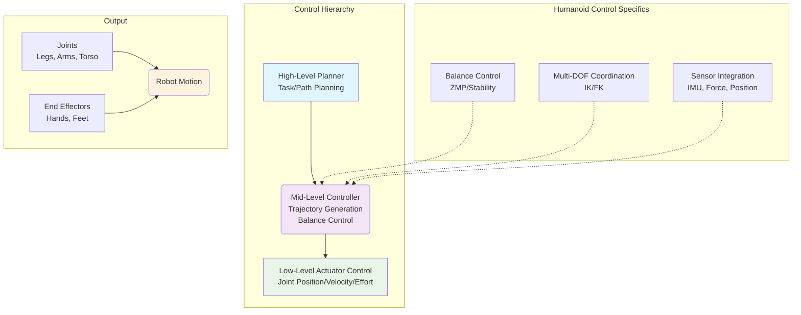
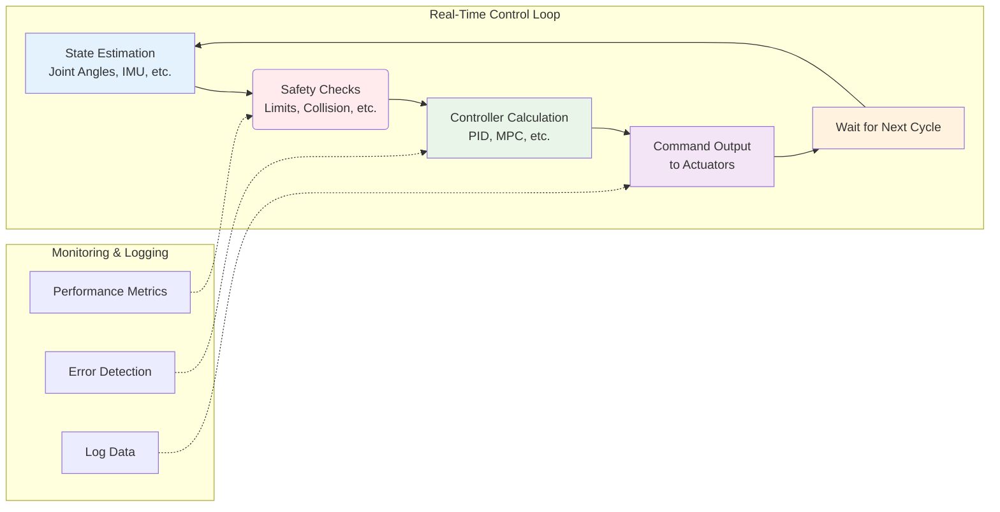

# Python Control Agents for Humanoid Robots

This chapter explores the implementation of Python-based control systems for humanoid robots, focusing on actuator control, joint coordination, and movement generation. Python control agents form the bridge between high-level planning and low-level hardware execution, enabling precise and responsive robot behavior.

## Learning Objectives

By the end of this chapter, you will be able to:
- Design and implement Python-based control agents for humanoid robots
- Implement PID controllers for joint position, velocity, and effort control
- Coordinate multi-joint movements for humanoid-specific behaviors
- Handle safety constraints and emergency stop procedures
- Integrate sensor feedback into control loops

## Introduction to Control Systems in Humanoid Robotics

Control systems in humanoid robotics face unique challenges compared to traditional wheeled or manipulator robots. Humanoid robots must maintain balance while performing complex multi-degree-of-freedom movements, requiring sophisticated control strategies that consider the robot's center of mass, zero moment point, and dynamic stability.

### Control Architecture Hierarchy



This diagram shows the hierarchical control architecture typical in humanoid robots, with different levels responsible for different aspects of control.

### Control Loop Structure



This flowchart illustrates the typical structure of a real-time control loop in humanoid robotics, showing the sequence of operations and safety considerations.

Unlike simple point-to-point movements, humanoid robots often require:
- **Balance maintenance**: Continuous adjustment to maintain stable posture
- **Dynamic locomotion**: Coordinated control of legs, arms, and torso for walking
- **Multi-object manipulation**: Coordinated use of multiple limbs for complex tasks
- **Human-like motion**: Natural movement patterns that are efficient and safe

Python control agents provide a flexible and expressive environment for implementing these complex control strategies, offering rapid prototyping capabilities and extensive libraries for mathematical computations, signal processing, and real-time control.

### Control Architecture Overview

Humanoid robot control typically operates at multiple levels:

**High-Level Planner**: Determines desired trajectories and goals based on tasks and environmental information.

**Mid-Level Controller**: Translates high-level goals into joint-space commands while considering constraints and balance requirements.

**Low-Level Actuator Control**: Direct control of individual actuators to achieve desired positions, velocities, or efforts.

This chapter focuses on the mid-level controller implementation using Python, which interfaces with both high-level planners and low-level actuator interfaces.

### Python in Robotics Control

Python has become increasingly popular for robotics control due to several advantages:

**Expressiveness**: Concise syntax allows for rapid implementation of complex control algorithms.

**Rich Ecosystem**: Extensive libraries for mathematics (NumPy), signal processing (SciPy), and machine learning.

**Prototyping Speed**: Faster development cycles compared to lower-level languages.

**ROS2 Integration**: Native support for ROS2 Python client library (rclpy).

However, Python's performance characteristics require careful consideration for real-time control applications. This chapter discusses strategies to maintain real-time performance while leveraging Python's strengths.

## Joint Space Control

Joint space control is fundamental to humanoid robot operation, enabling precise control of individual joint positions, velocities, and efforts. This section covers the implementation of various joint control strategies using Python.

### Joint State Management

Effective control begins with proper state management. The joint state includes position, velocity, and effort (torque/force) for each actuator:

```python
#!/usr/bin/env python3
import rclpy
from rclpy.node import Node
from sensor_msgs.msg import JointState
from control_msgs.msg import JointTrajectoryControllerState
from builtin_interfaces.msg import Duration
import numpy as np
from collections import deque
import time

class JointStateManager(Node):
    def __init__(self):
        super().__init__('joint_state_manager')

        # Subscribe to joint states
        self.joint_state_sub = self.create_subscription(
            JointState,
            '/joint_states',
            self.joint_state_callback,
            10
        )

        # Store historical data for velocity estimation
        self.position_history = {}
        self.timestamp_history = {}
        self.velocity_history = {}

        # Joint names for humanoid robot
        self.joint_names = [
            'left_hip_joint', 'left_knee_joint', 'left_ankle_joint',
            'right_hip_joint', 'right_knee_joint', 'right_ankle_joint',
            'left_shoulder_joint', 'left_elbow_joint', 'left_wrist_joint',
            'right_shoulder_joint', 'right_elbow_joint', 'right_wrist_joint',
            'head_yaw_joint', 'head_pitch_joint'
        ]

        # Initialize state dictionaries
        for joint_name in self.joint_names:
            self.position_history[joint_name] = deque(maxlen=10)
            self.timestamp_history[joint_name] = deque(maxlen=10)
            self.velocity_history[joint_name] = deque(maxlen=5)

        # Joint state storage
        self.current_positions = {name: 0.0 for name in self.joint_names}
        self.current_velocities = {name: 0.0 for name in self.joint_names}
        self.current_efforts = {name: 0.0 for name in self.joint_names}

        # Timing for control loop
        self.previous_update_time = self.get_clock().now()

        self.get_logger().info('Joint State Manager initialized')

    def joint_state_callback(self, msg):
        """Process incoming joint state messages"""
        current_time = self.get_clock().now()

        for i, joint_name in enumerate(msg.name):
            if joint_name in self.current_positions:
                # Store current state
                self.current_positions[joint_name] = msg.position[i]

                # Estimate velocity if not provided
                if len(msg.velocity) > i and msg.velocity[i] is not None:
                    self.current_velocities[joint_name] = msg.velocity[i]
                else:
                    # Calculate velocity from position history
                    self.calculate_velocity(joint_name, msg.position[i], current_time)

                if len(msg.effort) > i:
                    self.current_efforts[joint_name] = msg.effort[i]

        self.previous_update_time = current_time

    def calculate_velocity(self, joint_name, position, timestamp):
        """Calculate velocity using position history"""
        # Add current position and timestamp to history
        self.position_history[joint_name].append(position)
        self.timestamp_history[joint_name].append(timestamp.nanoseconds)

        if len(self.position_history[joint_name]) >= 2:
            # Calculate velocity using finite difference
            pos_hist = list(self.position_history[joint_name])
            time_hist = list(self.timestamp_history[joint_name])

            dt = (time_hist[-1] - time_hist[0]) * 1e-9  # Convert nanoseconds to seconds
            if dt > 0:
                vel = (pos_hist[-1] - pos_hist[0]) / dt
                self.current_velocities[joint_name] = vel
            else:
                self.current_velocities[joint_name] = 0.0
        else:
            self.current_velocities[joint_name] = 0.0

    def get_joint_state(self, joint_name):
        """Get current state for a specific joint"""
        if joint_name in self.current_positions:
            return {
                'position': self.current_positions[joint_name],
                'velocity': self.current_velocities[joint_name],
                'effort': self.current_efforts[joint_name]
            }
        return None

    def get_all_states(self):
        """Get all joint states as arrays for vectorized operations"""
        positions = np.array([self.current_positions[name] for name in self.joint_names])
        velocities = np.array([self.current_velocities[name] for name in self.joint_names])
        efforts = np.array([self.current_efforts[name] for name in self.joint_names])

        return {
            'positions': positions,
            'velocities': velocities,
            'efforts': efforts,
            'names': self.joint_names
        }
```

### PID Control Implementation

PID (Proportional-Integral-Derivative) controllers form the backbone of many robotic control systems. For humanoid robots, PID controllers must be carefully tuned to provide stable, responsive control without excessive oscillation or instability.

```python
class PIDController:
    def __init__(self, kp=1.0, ki=0.0, kd=0.0, output_limits=(None, None)):
        """
        Initialize PID controller

        Args:
            kp: Proportional gain
            ki: Integral gain
            kd: Derivative gain
            output_limits: Tuple of (min, max) output limits
        """
        self.kp = kp
        self.ki = ki
        self.kd = kd
        self.output_limits = output_limits

        # Internal state
        self.previous_error = 0.0
        self.integral = 0.0
        self.previous_time = None

        # Anti-windup limits
        self.windup_guard = 100.0

    def update(self, setpoint, measured_value, dt=None):
        """
        Update PID controller

        Args:
            setpoint: Desired value
            measured_value: Current measured value
            dt: Time delta (if None, calculates from internal clock)

        Returns:
            Control output
        """
        current_time = time.time()

        if dt is None:
            if self.previous_time is None:
                dt = 0.001  # Default to 1ms if first call
            else:
                dt = current_time - self.previous_time

        self.previous_time = current_time

        # Calculate error
        error = setpoint - measured_value

        # Proportional term
        p_term = self.kp * error

        # Integral term
        self.integral += error * dt
        # Anti-windup protection
        self.integral = np.clip(self.integral, -self.windup_guard, self.windup_guard)
        i_term = self.ki * self.integral

        # Derivative term
        if dt > 0:
            derivative = (error - self.previous_error) / dt
        else:
            derivative = 0.0
        d_term = self.kd * derivative

        # Calculate output
        output = p_term + i_term + d_term

        # Apply output limits
        if self.output_limits[0] is not None or self.output_limits[1] is not None:
            output = np.clip(output, self.output_limits[0], self.output_limits[1])

        self.previous_error = error

        return output
```

## Whole-Body Control Concepts

Whole-body control addresses the coordination of multiple joints and subsystems to achieve complex humanoid behaviors while maintaining balance and respecting physical constraints.

### Center of Mass Control

Controlling the center of mass (CoM) is critical for humanoid stability. The CoM must remain within the support polygon defined by the feet contact points.

```python
class CenterOfMassController:
    def __init__(self, robot_model):
        self.robot_model = robot_model
        self.gravity = 9.81  # m/s^2

    def calculate_com_position(self, joint_positions):
        """Calculate center of mass position from joint positions"""
        total_mass = 0.0
        com_x = 0.0
        com_y = 0.0
        com_z = 0.0

        # For each link in the robot
        for link in self.robot_model.links:
            if hasattr(link, 'mass') and link.mass > 0:
                # Transform link COM to world frame
                link_com = self.robot_model.forward_kinematics(
                    joint_positions, link.name
                )

                total_mass += link.mass
                com_x += link.mass * link_com[0]
                com_y += link.mass * link_com[1]
                com_z += link.mass * link_com[2]

        if total_mass > 0:
            return [com_x / total_mass, com_y / total_mass, com_z / total_mass]
        else:
            return [0.0, 0.0, 0.0]

    def calculate_zero_moment_point(self, com_pos, com_vel, com_acc, z_height):
        """Calculate Zero Moment Point (ZMP) for stability"""
        zmp_x = com_pos[0] - (z_height - com_pos[2]) / self.gravity * com_acc[0] - com_vel[0] * com_vel[0] / self.gravity
        zmp_y = com_pos[1] - (z_height - com_pos[2]) / self.gravity * com_acc[1] - com_vel[1] * com_vel[1] / self.gravity

        return [zmp_x, zmp_y]
```

### Inverse Kinematics for Humanoid Control

Inverse kinematics (IK) solves for joint angles needed to achieve desired end-effector poses. For humanoid robots, IK must consider multiple constraints including balance, joint limits, and obstacle avoidance.

```python
class HumanoidInverseKinematics:
    def __init__(self, robot_chain):
        self.robot_chain = robot_chain
        self.max_iterations = 100
        self.tolerance = 1e-4

    def jacobian_transpose_method(self, chain, joint_angles, target_pose, weights=None):
        """Solve IK using Jacobian transpose method"""
        if weights is None:
            weights = np.ones(len(joint_angles))

        current_pose = self.forward_kinematics(chain, joint_angles)
        error = self.pose_difference(target_pose, current_pose)

        iteration = 0
        while np.linalg.norm(error) > self.tolerance and iteration < self.max_iterations:
            # Calculate Jacobian matrix
            jacobian = self.calculate_jacobian(chain, joint_angles)

            # Apply joint weights
            weighted_jacobian = jacobian * weights

            # Update joint angles using Jacobian transpose
            delta_thetas = np.dot(weighted_jacobian.T, error)
            joint_angles += delta_thetas

            # Apply joint limits
            joint_angles = self.apply_joint_limits(joint_angles)

            # Recalculate error
            current_pose = self.forward_kinematics(chain, joint_angles)
            error = self.pose_difference(target_pose, current_pose)

            iteration += 1

        return joint_angles, iteration < self.max_iterations

    def pose_difference(self, pose1, pose2):
        """Calculate difference between two poses"""
        # Position difference
        pos_diff = np.array(pose1[:3]) - np.array(pose2[:3])

        # Orientation difference (simplified as angle-axis difference)
        # In practice, you'd use quaternion or rotation matrix difference
        rot_diff = np.array(pose1[3:]) - np.array(pose2[3:])

        return np.concatenate([pos_diff, rot_diff])
```

## Safety and Emergency Procedures

Safety is paramount in humanoid robotics, especially when operating near humans. Control systems must include comprehensive safety checks and emergency procedures.

### Joint Limit Monitoring

```python
class JointLimitMonitor:
    def __init__(self, joint_limits):
        """
        Initialize with joint limits dictionary
        Format: {joint_name: {'min': min_val, 'max': max_val}}
        """
        self.joint_limits = joint_limits
        self.warning_threshold = 0.1  # 10% from limit
        self.emergency_threshold = 0.05  # 5% from limit

    def check_limits(self, joint_positions):
        """
        Check if joint positions are within safe limits

        Returns:
            Dictionary with safety status for each joint
        """
        status = {}

        for joint_name, position in joint_positions.items():
            if joint_name in self.joint_limits:
                limits = self.joint_limits[joint_name]

                # Calculate distance to limits
                dist_to_min = abs(position - limits['min'])
                dist_to_max = abs(limits['max'] - position)
                range_size = limits['max'] - limits['min']

                # Determine safety status
                if dist_to_min < range_size * self.emergency_threshold or \
                   dist_to_max < range_size * self.emergency_threshold:
                    status[joint_name] = 'EMERGENCY'
                elif dist_to_min < range_size * self.warning_threshold or \
                     dist_to_max < range_size * self.warning_threshold:
                    status[joint_name] = 'WARNING'
                else:
                    status[joint_name] = 'OK'
            else:
                status[joint_name] = 'UNKNOWN'

        return status
```

### Emergency Stop Implementation

```python
class EmergencyStopHandler:
    def __init__(self, joint_controller):
        self.joint_controller = joint_controller
        self.emergency_active = False
        self.normal_positions = {}

    def activate_emergency_stop(self):
        """Activate emergency stop procedure"""
        self.emergency_active = True

        # Save current positions for recovery
        self.normal_positions = self.joint_controller.get_current_positions()

        # Send zero-velocity commands to all joints
        zero_commands = {joint: 0.0 for joint in self.normal_positions.keys()}
        self.joint_controller.send_velocity_commands(zero_commands)

        self.get_logger().warn('EMERGENCY STOP ACTIVATED - All joints commanded to zero velocity')

    def deactivate_emergency_stop(self):
        """Deactivate emergency stop and return to safe positions"""
        if self.emergency_active:
            # Gradually return to safe positions
            self.joint_controller.move_to_safe_positions(self.normal_positions)
            self.emergency_active = False
            self.get_logger().info('Emergency stop deactivated - returning to safe positions')

    def is_emergency_active(self):
        """Check if emergency stop is currently active"""
        return self.emergency_active
```

## Advanced Control Techniques

### Model Predictive Control (MPC)

Model Predictive Control is particularly useful for humanoid robots as it can handle multiple constraints and optimize for future behavior.

```python
class ModelPredictiveController:
    def __init__(self, prediction_horizon=10, control_horizon=3):
        self.prediction_horizon = prediction_horizon
        self.control_horizon = control_horizon

        # State matrices (simplified for example)
        self.A = None  # State transition matrix
        self.B = None  # Control input matrix
        self.C = None  # Output matrix

        # Weight matrices
        self.Q = np.eye(6)  # State tracking weight
        self.R = np.eye(3)  # Control effort weight
        self.P = np.eye(6)  # Terminal cost weight

    def setup_optimization_problem(self, current_state, reference_trajectory):
        """Set up the MPC optimization problem"""
        # This would typically interface with an optimization solver
        # like CVXPY or similar
        pass

    def compute_control(self, current_state, reference_trajectory):
        """Compute optimal control inputs using MPC"""
        # Solve optimization problem to get optimal control sequence
        # Return only the first control input (receding horizon)
        pass
```

### Adaptive Control

Adaptive control adjusts controller parameters based on changing conditions or uncertainties in the robot dynamics.

```python
class AdaptiveController:
    def __init__(self, initial_params):
        self.params = initial_params.copy()
        self.param_history = []
        self.adaptation_rate = 0.01

    def update_params(self, tracking_error, regressor_vector):
        """Update controller parameters based on tracking error"""
        # Parameter adaptation law
        param_adjustment = self.adaptation_rate * tracking_error * regressor_vector
        self.params += param_adjustment

        # Store for history
        self.param_history.append(self.params.copy())

        # Apply parameter bounds
        self.params = np.clip(self.params, -10.0, 10.0)

    def get_control_output(self, state_error):
        """Get control output using current parameters"""
        # Apply adaptive control law
        control_output = np.dot(self.params, state_error)
        return control_output
```

## Real-Time Considerations

Python's Global Interpreter Lock (GIL) can impact real-time performance. For critical control loops, consider the following approaches:

### Threading for Non-Critical Tasks

```python
import threading
import queue

class RealTimeControlLoop:
    def __init__(self):
        self.control_queue = queue.Queue()
        self.visualization_thread = threading.Thread(target=self.visualization_worker)
        self.visualization_thread.daemon = True
        self.visualization_thread.start()

        # High-priority control timer (runs in main thread)
        self.control_timer = self.create_timer(0.001, self.high_priority_control)  # 1kHz

    def high_priority_control(self):
        """Critical control loop runs in main thread"""
        if not self.control_queue.empty():
            # Process control commands with minimal delay
            cmd = self.control_queue.get_nowait()
            self.execute_control_command(cmd)

    def visualization_worker(self):
        """Non-critical visualization runs in separate thread"""
        while True:
            # Update visualization, logging, etc.
            time.sleep(0.033)  # ~30 Hz for visualization
```

### Control Loop Performance Monitoring

```python
class ControlLoopMonitor:
    def __init__(self, nominal_period):
        self.nominal_period = nominal_period
        self.cycle_times = deque(maxlen=1000)
        self.period_errors = deque(maxlen=1000)
        self.start_time = time.time()

    def record_cycle_start(self):
        """Call at the beginning of each control cycle"""
        self.cycle_start = time.time()

    def record_cycle_end(self):
        """Call at the end of each control cycle"""
        cycle_end = time.time()
        cycle_time = cycle_end - self.cycle_start
        period_error = cycle_time - self.nominal_period

        self.cycle_times.append(cycle_time)
        self.period_errors.append(period_error)

    def get_performance_stats(self):
        """Get control loop performance statistics"""
        if len(self.cycle_times) > 0:
            avg_cycle_time = sum(self.cycle_times) / len(self.cycle_times)
            max_cycle_time = max(self.cycle_times)
            min_cycle_time = min(self.cycle_times)

            avg_period_error = sum(self.period_errors) / len(self.period_errors)
            max_period_error = max(self.period_errors)

            return {
                'avg_cycle_time': avg_cycle_time,
                'max_cycle_time': max_cycle_time,
                'min_cycle_time': min_cycle_time),
                'avg_period_error': avg_period_error,
                'max_period_error': max_period_error,
                'cycle_count': len(self.cycle_times)
            }
        return None
```

## Troubleshooting Control Issues

### Common Control Problems and Solutions

**Oscillation**: If the robot exhibits oscillatory behavior, check PID gains. Often the proportional gain is too high. Reduce Kp and possibly increase Ki to maintain response.

**Slow Response**: If the robot responds too slowly, increase proportional gain (Kp) or add derivative action (Kd) to improve response speed.

**Steady-State Error**: Persistent error after settling may require increasing integral gain (Ki) to eliminate steady-state error.

**Actuator Saturation**: If actuators are hitting limits frequently, consider reducing control gains or implementing anti-windup measures.

**Jittery Movement**: High-frequency noise in control signals may indicate the need for filtering or lower control rates.

### Performance Tuning Strategies

**Gain Scheduling**: Adjust controller gains based on operating conditions or robot configuration.

**Filtering**: Apply appropriate filtering to sensor signals to reduce noise while maintaining responsiveness.

**Feedforward Control**: Add feedforward terms to compensate for known disturbances or robot dynamics.

**Constraint Handling**: Properly handle joint limits, velocity limits, and other physical constraints.

## Chapter Summary

This chapter covered essential concepts for implementing Python-based control agents for humanoid robots:

- Joint state management and monitoring
- PID control implementation with proper tuning
- Whole-body control including CoM and ZMP calculations
- Inverse kinematics for coordinated movement
- Safety systems and emergency procedures
- Advanced control techniques like MPC and adaptive control
- Real-time performance considerations
- Troubleshooting common control issues

Effective Python control agents are crucial for achieving stable, responsive, and safe humanoid robot operation. The combination of Python's expressiveness with proper real-time considerations enables sophisticated control strategies for complex humanoid behaviors.

## Further Reading

To deepen your understanding of Python control systems for humanoid robots:

- **Modern Robotics by Lynch and Park**: Comprehensive coverage of robotics kinematics, dynamics, and control
- **Robotics: Control, Sensing, Vision, and Intelligence by Fu et al.**: Classic text on robot control systems
- **Real-Time Systems for Robotics**: Specialized literature on real-time control implementation
- **ROS2 Control Framework**: Official documentation on ROS2's control infrastructure
- **Humanoid Robot Control Literature**: Recent papers on balance control and whole-body control

In the next chapter, we'll explore URDF design for humanoid robots, building on these control concepts to create effective robot representations for simulation and control.