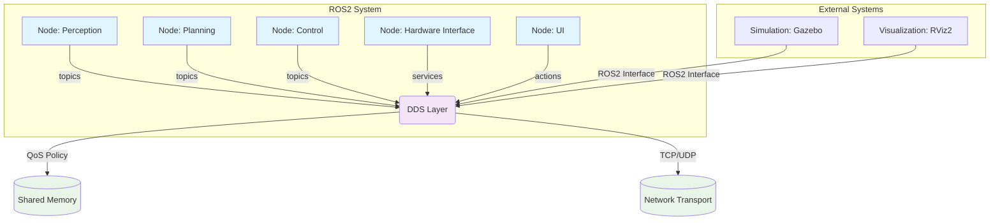
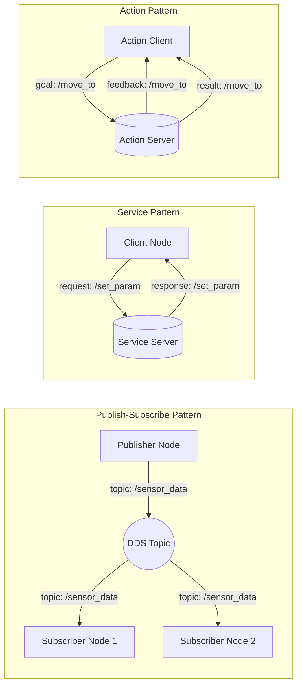

# ROS2 Architecture Fundamentals

Welcome to the foundational chapter on ROS2 architecture. This chapter provides a comprehensive understanding of the core components that make up the Robot Operating System 2 (ROS2), the next-generation framework for robotics development. Understanding ROS2 architecture is crucial for building robust, scalable, and maintainable humanoid robot systems.

## Learning Objectives

By the end of this chapter, you will be able to:
- Explain the core architectural components of ROS2 and their interactions
- Design effective communication patterns using nodes, topics, services, and actions
- Implement basic ROS2 nodes with publishers and subscribers
- Understand the DDS (Data Distribution Service) layer and its role in ROS2
- Apply best practices for ROS2 node design and communication

## Introduction to ROS2 Architecture

Robot Operating System 2 (ROS2) represents a complete redesign of the original ROS framework, addressing critical limitations related to security, real-time performance, and commercial deployment. Unlike ROS 1's centralized master-slave architecture, ROS2 uses a decentralized approach based on the Data Distribution Service (DDS) standard, enabling more robust and scalable robotic systems.

The key architectural improvements in ROS2 include:
- **Decentralized Architecture**: No single point of failure with the removal of the ROS master
- **Security**: Built-in security features for commercial and safety-critical applications
- **Real-time Support**: Better real-time performance and deterministic behavior
- **Multi-vendor DDS Implementations**: Support for different DDS vendors and configurations
- **Official Python 3 Support**: Full support for Python 3 and modern development practices

### Why ROS2 for Humanoid Robotics?

Humanoid robots present unique challenges that make ROS2's architectural improvements particularly valuable:

**Distributed Processing**: Humanoid robots often require distributed processing across multiple computers for perception, planning, and control. ROS2's decentralized architecture naturally supports this distributed model.

**Safety and Reliability**: With safety-critical applications, the elimination of a single point of failure in ROS2 provides more robust operation for humanoid robots.

**Real-time Performance**: Humanoid robots require real-time responses for balance, control, and safety. ROS2's architecture provides better timing guarantees.

**Commercial Deployment**: As humanoid robots move toward commercial applications, ROS2's security features and industrial support become essential.

## Core Architectural Components

ROS2 architecture consists of several core components that work together to provide a comprehensive robotics framework:

### Architecture Overview Diagram



The above diagram illustrates the core ROS2 architecture, showing how nodes communicate through the DDS layer with different transport mechanisms and QoS policies.

### Communication Patterns Diagram



This diagram shows the three main communication patterns in ROS2: publish-subscribe for asynchronous data streams, services for request-response interactions, and actions for goal-oriented tasks with feedback.

### Nodes

A **node** is the fundamental unit of computation in ROS2. It represents a single process that performs specific robot functionality. In humanoid robotics, nodes might handle:

- Sensor data processing (camera, IMU, force/torque sensors)
- Control algorithms (balance, walking, manipulation)
- Perception systems (object detection, SLAM)
- Planning and decision-making
- Communication with hardware

Nodes are implemented using client libraries (rcl) that provide language-specific interfaces to the underlying ROS2 infrastructure. The most common client libraries are:

- **rclpy**: Python client library
- **rclcpp**: C++ client library

#### Node Implementation Example

Here's a basic node implementation in Python:

```python
#!/usr/bin/env python3
import rclpy
from rclpy.node import Node

class HumanoidBaseNode(Node):
    def __init__(self):
        super().__init__('humanoid_base_node')
        self.get_logger().info('Humanoid Base Node initialized')

def main(args=None):
    rclpy.init(args=args)
    node = HumanoidBaseNode()
    try:
        rclpy.spin(node)
    except KeyboardInterrupt:
        pass
    finally:
        node.destroy_node()
        rclpy.shutdown()

if __name__ == '__main__':
    main()
```

### Topics and Publishers/Subscribers

**Topics** enable asynchronous communication between nodes through a publish-subscribe pattern. This is ideal for continuous data streams like sensor readings, robot state, or camera images.

Key characteristics of topics:
- **Asynchronous**: Publishers and subscribers don't need to run simultaneously
- **Many-to-many**: Multiple publishers can write to a topic, multiple subscribers can read from it
- **Transport agnostic**: Can use different transport protocols (TCP, UDP, shared memory)
- **Typed messages**: Use standardized message definitions (`.msg` files)

#### Topic Implementation Example

```python
# Publisher example
import rclpy
from rclpy.node import Node
from std_msgs.msg import String

class HumanoidStatusPublisher(Node):
    def __init__(self):
        super().__init__('humanoid_status_publisher')
        self.publisher = self.create_publisher(String, 'humanoid_status', 10)
        timer_period = 0.5  # seconds
        self.timer = self.create_timer(timer_period, self.timer_callback)
        self.i = 0

    def timer_callback(self):
        msg = String()
        msg.data = f'Humanoid status: operational {self.i}'
        self.publisher.publish(msg)
        self.get_logger().info(f'Publishing: "{msg.data}"')
        self.i += 1

# Subscriber example
class HumanoidStatusSubscriber(Node):
    def __init__(self):
        super().__init__('humanoid_status_subscriber')
        self.subscription = self.create_subscription(
            String,
            'humanoid_status',
            self.listener_callback,
            10)
        self.subscription  # prevent unused variable warning

    def listener_callback(self, msg):
        self.get_logger().info(f'Subscribed: "{msg.data}"')
```

### Services

**Services** provide synchronous request-response communication between nodes. This is suitable for operations that require immediate responses, such as configuration changes, calibration, or one-time commands.

Key characteristics of services:
- **Synchronous**: Client waits for response from server
- **One-to-one**: Each service request is handled by one service server
- **Request-response pattern**: Client sends request, server sends response
- **Typed requests and responses**: Use standardized service definitions (`.srv` files)

#### Service Implementation Example

```python
# Service server
import rclpy
from rclpy.node import Node
from example_interfaces.srv import SetBool

class HumanoidControlService(Node):
    def __init__(self):
        super().__init__('humanoid_control_service')
        self.srv = self.create_service(
            SetBool,
            'enable_humanoid_control',
            self.enable_control_callback)

    def enable_control_callback(self, request, response):
        if request.data:
            self.get_logger().info('Enabling humanoid control')
            response.success = True
            response.message = 'Control enabled'
        else:
            self.get_logger().info('Disabling humanoid control')
            response.success = True
            response.message = 'Control disabled'
        return response

# Service client
import rclpy
from rclpy.node import Node
from example_interfaces.srv import SetBool
import sys

class HumanoidControlClient(Node):
    def __init__(self):
        super().__init__('humanoid_control_client')
        self.cli = self.create_client(SetBool, 'enable_humanoid_control')
        while not self.cli.wait_for_service(timeout_sec=1.0):
            self.get_logger().info('Service not available, waiting again...')
        self.req = SetBool.Request()

    def send_request(self, enable):
        self.req.data = enable
        future = self.cli.call_async(self.req)
        rclpy.spin_until_future_complete(self, future)
        return future.result()
```

### Actions

**Actions** provide goal-based communication with feedback and status updates. This is ideal for long-running operations like navigation, manipulation, or complex robot behaviors.

Key characteristics of actions:
- **Goal-oriented**: Client sends a goal, server processes it
- **Feedback**: Server provides continuous feedback during execution
- **Preemption**: Goals can be canceled or preempted
- **Status updates**: Client receives status updates throughout execution
- **Typed goals, feedback, and results**: Use standardized action definitions (`.action` files)

#### Action Implementation Example

```python
# Action server
import rclpy
from rclpy.action import ActionServer
from rclpy.node import Node
from example_interfaces.action import Fibonacci

class HumanoidWalkActionServer(Node):
    def __init__(self):
        super().__init__('humanoid_walk_action_server')
        self._action_server = ActionServer(
            self,
            Fibonacci,
            'humanoid_walk_sequence',
            self.execute_callback)

    def execute_callback(self, goal_handle):
        self.get_logger().info('Executing walk sequence goal...')

        feedback_msg = Fibonacci.Feedback()
        feedback_msg.sequence = [0, 1]

        for i in range(1, goal_handle.request.order):
            if goal_handle.is_cancel_requested:
                goal_handle.canceled()
                self.get_logger().info('Walk sequence canceled')
                return Fibonacci.Result()

            feedback_msg.sequence.append(
                feedback_msg.sequence[i] + feedback_msg.sequence[i-1])
            self.get_logger().info(f'Feedback: {feedback_msg.sequence}')
            goal_handle.publish_feedback(feedback_msg)

        goal_handle.succeed()
        result = Fibonacci.Result()
        result.sequence = feedback_msg.sequence
        self.get_logger().info(f'Walk sequence completed: {result.sequence}')
        return result
```

## The DDS Layer

The Data Distribution Service (DDS) is the foundation of ROS2's communication architecture. DDS is a vendor-neutral, open standard for real-time, scalable, dependable data-critical applications.

### DDS Concepts in ROS2

**Domain**: A communication space where DDS participants can discover and communicate with each other. In ROS2, the domain ID can be set using the `ROS_DOMAIN_ID` environment variable.

**Participant**: An entity that participates in a DDS domain, typically corresponding to a ROS2 node.

**Topic**: A DDS topic is similar to a ROS2 topic but with additional QoS settings.

**Publisher/Subscriber**: DDS entities that send and receive data on topics.

**DataWriter/DataReader**: The DDS entities that actually write and read data.

### Quality of Service (QoS) Settings

QoS settings allow fine-tuning of communication behavior. Understanding QoS is crucial for humanoid robotics applications:

**Reliability**:
- `RELIABLE`: All messages are guaranteed to be delivered
- `BEST_EFFORT`: Messages may be dropped (suitable for sensor data)

**Durability**:
- `TRANSIENT_LOCAL`: Late-joining subscribers receive previous messages
- `VOLATILE`: Only new messages are sent to subscribers

**History**:
- `KEEP_ALL`: Store all messages
- `KEEP_LAST`: Store only the most recent messages

**Depth**: Number of messages to store in the history queue.

```python
from rclpy.qos import QoSProfile, ReliabilityPolicy, DurabilityPolicy

# Example QoS for sensor data (may drop messages, no need to store old data)
sensor_qos = QoSProfile(
    depth=5,
    reliability=ReliabilityPolicy.BEST_EFFORT,
    durability=DurabilityPolicy.VOLATILE
)

# Example QoS for critical commands (must deliver, keep all messages)
command_qos = QoSProfile(
    depth=10,
    reliability=ReliabilityPolicy.RELIABLE,
    durability=DurabilityPolicy.TRANSIENT_LOCAL
)
```

## ROS2 Launch System

The launch system in ROS2 provides a powerful way to start and manage multiple nodes simultaneously with proper configuration.

### Launch Files

Launch files are written in Python and provide more flexibility than ROS 1's XML-based launch files:

```python
from launch import LaunchDescription
from launch_ros.actions import Node
from ament_index_python.packages import get_package_share_directory

def generate_launch_description():
    return LaunchDescription([
        Node(
            package='humanoid_control',
            executable='base_controller',
            name='humanoid_base_controller',
            parameters=[
                get_package_share_directory('humanoid_control') + '/config/base.yaml'
            ],
            output='screen'
        ),
        Node(
            package='humanoid_perception',
            executable='camera_driver',
            name='camera_driver',
            parameters=[
                {'camera_topic': '/humanoid/camera/image_raw'},
                {'frame_id': 'camera_link'}
            ]
        )
    ])
```

## Lifecycle Nodes

Lifecycle nodes provide a structured approach to node state management, which is particularly valuable for humanoid robots that need to transition through different operational states (startup, calibration, ready, active, shutdown).

The lifecycle state machine includes:
- **Unconfigured**: Node created but not configured
- **Inactive**: Configured but not active
- **Active**: Running and operational
- **Finalized**: Shutting down

## Practical Example: Humanoid Robot Node Structure

Let's examine a complete example of how these architectural components work together in a humanoid robot context:

```python
#!/usr/bin/env python3
import rclpy
from rclpy.node import Node
from rclpy.qos import QoSProfile, ReliabilityPolicy
from sensor_msgs.msg import JointState
from geometry_msgs.msg import Twist
from std_msgs.msg import Bool
from humanoid_msgs.srv import BalanceControl, WalkCommand

class HumanoidController(Node):
    def __init__(self):
        super().__init__('humanoid_controller')

        # QoS profiles for different data types
        sensor_qos = QoSProfile(depth=10, reliability=ReliabilityPolicy.BEST_EFFORT)
        command_qos = QoSProfile(depth=1, reliability=ReliabilityPolicy.RELIABLE)

        # Publishers
        self.joint_state_pub = self.create_publisher(JointState, 'joint_states', 10)
        self.cmd_vel_pub = self.create_publisher(Twist, 'cmd_vel', command_qos)

        # Subscribers
        self.balance_sub = self.create_subscription(
            Bool, 'balance_active', self.balance_callback, sensor_qos)

        # Services
        self.balance_srv = self.create_service(
            BalanceControl, 'control_balance', self.balance_control_callback)
        self.walk_srv = self.create_service(
            WalkCommand, 'command_walk', self.walk_command_callback)

        # Timers
        self.control_timer = self.create_timer(0.01, self.control_loop)  # 100Hz control loop

        self.get_logger().info('Humanoid Controller initialized')

    def balance_callback(self, msg):
        """Handle balance state updates"""
        if msg.data:
            self.get_logger().info('Balance system active')
        else:
            self.get_logger().info('Balance system inactive')

    def balance_control_callback(self, request, response):
        """Handle balance control service requests"""
        try:
            # Implement balance control logic
            response.success = True
            response.message = f'Balance control {"enabled" if request.enable else "disabled"}'
        except Exception as e:
            response.success = False
            response.message = f'Error: {str(e)}'
        return response

    def walk_command_callback(self, request, response):
        """Handle walk command service requests"""
        try:
            # Implement walk command logic
            self.get_logger().info(f'Walking to: ({request.x}, {request.y}, {request.theta})')
            response.success = True
            response.message = 'Walk command received'
        except Exception as e:
            response.success = False
            response.message = f'Error: {str(e)}'
        return response

    def control_loop(self):
        """Main control loop running at 100Hz"""
        # This would contain the actual control algorithms
        pass

def main(args=None):
    rclpy.init(args=args)
    controller = HumanoidController()

    try:
        rclpy.spin(controller)
    except KeyboardInterrupt:
        controller.get_logger().info('Shutting down humanoid controller')
    finally:
        controller.destroy_node()
        rclpy.shutdown()

if __name__ == '__main__':
    main()
```

## Best Practices for ROS2 Architecture in Humanoid Robotics

### Modularity and Component Design

1. **Single Responsibility**: Each node should have a single, well-defined purpose
2. **Clear Interfaces**: Define clear input/output interfaces for nodes
3. **Configurable Parameters**: Use ROS2 parameters for runtime configuration
4. **Standard Message Types**: Use standard ROS2 message types when possible

### Performance Considerations

1. **Appropriate QoS Settings**: Match QoS settings to data requirements
2. **Efficient Message Sizes**: Minimize message sizes for high-frequency topics
3. **Proper Update Rates**: Set appropriate update rates for different functions
4. **Resource Management**: Monitor CPU and memory usage of nodes

### Safety and Reliability

1. **Error Handling**: Implement comprehensive error handling
2. **Graceful Degradation**: Design systems that can operate with reduced functionality
3. **Watchdog Timers**: Implement timers to detect node failures
4. **Safety States**: Define clear safety states and transitions

## Troubleshooting Common Architecture Issues

### Node Discovery Problems

**Symptoms**: Nodes can't communicate with each other
**Solutions**:
- Check that nodes are in the same `ROS_DOMAIN_ID`
- Verify network configuration for multi-machine setups
- Ensure proper firewall settings

### Message Synchronization Issues

**Symptoms**: Messages arrive out of order or with significant delay
**Solutions**:
- Review QoS settings for appropriate reliability/durability
- Check network bandwidth for high-frequency topics
- Consider message timestamping for synchronization

### Performance Bottlenecks

**Symptoms**: Slow response times, dropped messages
**Solutions**:
- Profile individual nodes to identify bottlenecks
- Adjust update rates for different components
- Optimize message processing in callbacks

## Chapter Summary

This chapter has provided a comprehensive overview of ROS2 architecture, covering:

- The fundamental components: nodes, topics, services, and actions
- The DDS communication layer and QoS settings
- Practical implementation examples for humanoid robotics
- Best practices for architectural design
- Troubleshooting common issues

Understanding ROS2 architecture is essential for building robust humanoid robot systems. The decentralized, secure, and real-time capable design of ROS2 makes it ideal for the complex requirements of humanoid robotics applications.

## Further Reading

To deepen your understanding of ROS2 architecture:

- **ROS2 Documentation**: Read the official ROS2 concepts documentation for detailed explanations of each architectural component
- **DDS Specification**: Explore the OMG DDS specification to understand the underlying communication standard
- **Real-time ROS2**: Research real-time configurations and optimizations for ROS2
- **ROS2 Security**: Learn about security features and best practices for commercial deployments
- **Performance Optimization**: Study techniques for optimizing ROS2 communication and processing

In the next chapter, we'll explore communication models in detail, diving deeper into how nodes interact and how to design effective communication patterns for humanoid robots.

Continue building your foundation in ROS2 fundamentals as these concepts form the backbone of all humanoid robotics applications.