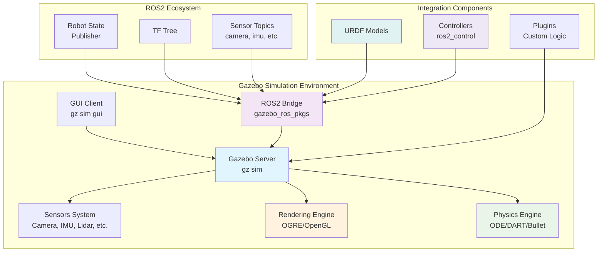

# Gazebo Environment Setup and Configuration

This chapter covers the setup and configuration of Gazebo simulation environments for humanoid robot development and testing. Gazebo provides a realistic physics engine and sensor simulation that enables safe and efficient testing of humanoid robots before deployment on physical hardware.

## Learning Objectives

By the end of this chapter, you will be able to:
- Install and configure Gazebo for humanoid robotics simulation
- Create realistic simulation environments with appropriate physics properties
- Configure sensors and their properties for humanoid robot simulation
- Set up lighting and visual elements for enhanced simulation
- Integrate Gazebo with ROS2 for seamless robot simulation

## Introduction to Gazebo for Humanoid Robotics

Gazebo is a powerful 3D simulation environment that provides realistic physics simulation, high-quality graphics, and convenient programmatic interfaces. For humanoid robotics, Gazebo enables developers to:

- **Test control algorithms** in a safe, repeatable environment
- **Validate robot designs** before physical construction
- **Develop perception systems** with realistic sensor data
- **Experiment with different scenarios** without hardware risk
- **Train AI systems** with synthetic data

The integration between Gazebo and ROS2 through the `gazebo_ros_pkgs` package enables seamless simulation of complex humanoid robots with accurate physics and sensor simulation.

### Why Gazebo for Humanoid Robots?

Humanoid robots present unique simulation challenges that Gazebo addresses effectively:

**Complex Physics**: Humanoid robots require accurate simulation of balance, collisions, and multi-contact dynamics.

**Sensor Integration**: Multiple sensors (cameras, IMUs, force/torque sensors) need realistic simulation.

**Environment Interaction**: Humanoid robots interact with complex environments requiring accurate contact simulation.

**Real-time Performance**: Gazebo provides real-time simulation performance suitable for control algorithm development.

## Gazebo Installation and Setup

### Gazebo Architecture Overview



This diagram shows the architecture of Gazebo and how it integrates with the ROS2 ecosystem for humanoid robot simulation.

### Simulation Workflow

```mermaid
flowchart LR
    A[Design Robot<br/>URDF/SDF] --> B[Configure World<br/>Environment Setup]
    B --> C[Launch Gazebo<br/>gz sim]
    C --> D[Spawn Robot<br/>ros2 run spawn_entity]
    D --> E[Load Controllers<br/>ros2 control]
    E --> F[Run Simulation<br/>Physics + Sensors]
    F --> G{Simulation Active?}
    G -->|Yes| H[Control Robot<br/>Commands + Feedback]
    G -->|No| I[Analyze Results<br/>Logs + Metrics]
    H --> F
    I --> J[Iterate Design<br/>Improve Model]
    J --> A

    K[Validation<br/>Performance Metrics] -.-> F
    L[Troubleshooting<br/>Issues Detection] -.-> G

    style A fill:#e3f2fd
    style D fill:#f3e5f5
    style E fill:#e8f5e8
    style F fill:#fff3e0
    style G fill:#ffccbc
    style H fill:#e8f5e8
    style I fill:#f3e5f5

```bash
# Add Gazebo repository
sudo apt update && sudo apt install -y wget
wget https://packages.osrfoundation.org/gazebo.gpg -O /tmp/gazebo.gpg
sudo cp /tmp/gazebo.gpg /usr/share/keyrings/gazebo-archive-keyring.gpg
echo "deb [arch=$(dpkg --print-architecture) signed-by=/usr/share/keyrings/gazebo-archive-keyring.gpg] http://packages.osrfoundation.org/gazebo/ubuntu-stable $(source /etc/os-release && echo $UBUNTU_CODENAME) main" | sudo tee /etc/apt/sources.list.d/gazebo-stable.list > /dev/null

# Update package list
sudo apt update

# Install Gazebo Garden
sudo apt install gz-garden

# Install ROS2 Gazebo interfaces
sudo apt install ros-humble-gazebo-ros-pkgs ros-humble-gazebo-ros-control
# OR for Jazzy:
# sudo apt install ros-jazzy-gazebo-ros-pkgs ros-jazzy-gazebo-ros-control
```

### Verifying Installation

Test the installation by launching a simple Gazebo world:

```bash
gz sim
```

This should open the Gazebo graphical interface with a default empty world.

## Basic Gazebo World Configuration

Gazebo worlds are defined using SDF (Simulation Description Format) files. Here's a basic world configuration for humanoid robot simulation:

```xml
<?xml version="1.0"?>
<sdf version="1.7">
  <world name="humanoid_world">
    <!-- Include a ground plane -->
    <include>
      <uri>model://ground_plane</uri>
    </include>

    <!-- Include a sun light source -->
    <include>
      <uri>model://sun</uri>
    </include>

    <!-- Physics engine configuration -->
    <physics name="1ms" type="ignored">
      <max_step_size>0.001</max_step_size>
      <real_time_factor>1.0</real_time_factor>
      <real_time_update_rate>1000.0</real_time_update_rate>
    </physics>

    <!-- Scene settings -->
    <scene>
      <ambient>0.4 0.4 0.4 1.0</ambient>
      <background>0.7 0.7 0.7 1.0</background>
      <shadows>true</shadows>
    </scene>

    <!-- Add a simple box for testing -->
    <model name="test_box">
      <pose>0 0 0.5 0 0 0</pose>
      <link name="link">
        <inertial>
          <mass>1.0</mass>
          <inertia>
            <ixx>0.083</ixx>
            <ixy>0</ixy>
            <ixz>0</ixz>
            <iyy>0.083</iyy>
            <iyz>0</iyz>
            <izz>0.083</izz>
          </inertia>
        </inertial>
        <collision name="collision">
          <geometry>
            <box>
              <size>1 1 1</size>
            </box>
          </geometry>
        </collision>
        <visual name="visual">
          <geometry>
            <box>
              <size>1 1 1</size>
            </box>
          </geometry>
          <material>
            <diffuse>0.8 0.2 0.2 1.0</diffuse>
            <specular>0.8 0.2 0.2 1.0</specular>
          </material>
        </visual>
      </link>
    </model>
  </world>
</sdf>
```

### Physics Engine Configuration

The physics engine configuration is crucial for humanoid robot simulation:

```xml
<physics name="humanoid_physics" type="ode">
  <max_step_size>0.001</max_step_size>  <!-- 1ms time step for accuracy -->
  <real_time_factor>1.0</real_time_factor>  <!-- Real-time simulation -->
  <real_time_update_rate>1000.0</real_time_update_rate>  <!-- Update rate -->

  <!-- ODE-specific parameters -->
  <ode>
    <solver>
      <type>quick</type>  <!-- Solver type -->
      <iters>10</iters>  <!-- Solver iterations -->
      <sor>1.3</sor>  <!-- Successive over-relaxation -->
    </solver>
    <constraints>
      <cfm>0.0</cfm>  <!-- Constraint force mixing -->
      <erp>0.2</erp>  <!-- Error reduction parameter -->
      <contact_max_correcting_vel>100.0</contact_max_correcting_vel>
      <contact_surface_layer>0.001</contact_surface_layer>
    </constraints>
  </ode>
</physics>
```

For humanoid robots, consider these physics settings:
- **Small time steps** (0.001s) for stable balance simulation
- **Higher solver iterations** for accurate contact simulation
- **Appropriate ERP and CFM values** for stable contacts

## Environment Design for Humanoid Robots

### Indoor Environments

Humanoid robots typically operate in indoor environments. Here's an example of a room configuration:

```xml
<!-- Room with walls -->
<model name="room_walls">
  <static>true</static>  <!-- Static model doesn't move -->

  <!-- Front wall -->
  <link name="front_wall">
    <pose>0 -5 2.5 0 0 0</pose>
    <collision name="collision">
      <geometry>
        <box><size>10 0.2 5</size></box>
      </geometry>
    </collision>
    <visual name="visual">
      <geometry>
        <box><size>10 0.2 5</size></box>
      </geometry>
      <material>
        <diffuse>0.8 0.8 0.8 1.0</diffuse>
      </material>
    </visual>
  </link>

  <!-- Back wall -->
  <link name="back_wall">
    <pose>0 5 2.5 0 0 3.14159</pose>
    <!-- Similar configuration -->
  </link>

  <!-- Side walls and floor would follow similar pattern -->
</model>
```

### Terrain and Obstacles

For testing humanoid locomotion, create varied terrain:

```xml
<!-- Steps for testing stair climbing -->
<model name="steps">
  <pose>5 0 0 0 0 0</pose>
  <link name="step1">
    <pose>0 0 0.1 0 0 0</pose>
    <collision><geometry><box><size>2 2 0.2</size></box></geometry></collision>
    <visual><geometry><box><size>2 2 0.2</size></box></geometry></visual>
  </link>
  <link name="step2">
    <pose>0 0 0.3 0 0 0</pose>
    <collision><geometry><box><size>2 1.5 0.2</size></box></geometry></collision>
    <visual><geometry><box><size>2 1.5 0.2</size></box></geometry></visual>
  </link>
</model>
```

## Sensor Configuration for Humanoid Robots

Humanoid robots require various sensors for perception and control. Gazebo can simulate these sensors accurately.

### Camera Sensors

```xml
<sensor name="head_camera" type="camera">
  <always_on>true</always_on>
  <update_rate>30</update_rate>
  <camera name="head_camera">
    <horizontal_fov>1.047</horizontal_fov> <!-- 60 degrees -->
    <image>
      <width>640</width>
      <height>480</height>
      <format>R8G8B8</format>
    </image>
    <clip>
      <near>0.1</near>
      <far>10.0</far>
    </clip>
  </camera>
  <visualize>true</visualize>
</sensor>
```

### IMU Sensors

```xml
<sensor name="imu_sensor" type="imu">
  <always_on>true</always_on>
  <update_rate>100</update_rate>
  <imu>
    <angular_velocity>
      <x>
        <noise type="gaussian">
          <mean>0.0</mean>
          <stddev>0.0017</stddev> <!-- ~0.1 deg/s -->
        </noise>
      </x>
      <y>
        <noise type="gaussian">
          <mean>0.0</mean>
          <stddev>0.0017</stddev>
        </noise>
      </y>
      <z>
        <noise type="gaussian">
          <mean>0.0</mean>
          <stddev>0.0017</stddev>
        </noise>
      </z>
    </angular_velocity>
    <linear_acceleration>
      <x>
        <noise type="gaussian">
          <mean>0.0</mean>
          <stddev>0.017</stddev>
        </noise>
      </x>
      <y>
        <noise type="gaussian">
          <mean>0.0</mean>
          <stddev>0.017</stddev>
        </noise>
      </y>
      <z>
        <noise type="gaussian">
          <mean>0.0</mean>
          <stddev>0.017</stddev>
        </noise>
      </z>
    </linear_acceleration>
  </imu>
</sensor>
```

### Force/Torque Sensors

```xml
<sensor name="ft_sensor" type="force_torque">
  <always_on>true</always_on>
  <update_rate>100</update_rate>
  <force_torque>
    <frame>child</frame>  <!-- Child link frame -->
    <measure_direction>child_to_parent</measure_direction>
  </force_torque>
</sensor>
```

## ROS2 Integration with Gazebo

### Launch File Configuration

Create a launch file to start Gazebo with your humanoid robot:

```python
# launch/humanoid_gazebo.launch.py
from launch import LaunchDescription
from launch.actions import DeclareLaunchArgument, IncludeLaunchDescription
from launch.launch_description_sources import PythonLaunchDescriptionSource
from launch.substitutions import LaunchConfiguration, PathJoinSubstitution
from launch_ros.substitutions import FindPackageShare
from launch_ros.actions import Node

def generate_launch_description():
    # Arguments
    model_arg = DeclareLaunchArgument(
        'model',
        default_value='humanoid_robot',
        description='Robot model name'
    )

    world_arg = DeclareLaunchArgument(
        'world',
        default_value='humanoid_world.sdf',
        description='World file to load'
    )

    # Start Gazebo with specified world
    gazebo = IncludeLaunchDescription(
        PythonLaunchDescriptionSource([
            PathJoinSubstitution([
                FindPackageShare('gazebo_ros'),
                'launch',
                'gazebo.launch.py'
            ])
        ]),
        launch_arguments={
            'world': PathJoinSubstitution([
                FindPackageShare('humanoid_description'),
                'worlds',
                LaunchConfiguration('world')
            ])
        }.items()
    )

    # Robot state publisher
    robot_state_publisher = Node(
        package='robot_state_publisher',
        executable='robot_state_publisher',
        name='robot_state_publisher',
        parameters=[{
            'use_sim_time': True,
            'robot_description': Command([
                'xacro ',
                PathJoinSubstitution([
                    FindPackageShare('humanoid_description'),
                    'urdf',
                    LaunchConfiguration('model'),
                    '.urdf.xacro'
                ])
            ])
        }]
    )

    return LaunchDescription([
        model_arg,
        world_arg,
        gazebo,
        robot_state_publisher
    ])
```

### Robot Spawn Configuration

To spawn your robot in Gazebo, use the spawn_entity script:

```bash
# Spawn robot at specific pose
ros2 run gazebo_ros spawn_entity.py -entity humanoid_robot -file $(ros2 pkg prefix humanoid_description)/share/humanoid_description/robots/humanoid_robot.urdf -x 0 -y 0 -z 1.0 -Y 0
```

## Advanced Gazebo Features

### Plugins for Enhanced Functionality

Gazebo plugins can extend simulation capabilities:

#### ros2_control Integration

Modern ROS2-based robots typically use `ros2_control` for hardware abstraction. Here's how to integrate it with Gazebo:

```xml
<!-- In your robot's URDF or SDF -->
<ros2_control name="GazeboSystem" type="system">
  <hardware>
    <plugin>gazebo_ros2_control/GazeboSystem</plugin>
  </hardware>
  <joint name="left_hip_joint">
    <command_interface name="position">
      <param name="min">-1.57</param>
      <param name="max">1.57</param>
    </command_interface>
    <state_interface name="position"/>
    <state_interface name="velocity"/>
    <state_interface name="effort"/>
  </joint>
  <!-- Repeat for each joint -->
</ros2_control>

<!-- Gazebo plugin to load ros2_control -->
<plugin filename="libgazebo_ros2_control-system.so" name="gazebo_ros2_control-system">
  <parameters>$(find my_robot_description)/config/ros2_controllers.yaml</parameters>
  <robot_param>/robot_description</robot_param>
  <robot_namespace>/</robot_namespace>
</plugin>
```

And the corresponding controller configuration file:

```yaml
# config/ros2_controllers.yaml
controller_manager:
  ros__parameters:
    update_rate: 100  # Hz

    joint_state_broadcaster:
      type: joint_state_broadcaster/JointStateBroadcaster

    left_leg_controller:
      type: position_controllers/JointGroupPositionController

    right_leg_controller:
      type: position_controllers/JointGroupPositionController

left_leg_controller:
  ros__parameters:
    joints:
      - left_hip_joint
      - left_knee_joint
      - left_ankle_joint

right_leg_controller:
  ros__parameters:
    joints:
      - right_hip_joint
      - right_knee_joint
      - right_ankle_joint
```

#### Custom Controllers for Humanoid Robots

For complex humanoid behaviors, you may need custom controllers:

```cpp
// Example custom controller header
#include "controller_interface/controller_interface.hpp"
#include "rclcpp/rclcpp.hpp"
#include "std_msgs/msg/float64_multi_array.hpp"

namespace gazebo_custom_controllers
{
class BalanceController : public controller_interface::ControllerInterface
{
public:
  controller_interface::CallbackReturn on_init() override;
  controller_interface::InterfaceConfiguration command_interface_configuration() const override;
  controller_interface::InterfaceConfiguration state_interface_configuration() const override;
  controller_interface::return_type update(
    const rclcpp::Time & time,
    const rclcpp::Duration & period) override;

private:
  // Balance control parameters
  double com_x_, com_y_, com_z_;
  double com_vel_x_, com_vel_y_, com_vel_z_;
  double desired_com_x_, desired_com_y_;
  double control_gain_;

  // ROS interfaces
  rclcpp::Subscription<std_msgs::msg::Float64MultiArray>::SharedPtr com_subscriber_;
  void com_callback(const std_msgs::msg::Float64MultiArray::SharedPtr msg);
};
}  // namespace gazebo_custom_controllers
```

### Advanced Physics Configurations

#### Custom Contact Materials

For humanoid robots, different materials may have different friction and contact properties:

```xml
<!-- In world file -->
<world>
  <!-- Define custom materials -->
  <material name="high_friction">
    <pbr>
      <metal>
        <albedo_map>file://materials/textures/rubber.png</albedo_map>
        <roughness>0.1</roughness>
        <metalness>0.0</metalness>
      </metal>
    </pbr>
  </material>

  <!-- Contact parameters -->
  <gazebo reference="left_foot">
    <mu1>0.8</mu1>  <!-- Primary friction coefficient -->
    <mu2>0.8</mu2>  <!-- Secondary friction coefficient -->
    <kp>1000000.0</kp>  <!-- Contact stiffness -->
    <kd>100.0</kd>     <!-- Contact damping -->
    <max_vel>100.0</max_vel>  <!-- Maximum contact penetration velocity -->
    <min_depth>0.001</min_depth>  <!-- Minimum contact depth -->
  </gazebo>

  <gazebo reference="right_foot">
    <mu1>0.8</mu1>
    <mu2>0.8</mu2>
    <kp>1000000.0</kp>
    <kd>100.0</kd>
  </gazebo>
</world>
```

#### Multi-Body Dynamics

For complex humanoid interactions:

```xml
<world>
  <!-- Enable multi-body dynamics -->
  <physics name="multibody_physics" type="dart">
    <max_step_size>0.001</max_step_size>
    <real_time_factor>1.0</real_time_factor>
    <real_time_update_rate>1000.0</real_time_update_rate>

    <!-- DART-specific parameters for better multi-body simulation -->
    <dart>
      <solver>
        <type>PGS</type>  <!-- Projected Gauss-Seidel solver -->
        <iterations>50</iterations>  <!-- More iterations for stability -->
        <sor>1.0</sor>  <!-- Successive Over-relaxation parameter -->
      </solver>
    </dart>
  </physics>
</world>
```

### Environment Scenarios for Humanoid Testing

#### Stair Climbing Environment

```xml
<model name="staircase">
  <pose>2 0 0 0 0 0</pose>
  <link name="step_0">
    <pose>0 0 0.15 0 0 0</pose>
    <collision><geometry><box><size>2 1.5 0.3</size></box></geometry></collision>
    <visual><geometry><box><size>2 1.5 0.3</size></box></geometry></visual>
  </link>
  <link name="step_1">
    <pose>0 0 0.45 0 0 0</pose>
    <collision><geometry><box><size>2 1.5 0.3</size></box></geometry></collision>
    <visual><geometry><box><size>2 1.5 0.3</size></box></geometry></visual>
  </link>
  <link name="step_2">
    <pose>0 0 0.75 0 0 0</pose>
    <collision><geometry><box><size>2 1.5 0.3</size></box></geometry></collision>
    <visual><geometry><box><size>2 1.5 0.3</size></box></geometry></visual>
  </link>
  <!-- Add more steps as needed -->
</model>
```

#### Balance Beam Challenge

```xml
<model name="balance_beam">
  <pose>0 0 0.1 0 0 0</pose>
  <link name="beam">
    <inertial>
      <mass>10.0</mass>
      <inertia>
        <ixx>0.833</ixx>  <!-- 10*(0.1² + 4²)/12 -->
        <iyy>133.4</iyy>   <!-- 10*(0.1² + 4²)/12 -->
        <izz>133.4</izz>   <!-- 10*(4² + 0.1²)/12 -->
      </inertia>
    </inertial>
    <collision name="collision">
      <geometry>
        <box><size>4 0.1 0.1</size></box>
      </geometry>
    </collision>
    <visual name="visual">
      <geometry>
        <box><size>4 0.1 0.1</size></box>
      </geometry>
      <material>
        <diffuse>0.6 0.4 0.2 1.0</diffuse>
      </material>
    </visual>
  </link>
</model>
```

#### Obstacle Course

```xml
<model name="obstacle_course">
  <!-- Cones for navigation -->
  <model name="cone_1">
    <pose>-1 1 0 0 0 0</pose>
    <link name="cone_link">
      <collision><geometry><cylinder><radius>0.1</radius><length>0.5</length></cylinder></geometry></collision>
      <visual><geometry><cylinder><radius>0.1</radius><length>0.5</length></cylinder></geometry></visual>
    </link>
  </model>

  <!-- Boxes to step over -->
  <model name="step_obstacle">
    <pose>3 0 0.1 0 0 0</pose>
    <link name="box_link">
      <collision><geometry><box><size>0.3 0.3 0.2</size></box></geometry></collision>
      <visual><geometry><box><size>0.3 0.3 0.2</size></box></geometry></visual>
    </link>
  </model>
</model>
```

### Simulation Monitoring and Diagnostics

#### Performance Monitoring

Monitor simulation performance with custom Gazebo plugins:

```cpp
// Performance monitor plugin
#include <gazebo/gazebo.hh>
#include <gazebo/common/Plugin.hh>
#include <gazebo/physics/physics.hh>
#include <rclcpp/rclcpp.hpp>
#include <std_msgs/msg/float32.hpp>

class PerformanceMonitor : public gazebo::WorldPlugin
{
public:
  void Load(gazebo::physics::WorldPtr _world, sdf::ElementPtr _sdf) override
  {
    this->world = _world;
    this->update_connection_ = gazebo::event::Events::ConnectWorldUpdateBegin(
      std::bind(&PerformanceMonitor::OnUpdate, this));

    // Initialize ROS2 node for publishing performance metrics
    this->node_ = std::make_shared<rclcpp::Node>("gazebo_performance_monitor");
    this->perf_pub_ = this->node_->create_publisher<std_msgs::msg::Float32>(
      "/gazebo/performance/real_time_factor", 10);
  }

  void OnUpdate()
  {
    double rtf = this->world->RealTimeFactor();
    auto msg = std_msgs::msg::Float32();
    msg.data = rtf;
    this->perf_pub_->publish(msg);
  }

private:
  gazebo::physics::WorldPtr world;
  gazebo::event::ConnectionPtr update_connection_;
  rclcpp::Node::SharedPtr node_;
  rclcpp::Publisher<std_msgs::msg::Float32>::SharedPtr perf_pub_;
};

GZ_REGISTER_WORLD_PLUGIN(PerformanceMonitor)
```

#### Sensor Data Validation

Validate sensor data quality in simulation:

```python
#!/usr/bin/env python3
import rclpy
from rclpy.node import Node
from sensor_msgs.msg import Imu, JointState
from std_msgs.msg import Float32
import numpy as np

class SensorValidator(Node):
    def __init__(self):
        super().__init__('sensor_validator')

        # Subscriptions
        self.imu_sub = self.create_subscription(Imu, '/imu/data', self.imu_callback, 10)
        self.joint_sub = self.create_subscription(JointState, '/joint_states', self.joint_callback, 10)

        # Publishers for validation metrics
        self.acceleration_valid_pub = self.create_publisher(Float32, '/validation/acceleration_valid', 10)
        self.joint_range_valid_pub = self.create_publisher(Float32, '/validation/joint_ranges_valid', 10)

        # Validation parameters
        self.gravity_threshold = 11.0  # m/s², should be close to 9.81
        self.gravity_tolerance = 2.0

        self.joint_limits = {
            'left_hip_joint': (-1.57, 1.57),
            'right_hip_joint': (-1.57, 1.57),
            # Add other joints...
        }

    def imu_callback(self, msg):
        """Validate IMU data quality"""
        # Calculate magnitude of acceleration (should be close to gravity when stationary)
        accel_mag = np.sqrt(
            msg.linear_acceleration.x**2 +
            msg.linear_acceleration.y**2 +
            msg.linear_acceleration.z**2
        )

        # Check if acceleration is within reasonable range of gravity
        is_valid = abs(accel_mag - 9.81) < self.gravity_tolerance
        valid_msg = Float32()
        valid_msg.data = float(is_valid)
        self.acceleration_valid_pub.publish(valid_msg)

    def joint_callback(self, msg):
        """Validate joint state data"""
        valid_joints = 0
        total_joints = 0

        for i, joint_name in enumerate(msg.name):
            if joint_name in self.joint_limits:
                min_limit, max_limit = self.joint_limits[joint_name]
                position = msg.position[i]

                # Check if joint is within limits
                if min_limit <= position <= max_limit:
                    valid_joints += 1
                total_joints += 1

        validity_ratio = valid_joints / total_joints if total_joints > 0 else 0.0
        valid_msg = Float32()
        valid_msg.data = validity_ratio
        self.joint_range_valid_pub.publish(valid_msg)
```

```xml
<!-- Contact sensor plugin -->
<plugin filename="libgazebo_ros_contact.so" name="gazebo_ros_contact">
  <ros>
    <namespace>/humanoid</namespace>
    <remapping>~/contacts:=foot_contacts</remapping>
  </ros>
  <update_rate>30</update_rate>
</plugin>

<!-- Joint state publisher plugin -->
<plugin filename="libgazebo_ros_joint_state_publisher.so" name="gazebo_ros_joint_state_publisher">
  <ros>
    <namespace>/humanoid</namespace>
  </ros>
  <update_rate>30</update_rate>
  <joint_name>left_hip_joint</joint_name>
  <joint_name>left_knee_joint</joint_name>
  <!-- Add all joints to publish -->
</plugin>

<!-- Diff drive controller plugin for wheeled robots or simple locomotion -->
<plugin filename="libgazebo_ros_diff_drive.so" name="gazebo_ros_diff_drive">
  <ros>
    <namespace>/humanoid/base</namespace>
  </ros>
  <left_joint>left_wheel_joint</left_joint>
  <right_joint>right_wheel_joint</right_joint>
  <wheel_separation>0.3</wheel_separation>
  <wheel_diameter>0.15</wheel_diameter>
  <odom_publish_frequency>30</odom_publish_frequency>
</plugin>
```

### Lighting and Visual Effects

Enhance the visual quality of your simulation:

```xml
<scene>
  <ambient>0.3 0.3 0.3 1.0</ambient>
  <background>0.8 0.9 1.0 1.0</background>
  <shadows>true</shadows>
  <grid>false</grid>  <!-- Hide grid in final simulations -->
  <origin_visual>false</origin_visual>  <!-- Hide origin axes -->
</scene>

<!-- Custom lighting -->
<light name="ambient_light" type="directional">
  <pose>0 0 10 0 0 0</pose>
  <diffuse>0.8 0.8 0.8 1</diffuse>
  <specular>0.2 0.2 0.2 1</specular>
  <attenuation>
    <range>1000</range>
    <constant>0.9</constant>
    <linear>0.01</linear>
    <quadratic>0.001</quadratic>
  </attenuation>
  <direction>-0.4 -0.4 -1</direction>
</light>
```

## Performance Optimization

### Reducing Computational Load

For complex humanoid simulations, optimize performance:

**Reduce update rates**: Lower sensor update rates where possible
```xml
<update_rate>30</update_rate>  <!-- Instead of 100-1000 Hz -->
```

**Simplify collision geometries**: Use boxes and cylinders instead of meshes for collision detection

**Limit physics complexity**: Use appropriate ERP and CFM values to balance stability and performance

### Parallel Processing

Gazebo can utilize multiple cores:
```bash
# Launch with multi-threaded physics
gz sim -r -v 3 --threads 4 world_file.sdf
```

## Troubleshooting Common Issues

### Physics Instabilities

**Problem**: Robot falls through ground or exhibits jittery behavior
**Solution**:
- Check inertial parameters in URDF
- Verify collision geometries
- Adjust ERP and CFM values
- Reduce time step size

### Sensor Noise Issues

**Problem**: Excessive sensor noise affecting control
**Solution**:
- Adjust noise parameters in SDF
- Apply filtering in the control system
- Verify sensor mounting positions

### Rendering Performance

**Problem**: Slow rendering/frame rate
**Solution**:
- Reduce visual complexity
- Disable unnecessary rendering
- Adjust lighting complexity
- Use simpler textures

### Plugin Loading Issues

**Problem**: Plugins fail to load or connect
**Solution**:
- Verify plugin library paths
- Check ROS2 namespace configurations
- Ensure proper dependency installation
- Verify plugin compatibility with Gazebo version

## Best Practices for Humanoid Simulation

### Environment Design

- **Start simple**: Begin with basic environments before adding complexity
- **Realistic scaling**: Ensure environments are properly scaled for humanoid dimensions
- **Safety zones**: Include clear areas for testing without obstacles initially
- **Variety**: Create diverse environments for comprehensive testing

### Physics Configuration

- **Conservative parameters**: Start with stable physics settings, then optimize
- **Validation**: Compare simulation behavior with expected physical behavior
- **Documentation**: Keep records of working physics parameters for reference

### Integration Testing

- **Modular approach**: Test individual components before integration
- **Incremental complexity**: Gradually add complexity to simulations
- **Baseline comparisons**: Maintain reference behaviors for regression testing

## Chapter Summary

This chapter covered the essential aspects of configuring Gazebo environments for humanoid robotics:

- Installation and basic setup of Gazebo
- World configuration with appropriate physics for humanoid robots
- Sensor simulation for realistic perception
- ROS2 integration for seamless simulation workflows
- Performance optimization techniques
- Troubleshooting common issues

Proper Gazebo configuration is crucial for effective humanoid robot development, enabling safe testing and validation before physical deployment.

## Further Reading

To deepen your understanding of Gazebo simulation for humanoid robots:

- **Gazebo Documentation**: Official guides and tutorials for advanced features
- **ROS2 Control Integration**: Learn about integrating ros2_control with Gazebo
- **Physics Simulation**: Study advanced physics concepts for robotic simulation
- **Sensor Fusion**: Explore techniques for combining multiple sensor inputs
- **Simulation-Based Learning**: Research on using simulation for robot learning

In the next chapter, we'll explore physics and collision simulation in greater detail, focusing on the specific requirements for humanoid robot stability and interaction.