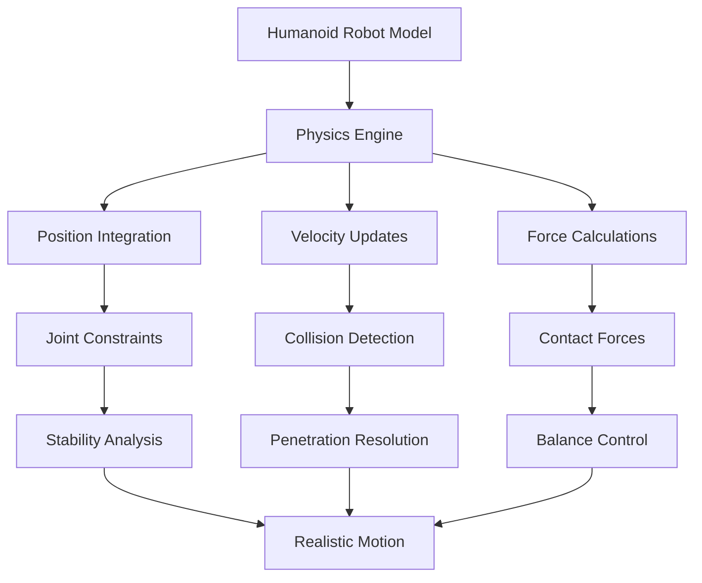
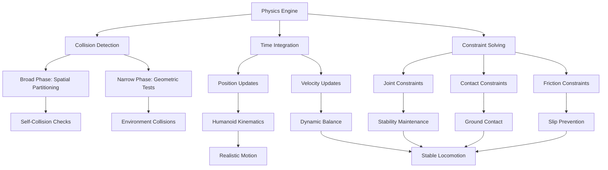

# Physics and Collision Simulation in Humanoid Robotics

Humanoid robotics simulation requires sophisticated physics modeling to accurately represent real-world interactions. This chapter explores the critical aspects of physics simulation and collision detection that enable realistic humanoid robot behavior in Gazebo environments.

## Learning Objectives

By the end of this chapter, you will be able to:

1. Understand the fundamental physics principles governing humanoid robot simulation
2. Configure and optimize collision detection algorithms for humanoid robots
3. Implement realistic contact dynamics and friction models for stable locomotion
4. Design collision geometries that balance accuracy and computational efficiency
5. Troubleshoot common physics-related issues in humanoid simulation
6. Evaluate and optimize physics parameters for realistic humanoid behavior

## Introduction

Physics simulation is the cornerstone of realistic humanoid robotics development. Unlike wheeled robots that primarily interact with surfaces through rolling motion, humanoid robots engage in complex multi-point contacts, dynamic balance challenges, and intricate collision scenarios. The physics engine in Gazebo must accurately model these interactions to provide meaningful simulation results that translate to real-world performance.

Humanoid robots face unique challenges in physics simulation:

- **Multi-point contact stability**: Maintaining balance through feet contact with ground
- **Dynamic locomotion**: Walking, running, and jumping motions requiring precise timing
- **Complex joint interactions**: Multiple degrees of freedom creating coupled dynamics
- **Environmental interaction**: Grasping objects, climbing stairs, navigating obstacles

Understanding these physics principles enables developers to create more robust and realistic humanoid simulations that serve as effective platforms for algorithm development and testing.

## Prerequisites

Before diving into this chapter, you should have:

- Basic understanding of ROS2 concepts and node communication
- Experience with URDF/XACRO model creation for robots
- Familiarity with Gazebo simulation environment
- Understanding of basic physics concepts (forces, torques, mass, inertia)
- Python programming experience for ROS2 nodes

## Theory and Concepts

### Physics Engine Fundamentals

Gazebo uses the Open Dynamics Engine (ODE) as its default physics backend, though it supports other engines like Bullet and DART. The physics engine performs several critical calculations:

1. **Integration**: Solving differential equations to update positions and velocities
2. **Collision Detection**: Identifying when objects intersect or come into contact
3. **Contact Resolution**: Calculating forces and torques from collisions
4. **Constraint Solving**: Maintaining joint relationships and physical constraints

For humanoid robots, the physics engine must handle complex multi-body dynamics where each limb contributes to the overall system behavior.



### Collision Detection Algorithms

Collision detection in Gazebo employs hierarchical approaches to efficiently identify potential collisions:

**Broad Phase**: Uses spatial partitioning (octrees, bounding volume hierarchies) to quickly eliminate non-interacting objects.

**Narrow Phase**: Performs precise geometric intersection tests between potentially colliding pairs.

For humanoid robots, collision detection must handle:

- Self-collision prevention (limbs not intersecting the torso)
- Environment collisions (avoiding walls, furniture, obstacles)
- Ground contact (foot-ground interaction for walking)
- Object manipulation (grasping and holding items)

### Contact Dynamics and Friction Models

When collisions occur, the physics engine calculates contact forces using various friction models. The Coulomb friction model is most commonly used:

**Static Friction**: Prevents initial sliding motion
**Dynamic Friction**: Resists ongoing sliding motion
**Rolling Friction**: Accounts for energy loss in rolling contacts

The friction coefficient determines how much force is required to initiate or maintain sliding motion. For humanoid robots walking on various surfaces, accurate friction modeling is crucial for stable locomotion.

### Stability Considerations

Humanoid robots require careful attention to stability during simulation:

- **Center of Mass (CoM)**: Must remain within support polygon during stance phase
- **Zero Moment Point (ZMP)**: Critical for dynamic balance control
- **Angular Momentum**: Conserved quantities affecting rotational stability
- **Impulse Response**: How impacts affect overall system dynamics

### Physics Parameters Configuration

Key parameters affecting humanoid physics simulation include:

- **Update Rate**: Frequency of physics calculations (typically 1000 Hz)
- **Solver Iterations**: Number of iterations for constraint solving
- **Surface Properties**: Friction coefficients, restitution, stiffness
- **Body Properties**: Mass, inertia, damping coefficients

## Practical Implementation

Let's implement a comprehensive physics simulation setup for a humanoid robot in Gazebo.

### 1. Enhanced URDF with Physics Properties

First, we'll create a URDF file with proper collision and physics properties for our humanoid robot:

```xml
<?xml version="1.0"?>
<robot name="humanoid_robot">
  <!-- Materials -->
  <material name="blue">
    <color rgba="0 0 0.8 1"/>
  </material>
  <material name="red">
    <color rgba="0.8 0 0 1"/>
  </material>
  <material name="white">
    <color rgba="1 1 1 1"/>
  </material>
  <material name="black">
    <color rgba="0 0 0 1"/>
  </material>

  <!-- Base Link -->
  <link name="base_link">
    <visual>
      <geometry>
        <box size="0.3 0.2 0.5"/>
      </geometry>
      <material name="white"/>
    </visual>
    <collision>
      <geometry>
        <box size="0.3 0.2 0.5"/>
      </geometry>
    </collision>
    <inertial>
      <mass value="10.0"/>
      <inertia ixx="0.2" ixy="0.0" ixz="0.0" iyy="0.3" iyz="0.0" izz="0.1"/>
    </inertial>
  </link>

  <!-- Torso -->
  <link name="torso">
    <visual>
      <geometry>
        <box size="0.2 0.15 0.4"/>
      </geometry>
      <material name="white"/>
    </visual>
    <collision>
      <geometry>
        <box size="0.2 0.15 0.4"/>
      </geometry>
    </collision>
    <inertial>
      <mass value="8.0"/>
      <inertia ixx="0.15" ixy="0.0" ixz="0.0" iyy="0.2" iyz="0.0" izz="0.08"/>
    </inertial>
  </link>

  <!-- Head -->
  <link name="head">
    <visual>
      <geometry>
        <sphere radius="0.1"/>
      </geometry>
      <material name="white"/>
    </visual>
    <collision>
      <geometry>
        <sphere radius="0.1"/>
      </geometry>
    </collision>
    <inertial>
      <mass value="2.0"/>
      <inertia ixx="0.008" ixy="0.0" ixz="0.0" iyy="0.008" iyz="0.0" izz="0.008"/>
    </inertial>
  </link>

  <!-- Left Arm Components -->
  <link name="left_upper_arm">
    <visual>
      <geometry>
        <capsule length="0.3" radius="0.05"/>
      </geometry>
      <material name="red"/>
    </visual>
    <collision>
      <geometry>
        <capsule length="0.3" radius="0.05"/>
      </geometry>
    </collision>
    <inertial>
      <mass value="1.5"/>
      <inertia ixx="0.015" ixy="0.0" ixz="0.0" iyy="0.015" iyz="0.0" izz="0.001"/>
    </inertial>
  </link>

  <link name="left_lower_arm">
    <visual>
      <geometry>
        <capsule length="0.25" radius="0.04"/>
      </geometry>
      <material name="red"/>
    </visual>
    <collision>
      <geometry>
        <capsule length="0.25" radius="0.04"/>
      </geometry>
    </collision>
    <inertial>
      <mass value="1.0"/>
      <inertia ixx="0.01" ixy="0.0" ixz="0.0" iyy="0.01" iyz="0.0" izz="0.0008"/>
    </inertial>
  </link>

  <!-- Left Leg Components -->
  <link name="left_upper_leg">
    <visual>
      <geometry>
        <capsule length="0.4" radius="0.06"/>
      </geometry>
      <material name="blue"/>
    </visual>
    <collision>
      <geometry>
        <capsule length="0.4" radius="0.06"/>
      </geometry>
    </collision>
    <inertial>
      <mass value="2.5"/>
      <inertia ixx="0.035" ixy="0.0" ixz="0.0" iyy="0.035" iyz="0.0" izz="0.002"/>
    </inertial>
  </link>

  <link name="left_lower_leg">
    <visual>
      <geometry>
        <capsule length="0.35" radius="0.05"/>
      </geometry>
      <material name="blue"/>
    </visual>
    <collision>
      <geometry>
        <capsule length="0.35" radius="0.05"/>
      </geometry>
    </collision>
    <inertial>
      <mass value="2.0"/>
      <inertia ixx="0.025" ixy="0.0" ixz="0.0" iyy="0.025" iyz="0.0" izz="0.0015"/>
    </inertial>
  </link>

  <link name="left_foot">
    <visual>
      <geometry>
        <box size="0.2 0.1 0.05"/>
      </geometry>
      <material name="black"/>
    </visual>
    <collision>
      <geometry>
        <box size="0.2 0.1 0.05"/>
      </geometry>
    </collision>
    <inertial>
      <mass value="0.8"/>
      <inertia ixx="0.0015" ixy="0.0" ixz="0.0" iyy="0.0045" iyz="0.0" izz="0.006"/>
    </inertial>
  </link>

  <!-- Joint Definitions -->
  <joint name="torso_joint" type="fixed">
    <parent link="base_link"/>
    <child link="torso"/>
    <origin xyz="0 0 0.35"/>
  </joint>

  <joint name="head_joint" type="revolute">
    <parent link="torso"/>
    <child link="head"/>
    <origin xyz="0 0 0.25"/>
    <axis xyz="0 1 0"/>
    <limit lower="-0.5" upper="0.5" effort="100" velocity="1.0"/>
  </joint>

  <!-- Left Shoulder -->
  <joint name="left_shoulder_yaw" type="revolute">
    <parent link="torso"/>
    <child link="left_upper_arm"/>
    <origin xyz="0.15 0 0.1"/>
    <axis xyz="0 0 1"/>
    <limit lower="-1.57" upper="1.57" effort="100" velocity="1.0"/>
  </joint>

  <joint name="left_elbow" type="revolute">
    <parent link="left_upper_arm"/>
    <child link="left_lower_arm"/>
    <origin xyz="0 0 -0.35"/>
    <axis xyz="0 1 0"/>
    <limit lower="-2.36" upper="0" effort="100" velocity="1.0"/>
  </joint>

  <!-- Left Hip -->
  <joint name="left_hip_yaw" type="revolute">
    <parent link="base_link"/>
    <child link="left_upper_leg"/>
    <origin xyz="0.05 0 -0.25"/>
    <axis xyz="0 0 1"/>
    <limit lower="-0.79" upper="0.79" effort="200" velocity="1.0"/>
  </joint>

  <joint name="left_knee" type="revolute">
    <parent link="left_upper_leg"/>
    <child link="left_lower_leg"/>
    <origin xyz="0 0 -0.45"/>
    <axis xyz="0 1 0"/>
    <limit lower="0" upper="2.36" effort="200" velocity="1.0"/>
  </joint>

  <joint name="left_ankle" type="revolute">
    <parent link="left_lower_leg"/>
    <child link="left_foot"/>
    <origin xyz="0 0 -0.4"/>
    <axis xyz="0 1 0"/>
    <limit lower="-0.79" upper="0.79" effort="150" velocity="1.0"/>
  </joint>

  <!-- Gazebo-specific properties -->
  <gazebo reference="base_link">
    <mu1>0.8</mu1>
    <mu2>0.8</mu2>
    <kp>1000000.0</kp>
    <kd>100.0</kd>
    <material>Gazebo/White</material>
  </gazebo>

  <gazebo reference="torso">
    <mu1>0.8</mu1>
    <mu2>0.8</mu2>
    <kp>1000000.0</kp>
    <kd>100.0</kd>
    <material>Gazebo/White</material>
  </gazebo>

  <gazebo reference="left_foot">
    <mu1>1.0</mu1>
    <mu2>1.0</mu2>
    <kp>1000000.0</kp>
    <kd>100.0</kd>
    <material>Gazebo/Black</material>
  </gazebo>

  <!-- Transmission for joints -->
  <transmission name="left_shoulder_yaw_trans">
    <type>transmission_interface/SimpleTransmission</type>
    <joint name="left_shoulder_yaw">
      <hardwareInterface>hardware_interface/PositionJointInterface</hardwareInterface>
    </joint>
    <actuator name="left_shoulder_yaw_motor">
      <hardwareInterface>hardware_interface/PositionJointInterface</hardwareInterface>
      <mechanicalReduction>1</mechanicalReduction>
    </actuator>
  </transmission>

  <transmission name="left_elbow_trans">
    <type>transmission_interface/SimpleTransmission</type>
    <joint name="left_elbow">
      <hardwareInterface>hardware_interface/PositionJointInterface</hardwareInterface>
    </joint>
    <actuator name="left_elbow_motor">
      <hardwareInterface>hardware_interface/PositionJointInterface</hardwareInterface>
      <mechanicalReduction>1</mechanicalReduction>
    </actuator>
  </transmission>

  <transmission name="left_hip_yaw_trans">
    <type>transmission_interface/SimpleTransmission</type>
    <joint name="left_hip_yaw">
      <hardwareInterface>hardware_interface/PositionJointInterface</hardwareInterface>
    </joint>
    <actuator name="left_hip_yaw_motor">
      <hardwareInterface>hardware_interface/PositionJointInterface</hardwareInterface>
      <mechanicalReduction>1</mechanicalReduction>
    </actuator>
  </transmission>

  <transmission name="left_knee_trans">
    <type>transmission_interface/SimpleTransmission</type>
    <joint name="left_knee">
      <hardwareInterface>hardware_interface/PositionJointInterface</hardwareInterface>
    </joint>
    <actuator name="left_knee_motor">
      <hardwareInterface>hardware_interface/PositionJointInterface</hardwareInterface>
      <mechanicalReduction>1</mechanicalReduction>
    </actuator>
  </transmission>

  <transmission name="left_ankle_trans">
    <type>transmission_interface/SimpleTransmission</type>
    <joint name="left_ankle">
      <hardwareInterface>hardware_interface/PositionJointInterface</hardwareInterface>
    </joint>
    <actuator name="left_ankle_motor">
      <hardwareInterface>hardware_interface/PositionJointInterface</hardwareInterface>
      <mechanicalReduction>1</mechanicalReduction>
    </actuator>
  </transmission>
</robot>
```

### 2. Physics Configuration File

Create a physics configuration file (`config/physics.urdf.xacro`) to define physics parameters:

```xml
<?xml version="1.0"?>
<robot xmlns:xacro="http://www.ros.org/wiki/xacro">
  <xacro:macro name="physics_properties" params="friction_coeff:=0.8">
    <!-- Surface properties for ground contact -->
    <gazebo reference="">
      <surface>
        <friction>
          <ode>
            <mu>${friction_coeff}</mu>
            <mu2>${friction_coeff}</mu2>
            <slip1>0.0</slip1>
            <slip2>0.0</slip2>
            <fdir1>0 0 0</fdir1>
          </ode>
        </friction>
        <bounce>
          <restitution_coefficient>0.1</restitution_coefficient>
          <threshold>100000</threshold>
        </bounce>
        <contact>
          <ode>
            <soft_cfm>0</soft_cfm>
            <soft_erp>0.2</soft_erp>
            <kp>1e+12</kp>
            <kd>1</kd>
            <max_vel>100.0</max_vel>
            <min_depth>0.001</min_depth>
          </ode>
        </contact>
      </surface>
    </gazebo>
  </xacro:macro>

  <!-- Physics world configuration -->
  <gazebo>
    <gravity>0 0 -9.8</gravity>
    <ode>
      <solver>
        <type>quick</type>
        <iters>10</iters>
        <sor>1.3</sor>
      </solver>
      <constraints>
        <cfm>0.0</cfm>
        <erp>0.2</erp>
        <contact_max_correcting_vel>100.0</contact_max_correcting_vel>
        <contact_surface_layer>0.001</contact_surface_layer>
      </constraints>
    </ode>
  </gazebo>
</robot>
```

### 3. Physics Monitoring Node

Create a Python node to monitor physics parameters and detect collision issues:

```python
#!/usr/bin/env python3
"""
Physics monitoring node for humanoid robot simulation.
Monitors collision contacts, forces, and stability metrics.
"""

import rclpy
from rclpy.node import Node
from gazebo_msgs.msg import ContactsState
from geometry_msgs.msg import WrenchStamped
from sensor_msgs.msg import JointState
from std_msgs.msg import Float64
import numpy as np
from collections import deque


class PhysicsMonitor(Node):
    def __init__(self):
        super().__init__('physics_monitor')

        # Subscribers for physics data
        self.collision_sub = self.create_subscription(
            ContactsState,
            '/gazebo/collision_contacts',
            self.collision_callback,
            10
        )

        self.joint_state_sub = self.create_subscription(
            JointState,
            '/joint_states',
            self.joint_state_callback,
            10
        )

        # Publishers for physics metrics
        self.stability_pub = self.create_publisher(Float64, '/physics/stability_metric', 10)
        self.contact_force_pub = self.create_publisher(Float64, '/physics/contact_force', 10)

        # Parameters
        self.declare_parameter('stability_window', 10)
        self.stability_window = self.get_parameter('stability_window').value

        # Data storage
        self.joint_positions = {}
        self.contact_history = deque(maxlen=self.stability_window)
        self.stability_threshold = 0.1

        # Timer for periodic physics updates
        self.physics_timer = self.create_timer(0.1, self.physics_update_callback)

        self.get_logger().info('Physics Monitor initialized')

    def collision_callback(self, msg):
        """Process collision contact information."""
        total_force = 0.0

        for contact in msg.states:
            # Calculate total contact force magnitude
            for wrench in contact.wrenches:
                force_magnitude = np.sqrt(
                    wrench.force.x**2 + wrench.force.y**2 + wrench.force.z**2
                )
                total_force += force_magnitude

        # Publish contact force
        force_msg = Float64()
        force_msg.data = total_force
        self.contact_force_pub.publish(force_msg)

        # Store in history for stability analysis
        self.contact_history.append(total_force)

        # Log significant contacts
        if total_force > 50.0:  # Threshold for significant contact
            self.get_logger().info(
                f'Significant contact detected: {total_force:.2f}N '
                f'at {msg.collision1_name} - {msg.collision2_name}'
            )

    def joint_state_callback(self, msg):
        """Update joint position data."""
        for i, name in enumerate(msg.name):
            if i < len(msg.position):
                self.joint_positions[name] = msg.position[i]

    def physics_update_callback(self):
        """Periodic physics monitoring and stability assessment."""
        if len(self.contact_history) == 0:
            return

        # Calculate stability metric based on contact force variance
        contact_array = np.array(list(self.contact_history))
        force_variance = np.var(contact_array)

        # Calculate center of pressure (simplified)
        cop_x = self.calculate_center_of_pressure()

        # Publish stability metric
        stability_msg = Float64()
        stability_msg.data = 1.0 / (1.0 + force_variance)  # Higher is more stable
        self.stability_pub.publish(stability_msg)

        # Check for instability
        if force_variance > self.stability_threshold:
            self.get_logger().warn(
                f'High contact force variance detected: {force_variance:.4f}'
            )

        # Log stability info
        self.get_logger().debug(
            f'Stability: {stability_msg.data:.4f}, COP X: {cop_x:.4f}'
        )

    def calculate_center_of_pressure(self):
        """Calculate simplified center of pressure from foot contacts."""
        # This is a simplified calculation - in practice, you'd use actual foot sensors
        left_foot_contact = 0.0
        right_foot_contact = 0.0

        # Extract foot contact information (simplified)
        for contact in list(self.contact_history)[-5:]:  # Last 5 samples
            if 'left_foot' in str(contact) or 'right_foot' in str(contact):
                # Simplified logic for demonstration
                left_foot_contact += 1

        # Return approximate center of pressure
        return (left_foot_contact - right_foot_contact) / max(left_foot_contact + right_foot_contact, 1)

    def get_stability_score(self):
        """Return current stability score."""
        if len(self.contact_history) == 0:
            return 0.0

        contact_array = np.array(list(self.contact_history))
        return float(np.mean(contact_array))


def main(args=None):
    rclpy.init(args=args)
    node = PhysicsMonitor()

    try:
        rclpy.spin(node)
    except KeyboardInterrupt:
        pass
    finally:
        node.destroy_node()
        rclpy.shutdown()


if __name__ == '__main__':
    main()
```

### 4. Physics Parameter Tuning Node

Create a node for dynamic physics parameter adjustment:

```python
#!/usr/bin/env python3
"""
Physics parameter tuning node for humanoid simulation.
Allows real-time adjustment of physics parameters during simulation.
"""

import rclpy
from rclpy.node import Node
from rcl_interfaces.msg import ParameterDescriptor
from std_msgs.msg import Float64
from gazebo_msgs.srv import SetPhysicsProperties, GetPhysicsProperties
import math


class PhysicsTuner(Node):
    def __init__(self):
        super().__init__('physics_tuner')

        # Services for physics control
        self.set_physics_client = self.create_client(
            SetPhysicsProperties, '/gazebo/set_physics_properties'
        )
        self.get_physics_client = self.create_client(
            GetPhysicsProperties, '/gazebo/get_physics_properties'
        )

        # Publishers for parameter adjustment
        self.friction_pub = self.create_publisher(Float64, '/physics/friction_target', 10)
        self.damping_pub = self.create_publisher(Float64, '/physics/damping_target', 10)

        # Parameter declarations
        self.declare_parameter('gravity_z', -9.81,
                              ParameterDescriptor(description='Gravity Z component'))
        self.declare_parameter('friction_coeff', 0.8,
                              ParameterDescriptor(description='Surface friction coefficient'))
        self.declare_parameter('max_velocity', 100.0,
                              ParameterDescriptor(description='Maximum contact velocity'))

        # Timer for physics updates
        self.tuning_timer = self.create_timer(1.0, self.tune_physics_parameters)

        # Wait for services
        while not self.set_physics_client.wait_for_service(timeout_sec=1.0):
            self.get_logger().info('Waiting for physics service...')

        self.get_logger().info('Physics Tuner initialized')

    def tune_physics_parameters(self):
        """Adjust physics parameters based on simulation conditions."""
        try:
            # Get current physics properties
            future = self.get_physics_client.call_async(GetPhysicsProperties.Request())
            rclpy.spin_until_future_complete(self, future)

            if future.result() is not None:
                current_props = future.result()

                # Adjust parameters based on current conditions
                new_friction = self.get_parameter('friction_coeff').value
                new_gravity = [0.0, 0.0, self.get_parameter('gravity_z').value]
                new_max_vel = self.get_parameter('max_velocity').value

                # Create new physics properties request
                req = SetPhysicsProperties.Request()
                req.time_step = current_props.time_step
                req.max_update_rate = current_props.max_update_rate
                req.gravity = [0.0, 0.0, self.get_parameter('gravity_z').value]

                # ODE solver properties
                req.ode_config.auto_disable_bodies = current_props.ode_config.auto_disable_bodies
                req.ode_config.sor_pgs_precon_iters = current_props.ode_config.sor_pgs_precon_iters
                req.ode_config.sor_pgs_iters = current_props.ode_config.sor_pgs_iters
                req.ode_config.sor_pgs_w = current_props.ode_config.sor_pgs_w
                req.ode_config.sor_pgs_rms_error_tol = current_props.ode_config.sor_pgs_rms_error_tol
                req.ode_config.contact_surface_layer = current_props.ode_config.contact_surface_layer
                req.ode_config.contact_max_correcting_vel = new_max_vel
                req.ode_config.cfm = current_props.ode_config.cfm
                req.ode_config.erp = current_props.ode_config.erp
                req.ode_config.max_contacts = current_props.ode_config.max_contacts

                # Call service to update physics
                future_set = self.set_physics_client.call_async(req)
                rclpy.spin_until_future_complete(self, future_set)

                if future_set.result() is not None:
                    self.get_logger().info(
                        f'Physics parameters updated: friction={new_friction}, '
                        f'gravity={new_gravity[2]}, max_vel={new_max_vel}'
                    )

                    # Publish target values for monitoring
                    friction_msg = Float64()
                    friction_msg.data = new_friction
                    self.friction_pub.publish(friction_msg)

                    damping_msg = Float64()
                    damping_msg.data = current_props.ode_config.erp
                    self.damping_pub.publish(damping_msg)
                else:
                    self.get_logger().error('Failed to set physics properties')
            else:
                self.get_logger().error('Failed to get current physics properties')

        except Exception as e:
            self.get_logger().error(f'Error tuning physics parameters: {str(e)}')

    def adjust_friction_for_terrain(self, terrain_type):
        """Adjust friction based on terrain type."""
        friction_map = {
            'grass': 0.6,
            'concrete': 0.8,
            'ice': 0.1,
            'wood': 0.7,
            'carpet': 0.9
        }

        target_friction = friction_map.get(terrain_type, 0.8)
        self.set_parameters([rclpy.parameter.Parameter('friction_coeff',
                                                     rclpy.Parameter.Type.DOUBLE,
                                                     target_friction)])

        self.get_logger().info(f'Terrain friction adjusted to: {target_friction}')


def main(args=None):
    rclpy.init(args=args)
    node = PhysicsTuner()

    try:
        rclpy.spin(node)
    except KeyboardInterrupt:
        pass
    finally:
        node.destroy_node()
        rclpy.shutdown()


if __name__ == '__main__':
    main()
```

### 5. Launch File for Physics Simulation

Create a launch file to bring up the physics simulation:

```python
from launch import LaunchDescription
from launch.actions import DeclareLaunchArgument, IncludeLaunchDescription
from launch.launch_description_sources import PythonLaunchDescriptionSource
from launch.substitutions import PathJoinSubstitution, LaunchConfiguration
from launch_ros.actions import Node
from launch_ros.substitutions import FindPackageShare
import os


def generate_launch_description():
    ld = LaunchDescription()

    # Arguments
    use_sim_time = LaunchConfiguration('use_sim_time', default='true')
    robot_name = LaunchConfiguration('robot_name', default='humanoid_robot')

    # Gazebo launch
    gazebo = IncludeLaunchDescription(
        PythonLaunchDescriptionSource([
            PathJoinSubstitution([
                FindPackageShare('gazebo_ros'),
                'launch',
                'gazebo.launch.py'
            ])
        ]),
        launch_arguments={
            'world': PathJoinSubstitution([
                FindPackageShare('humanoid_simulation'),
                'worlds',
                'humanoid_world.world'
            ])
        }.items()
    )

    # Robot spawn node
    spawn_entity = Node(
        package='gazebo_ros',
        executable='spawn_entity.py',
        arguments=[
            '-topic', 'robot_description',
            '-entity', robot_name,
            '-x', '0', '-y', '0', '-z', '1.0'
        ],
        output='screen'
    )

    # Physics monitor node
    physics_monitor = Node(
        package='humanoid_simulation',
        executable='physics_monitor',
        name='physics_monitor',
        parameters=[{'stability_window': 20}],
        output='screen'
    )

    # Physics tuner node
    physics_tuner = Node(
        package='humanoid_simulation',
        executable='physics_tuner',
        name='physics_tuner',
        parameters=[
            {'gravity_z': -9.81},
            {'friction_coeff': 0.8},
            {'max_velocity': 100.0}
        ],
        output='screen'
    )

    # Robot state publisher
    robot_state_publisher = Node(
        package='robot_state_publisher',
        executable='robot_state_publisher',
        name='robot_state_publisher',
        parameters=[{
            'use_sim_time': use_sim_time,
            'robot_description': PathJoinSubstitution([
                FindPackageShare('humanoid_simulation'),
                'urdf',
                'humanoid_robot.urdf'
            ])
        }],
        output='screen'
    )

    # Add all actions to launch description
    ld.add_action(gazebo)
    ld.add_action(spawn_entity)
    ld.add_action(physics_monitor)
    ld.add_action(physics_tuner)
    ld.add_action(robot_state_publisher)

    return ld
```

### 6. World File with Physics Properties

Create a Gazebo world file with appropriate physics settings:

```xml
<?xml version="1.0" ?>
<sdf version="1.6">
  <world name="humanoid_world">
    <!-- Physics Engine Configuration -->
    <physics type="ode">
      <max_step_size>0.001</max_step_size>
      <real_time_factor>1.0</real_time_factor>
      <real_time_update_rate>1000</real_time_update_rate>

      <ode>
        <solver>
          <type>quick</type>
          <iters>10</iters>
          <sor>1.3</sor>
        </solver>
        <constraints>
          <cfm>0.0</cfm>
          <erp>0.2</erp>
          <contact_max_correcting_vel>100.0</contact_max_correcting_vel>
          <contact_surface_layer>0.001</contact_surface_layer>
        </constraints>
      </ode>
    </physics>

    <!-- Ground Plane -->
    <include>
      <uri>model://ground_plane</uri>
    </include>

    <!-- Lighting -->
    <include>
      <uri>model://sun</uri>
    </include>

    <!-- Simple floor with friction properties -->
    <model name="floor">
      <pose>0 0 0 0 0 0</pose>
      <static>true</static>
      <link name="floor_link">
        <collision name="floor_collision">
          <geometry>
            <plane>
              <normal>0 0 1</normal>
              <size>10 10</size>
            </plane>
          </geometry>
          <surface>
            <friction>
              <ode>
                <mu>0.8</mu>
                <mu2>0.8</mu2>
              </ode>
            </friction>
          </surface>
        </collision>
        <visual name="floor_visual">
          <geometry>
            <plane>
              <normal>0 0 1</normal>
              <size>10 10</size>
            </plane>
          </geometry>
          <material>
            <ambient>0.8 0.8 0.8 1</ambient>
            <diffuse>0.8 0.8 0.8 1</diffuse>
          </material>
        </visual>
      </link>
    </model>

    <!-- Some obstacles for testing -->
    <model name="obstacle_box">
      <pose>2 0 0.5 0 0 0</pose>
      <static>false</static>
      <link name="box_link">
        <collision name="box_collision">
          <geometry>
            <box>
              <size>0.5 0.5 1.0</size>
            </box>
          </geometry>
          <surface>
            <friction>
              <ode>
                <mu>0.6</mu>
                <mu2>0.6</mu2>
              </ode>
            </friction>
          </surface>
        </collision>
        <visual name="box_visual">
          <geometry>
            <box>
              <size>0.5 0.5 1.0</size>
            </box>
          </geometry>
          <material>
            <ambient>0.5 0.5 0.5 1</ambient>
            <diffuse>0.5 0.5 0.5 1</diffuse>
          </material>
        </visual>
        <inertial>
          <mass>10.0</mass>
          <inertia>
            <ixx>0.833</ixx>
            <ixy>0</ixy>
            <ixz>0</ixz>
            <iyy>0.833</iyy>
            <iyz>0</iyz>
            <izz>0.833</izz>
          </inertia>
        </inertial>
      </link>
    </model>

  </world>
</sdf>
```

:::tip
Always use capsule shapes for limbs in humanoid robots as they provide good collision detection while maintaining computational efficiency. Boxes and spheres work well for torso and head components.
:::



## Troubleshooting

### Common Physics Issues and Solutions

#### 1. Robot Falling Through Ground
**Symptoms**: Robot penetrates through the ground plane or other static objects.
**Causes**:
- Insufficient contact stiffness (kp) values
- Too high maximum velocity limits
- Inadequate solver iterations
**Solutions**:
- Increase `<kp>` values in collision surfaces (try 1e+6 to 1e+8)
- Reduce `<contact_max_correcting_vel>` (try 10-100)
- Increase ODE solver iterations (try 20-50)

#### 2. Excessive Oscillation or Jittering
**Symptoms**: Robot joints oscillate rapidly or exhibit jittery motion.
**Causes**:
- High ERP (Error Reduction Parameter) values
- Low CFM (Constraint Force Mixing) values
- Inappropriate mass/inertia ratios
**Solutions**:
- Lower ERP values (try 0.1-0.3)
- Increase CFM values slightly (try 1e-6 to 1e-5)
- Verify mass and inertia tensor values match physical reality

#### 3. Unstable Walking/Locomotion
**Symptoms**: Robot falls over easily during walking or standing.
**Causes**:
- Incorrect friction coefficients
- Poor center of mass placement
- Inadequate joint damping
**Solutions**:
- Set foot friction to 1.0 or higher for good grip
- Ensure CoM remains within support polygon during stance phase
- Add appropriate joint damping (try 0.1-1.0)

#### 4. Self-Collision Penetration
**Symptoms**: Robot limbs pass through body parts.
**Causes**:
- Missing self-collision protection
- Inappropriate collision geometry
- Solver tolerances too loose
**Solutions**:
- Enable self-collision checking in URDF
- Use appropriate collision shapes
- Tighten solver tolerances

:::warning
Avoid setting extremely high stiffness values (>1e+10) as this can cause numerical instability and simulation crashes.
:::

### Debugging Physics Parameters

Use these diagnostic techniques to identify physics issues:

1. **Monitor contact forces**: Check if contact forces are reasonable (typically 10-1000N for ground contact)
2. **Visualize collision shapes**: Use Gazebo's collision visualization to verify shapes align properly
3. **Check COM position**: Ensure center of mass is physically reasonable
4. **Validate inertia tensors**: Use consistent units and positive-definite matrices

### Performance Optimization

For better physics simulation performance:

- **Reduce solver iterations** when possible (start with 10-20)
- **Use simpler collision geometries** where precision isn't critical
- **Group static objects** to reduce collision detection overhead
- **Adjust time step** based on required accuracy vs. speed tradeoff

:::danger
Never disable gravity or set unrealistic physics parameters during development, as this invalidates the simulation's ability to predict real-world behavior.
:::

## Summary

This chapter covered essential aspects of physics simulation and collision detection for humanoid robotics in Gazebo:

1. **Physics Engine Fundamentals**: Understanding how Gazebo's ODE engine handles integration, collision detection, and constraint solving for complex humanoid systems.

2. **Collision Detection Strategies**: Implementing hierarchical collision detection with appropriate broad and narrow phase algorithms for efficient humanoid simulation.

3. **Contact Dynamics and Friction**: Configuring realistic friction models and surface properties to achieve stable ground contact and environmental interaction.

4. **Stability Considerations**: Addressing center of mass, zero moment point, and angular momentum conservation for humanoid balance.

5. **Parameter Optimization**: Fine-tuning physics parameters like stiffness, damping, and solver settings for optimal simulation quality.

6. **Monitoring and Diagnostics**: Using physics monitoring nodes to track stability metrics and detect simulation issues in real-time.

7. **Troubleshooting Techniques**: Identifying and resolving common physics-related problems in humanoid simulation.

Proper physics configuration is crucial for creating realistic humanoid robot simulations that effectively bridge the gap between virtual development and real-world deployment.

## Further Reading

1. [Gazebo Documentation - Physics](http://gazebosim.org/tutorials?tut=physics&cat=simulation) - Official Gazebo physics documentation with detailed parameter explanations.

2. [Open Dynamics Engine Manual](http://www.ode.org/ode-latest-userguide.pdf) - Comprehensive guide to ODE physics engine concepts and parameters.

3. [Humanoid Robot Simulation Best Practices](https://ieeexplore.ieee.org/document/9102345) - IEEE paper on optimizing humanoid simulation for research applications.

4. [ROS2 Control for Humanoid Robots](https://control.ros.org/) - Documentation for implementing advanced control systems in ROS2.

5. [Physics-Based Animation for Robotics](https://mitpress.mit.edu/books/physics-based-animation) - Academic textbook covering physics simulation fundamentals for robotic applications.