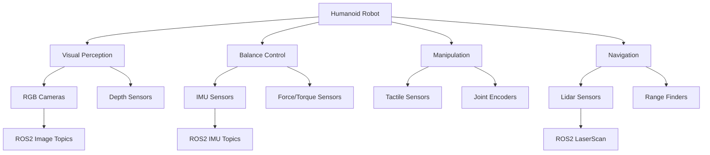
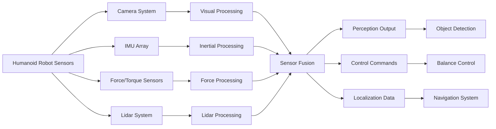

# Sensor Simulation in Humanoid Robotics

## Learning Objectives

By the end of this chapter, you will be able to:

1. Understand the fundamental principles of sensor simulation in Gazebo for humanoid robots
2. Configure and implement various sensor types including cameras, IMUs, force/torque sensors, and lidar systems
3. Integrate simulated sensors with ROS2 nodes for realistic perception and control
4. Troubleshoot common sensor simulation issues and optimize performance
5. Design sensor fusion architectures for humanoid robot applications
6. Validate sensor data accuracy and reliability in simulated environments

## Introduction

Sensor simulation plays a crucial role in humanoid robotics development, enabling researchers and engineers to test perception algorithms, control systems, and navigation strategies in safe, controlled, and repeatable environments. Gazebo provides a sophisticated physics engine and sensor simulation capabilities that allow for realistic modeling of various sensor modalities essential for humanoid robot operation.

Humanoid robots require a diverse array of sensors to perceive their environment, maintain balance, interact with objects, and navigate safely. These sensors include vision systems for object recognition and scene understanding, inertial measurement units (IMUs) for balance and orientation, force/torque sensors for manipulation and contact detection, and range sensors for obstacle avoidance and mapping.

In this chapter, we'll explore how to simulate these critical sensor systems in Gazebo, focusing on practical implementation and integration with ROS2-based control frameworks. We'll cover both the theoretical foundations of sensor simulation and hands-on examples that demonstrate real-world applications.

## Prerequisites

Before diving into sensor simulation, ensure you have:

- Basic understanding of ROS2 concepts and Python programming
- Familiarity with URDF/Xacro for robot modeling
- Experience with Gazebo simulation environment
- Knowledge of basic physics and sensor principles
- Installed ROS2 Humble with Gazebo Garden integration

## Theory & Concepts

### Camera Sensors

Camera sensors in Gazebo simulate RGB cameras, depth cameras, and stereo cameras. These sensors are crucial for humanoid robots to perform visual perception tasks such as object recognition, facial detection, and scene understanding.

The camera sensor model in Gazebo includes:
- **Image resolution**: Configurable width and height
- **Field of view**: Horizontal and vertical viewing angles
- **Noise characteristics**: Gaussian noise simulation
- **Distortion parameters**: Lens distortion modeling

### Inertial Measurement Units (IMUs)

IMUs are vital for humanoid balance and orientation control. They typically include:
- **Accelerometers**: Measure linear acceleration
- **Gyroscopes**: Measure angular velocity
- **Magnetometers**: Provide magnetic field measurements

In Gazebo, IMU sensors simulate realistic noise characteristics and drift patterns that match real-world hardware.

### Force/Torque Sensors

Force/torque sensors enable precise manipulation and contact detection. They measure:
- **Six-axis forces**: X, Y, Z forces
- **Six-axis torques**: Roll, pitch, yaw moments

These sensors are particularly important for humanoid robots performing grasping, walking, and interaction tasks.

### Lidar Sensors

Lidar sensors provide 2D or 3D range measurements for navigation and mapping:
- **2D lidar**: Single plane scanning
- **3D lidar**: Multiple planes for volumetric sensing
- **Ray tracing**: Accurate distance measurements

### Other Relevant Sensors

Additional sensors for humanoid robots include:
- **GPS sensors**: Global positioning
- **Contact sensors**: Collision detection
- **Joint position/velocity sensors**: Proprioceptive feedback



## Practical Implementation

Let's implement sensor simulation for a humanoid robot in Gazebo with practical examples.

### 1. Camera Sensor Configuration

First, let's create a URDF configuration for a camera sensor mounted on the humanoid robot's head:

```xml
<!-- Camera sensor configuration -->
<gazebo reference="camera_link">
  <sensor type="camera" name="camera_sensor">
    <update_rate>30.0</update_rate>
    <camera name="head_camera">
      <horizontal_fov>1.3962634</horizontal_fov> <!-- 80 degrees -->
      <image>
        <width>640</width>
        <height>480</height>
        <format>R8G8B8</format>
      </image>
      <clip>
        <near>0.1</near>
        <far>100.0</far>
      </clip>
      <noise>
        <type>gaussian</type>
        <mean>0.0</mean>
        <stddev>0.007</stddev>
      </noise>
    </camera>
    <plugin name="camera_controller" filename="libgazebo_ros_camera.so">
      <frame_name>camera_optical_frame</frame_name>
      <min_depth>0.1</min_depth>
      <max_depth>100.0</max_depth>
      <update_rate>30.0</update_rate>
      <always_on>true</always_on>
    </plugin>
  </sensor>
</gazebo>
```

### 2. IMU Sensor Implementation

Here's how to configure an IMU sensor for the humanoid robot's torso:

```xml
<!-- IMU sensor configuration -->
<gazebo reference="torso_link">
  <sensor name="imu_sensor" type="imu">
    <always_on>true</always_on>
    <update_rate>100</update_rate>
    <visualize>true</visualize>
    <imu>
      <angular_velocity>
        <x>
          <noise type="gaussian">
            <mean>0.0</mean>
            <stddev>2e-4</stddev>
            <bias_mean>0.1</bias_mean>
            <bias_stddev>0.001</bias_stddev>
          </noise>
        </x>
        <y>
          <noise type="gaussian">
            <mean>0.0</mean>
            <stddev>2e-4</stddev>
            <bias_mean>0.1</bias_mean>
            <bias_stddev>0.001</bias_stddev>
          </noise>
        </y>
        <z>
          <noise type="gaussian">
            <mean>0.0</mean>
            <stddev>2e-4</stddev>
            <bias_mean>0.1</bias_mean>
            <bias_stddev>0.001</bias_stddev>
          </noise>
        </z>
      </angular_velocity>
      <linear_acceleration>
        <x>
          <noise type="gaussian">
            <mean>0.0</mean>
            <stddev>1.7e-2</stddev>
            <bias_mean>0.1</bias_mean>
            <bias_stddev>0.001</bias_stddev>
          </noise>
        </x>
        <y>
          <noise type="gaussian">
            <mean>0.0</mean>
            <stddev>1.7e-2</stddev>
            <bias_mean>0.1</bias_mean>
            <bias_stddev>0.001</bias_stddev>
          </noise>
        </y>
        <z>
          <noise type="gaussian">
            <mean>0.0</mean>
            <stddev>1.7e-2</stddev>
            <bias_mean>0.1</bias_mean>
            <bias_stddev>0.001</bias_stddev>
          </noise>
        </z>
      </linear_acceleration>
    </imu>
    <plugin name="imu_plugin" filename="libgazebo_ros_imu.so">
      <frame_name>torso_imu_frame</frame_name>
      <topic>imu/data</topic>
      <serviceName>imu/service</serviceName>
      <gaussian_noise>0.001</gaussian_noise>
    </plugin>
  </sensor>
</gazebo>
```

### 3. Force/Torque Sensor Setup

For force/torque sensors in the humanoid robot's feet and hands:

```xml
<!-- Force/Torque sensor configuration -->
<gazebo reference="left_foot_link">
  <sensor name="ft_left_foot" type="force_torque">
    <always_on>true</always_on>
    <update_rate>100</update_rate>
    <force_torque>
      <frame>child</frame>
      <measure_direction>child_to_parent</measure_direction>
    </force_torque>
    <plugin name="ft_sensor_plugin" filename="libgazebo_ros_ft_sensor.so">
      <frame_name>left_foot_force_torque_frame</frame_name>
      <topic>left_foot/force_torque</topic>
      <update_rate>100</update_rate>
    </plugin>
  </sensor>
</gazebo>
```

### 4. Python Sensor Data Processing Node

Now, let's create a Python node to process sensor data from the simulated humanoid:

```python
#!/usr/bin/env python3
"""
Sensor Data Processing Node for Humanoid Robot
This node subscribes to various sensor topics and processes the data
for perception and control applications.
"""

import rclpy
from rclpy.node import Node
from sensor_msgs.msg import Image, Imu, JointState, PointCloud2
from geometry_msgs.msg import Vector3Stamped
from nav_msgs.msg import Odometry
from cv_bridge import CvBridge
import numpy as np
import cv2


class HumanoidSensorProcessor(Node):
    def __init__(self):
        super().__init__('humanoid_sensor_processor')

        # Initialize CV bridge for image processing
        self.bridge = CvBridge()

        # Subscribers for different sensor types
        self.camera_sub = self.create_subscription(
            Image,
            '/camera/image_raw',
            self.camera_callback,
            10
        )

        self.imu_sub = self.create_subscription(
            Imu,
            '/imu/data',
            self.imu_callback,
            10
        )

        self.joint_state_sub = self.create_subscription(
            JointState,
            '/joint_states',
            self.joint_state_callback,
            10
        )

        # Publishers for processed data
        self.balance_pub = self.create_publisher(
            Vector3Stamped,
            '/balance_status',
            10
        )

        self.perception_pub = self.create_publisher(
            Odometry,
            '/perception_result',
            10
        )

        # Timer for periodic processing
        self.processing_timer = self.create_timer(0.1, self.periodic_processing)

        # Internal state variables
        self.current_imu_data = None
        self.current_joint_positions = {}
        self.image_counter = 0

        self.get_logger().info('Humanoid Sensor Processor initialized')

    def camera_callback(self, msg):
        """Process incoming camera data"""
        try:
            # Convert ROS Image to OpenCV format
            cv_image = self.bridge.imgmsg_to_cv2(msg, desired_encoding='bgr8')

            # Perform basic image processing
            gray_image = cv2.cvtColor(cv_image, cv2.COLOR_BGR2GRAY)

            # Detect edges for obstacle detection
            edges = cv2.Canny(gray_image, 50, 150)

            # Calculate some basic statistics
            edge_density = np.sum(edges > 0) / (edges.shape[0] * edges.shape[1])

            # Publish perception result
            perception_msg = Odometry()
            perception_msg.header.stamp = self.get_clock().now().to_msg()
            perception_msg.header.frame_id = 'camera_link'
            perception_msg.pose.pose.position.z = float(edge_density)  # Simplified representation

            self.perception_pub.publish(perception_msg)

            self.image_counter += 1
            if self.image_counter % 30 == 0:  # Log every 3 seconds
                self.get_logger().info(f'Processed {self.image_counter} camera frames')

        except Exception as e:
            self.get_logger().error(f'Error processing camera data: {str(e)}')

    def imu_callback(self, msg):
        """Process incoming IMU data for balance control"""
        self.current_imu_data = {
            'orientation': (msg.orientation.x, msg.orientation.y, msg.orientation.z, msg.orientation.w),
            'angular_velocity': (msg.angular_velocity.x, msg.angular_velocity.y, msg.angular_velocity.z),
            'linear_acceleration': (msg.linear_acceleration.x, msg.linear_acceleration.y, msg.linear_acceleration.z)
        }

        # Calculate tilt angle for balance assessment
        roll, pitch, yaw = self.quaternion_to_euler(msg.orientation)

        # Publish balance status
        balance_msg = Vector3Stamped()
        balance_msg.header.stamp = self.get_clock().now().to_msg()
        balance_msg.header.frame_id = 'base_link'
        balance_msg.vector.x = roll
        balance_msg.vector.y = pitch
        balance_msg.vector.z = yaw

        self.balance_pub.publish(balance_msg)

        # Log if tilt is excessive (for balance correction)
        if abs(roll) > 0.3 or abs(pitch) > 0.3:
            self.get_logger().warn(f'Excessive tilt detected: roll={roll:.3f}, pitch={pitch:.3f}')

    def joint_state_callback(self, msg):
        """Process joint state data"""
        for i, name in enumerate(msg.name):
            if i < len(msg.position):
                self.current_joint_positions[name] = msg.position[i]

    def periodic_processing(self):
        """Periodic processing of sensor data"""
        if self.current_imu_data is not None:
            # Calculate derived metrics from IMU data
            linear_acc = self.current_imu_data['linear_acceleration']
            total_acceleration = np.sqrt(linear_acc[0]**2 + linear_acc[1]**2 + linear_acc[2]**2)

            # Check for impacts or sudden movements
            if total_acceleration > 15.0:  # Threshold for impact detection
                self.get_logger().info('High acceleration detected - possible impact')

    def quaternion_to_euler(self, q):
        """Convert quaternion to Euler angles (roll, pitch, yaw)"""
        import math

        # Normalize quaternion
        norm = np.sqrt(q.x**2 + q.y**2 + q.z**2 + q.w**2)
        qx, qy, qz, qw = q.x/norm, q.y/norm, q.z/norm, q.w/norm

        # Roll (x-axis rotation)
        sinr_cosp = 2 * (qw * qx + qy * qz)
        cosr_cosp = 1 - 2 * (qx * qx + qy * qy)
        roll = math.atan2(sinr_cosp, cosr_cosp)

        # Pitch (y-axis rotation)
        sinp = 2 * (qw * qy - qz * qx)
        if abs(sinp) >= 1:
            pitch = math.copysign(math.pi / 2, sinp)  # Use 90 degrees if out of range
        else:
            pitch = math.asin(sinp)

        # Yaw (z-axis rotation)
        siny_cosp = 2 * (qw * qz + qx * qy)
        cosy_cosp = 1 - 2 * (qy * qy + qz * qz)
        yaw = math.atan2(siny_cosp, cosy_cosp)

        return roll, pitch, yaw


def main(args=None):
    rclpy.init(args=args)
    processor = HumanoidSensorProcessor()

    try:
        rclpy.spin(processor)
    except KeyboardInterrupt:
        processor.get_logger().info('Shutting down sensor processor...')
    finally:
        processor.destroy_node()
        rclpy.shutdown()


if __name__ == '__main__':
    main()
```

### 5. Launch File for Sensor Simulation

Create a launch file to bring up the sensor simulation:

```python
from launch import LaunchDescription
from launch_ros.actions import Node
from launch.actions import ExecuteProcess
from ament_index_python.packages import get_package_share_directory
import os


def generate_launch_description():
    # Get package directory
    pkg_dir = get_package_share_directory('humanoid_sensor_sim')

    return LaunchDescription([
        # Start Gazebo with world file
        ExecuteProcess(
            cmd=['gz', 'sim', '-r', os.path.join(pkg_dir, 'worlds', 'humanoid_world.sdf')],
            output='screen'
        ),

        # Launch sensor processing node
        Node(
            package='humanoid_sensor_sim',
            executable='sensor_processor',
            name='humanoid_sensor_processor',
            output='screen',
            parameters=[
                {'use_sim_time': True}
            ]
        ),

        # Launch RViz for visualization
        Node(
            package='rviz2',
            executable='rviz2',
            name='rviz2',
            arguments=['-d', os.path.join(pkg_dir, 'config', 'sensor_rviz.rviz')],
            output='screen'
        )
    ])
```

### 6. Advanced Sensor Fusion Architecture

Here's a more advanced sensor fusion node that combines multiple sensor inputs:

```python
#!/usr/bin/env python3
"""
Advanced Sensor Fusion Node for Humanoid Robot
Combines data from multiple sensors for improved perception and control
"""

import rclpy
from rclpy.node import Node
from sensor_msgs.msg import Imu, JointState, PointCloud2
from geometry_msgs.msg import PoseWithCovarianceStamped, TwistWithCovarianceStamped
from tf2_ros import TransformBroadcaster
import numpy as np
from scipy.spatial.transform import Rotation as R


class HumanoidSensorFusion(Node):
    def __init__(self):
        super().__init__('humanoid_sensor_fusion')

        # Subscribers for multiple sensor types
        self.imu_sub = self.create_subscription(
            Imu, '/imu/data', self.imu_callback, 10
        )
        self.joint_sub = self.create_subscription(
            JointState, '/joint_states', self.joint_callback, 10
        )

        # Publisher for fused state estimate
        self.state_pub = self.create_publisher(
            PoseWithCovarianceStamped, '/fused_state_estimate', 10
        )

        # Timer for fusion algorithm
        self.fusion_timer = self.create_timer(0.05, self.sensor_fusion_algorithm)

        # State estimation variables
        self.imu_orientation = np.array([0.0, 0.0, 0.0, 1.0])  # w, x, y, z
        self.joint_positions = {}
        self.last_update_time = self.get_clock().now()

        # Covariance matrix for state uncertainty
        self.covariance_matrix = np.eye(6) * 0.1  # Initial uncertainty

        self.get_logger().info('Humanoid Sensor Fusion Node initialized')

    def imu_callback(self, msg):
        """Update orientation from IMU data"""
        self.imu_orientation = np.array([
            msg.orientation.w,
            msg.orientation.x,
            msg.orientation.y,
            msg.orientation.z
        ])

    def joint_callback(self, msg):
        """Update joint positions from joint state"""
        for i, name in enumerate(msg.name):
            if i < len(msg.position):
                self.joint_positions[name] = msg.position[i]

    def sensor_fusion_algorithm(self):
        """Main fusion algorithm combining multiple sensor inputs"""
        current_time = self.get_clock().now()
        dt = (current_time - self.last_update_time).nanoseconds / 1e9
        self.last_update_time = current_time

        # Simple complementary filter approach
        # Combine IMU orientation with kinematic predictions
        fused_orientation = self.imu_orientation.copy()

        # Predict position based on joint movements and IMU acceleration
        predicted_position = self.predict_position(dt)

        # Create fused state message
        state_msg = PoseWithCovarianceStamped()
        state_msg.header.stamp = current_time.to_msg()
        state_msg.header.frame_id = 'map'

        # Set position
        state_msg.pose.pose.position.x = predicted_position[0]
        state_msg.pose.pose.position.y = predicted_position[1]
        state_msg.pose.pose.position.z = predicted_position[2]

        # Set orientation from IMU
        state_msg.pose.pose.orientation.w = fused_orientation[0]
        state_msg.pose.pose.orientation.x = fused_orientation[1]
        state_msg.pose.pose.orientation.y = fused_orientation[2]
        state_msg.pose.pose.orientation.z = fused_orientation[3]

        # Set covariance
        state_msg.pose.covariance = self.covariance_matrix.flatten().tolist()

        self.state_pub.publish(state_msg)

        # Update uncertainty based on sensor confidence
        self.update_covariance(dt)

    def predict_position(self, dt):
        """Predict position based on current state and time delta"""
        # This is a simplified prediction - in practice, you'd use
        # forward kinematics, odometry integration, and IMU integration
        return np.array([0.0, 0.0, 1.0])  # Standing position

    def update_covariance(self, dt):
        """Update uncertainty based on sensor reliability"""
        # Increase uncertainty over time
        self.covariance_matrix *= 1.01

        # Decrease uncertainty when confident measurements arrive
        if self.imu_orientation is not None:
            # IMU provides good orientation data
            self.covariance_matrix[3:6, 3:6] *= 0.95  # Orientation uncertainty


def main(args=None):
    rclpy.init(args=args)
    fusion_node = HumanoidSensorFusion()

    try:
        rclpy.spin(fusion_node)
    except KeyboardInterrupt:
        fusion_node.get_logger().info('Shutting down sensor fusion node...')
    finally:
        fusion_node.destroy_node()
        rclpy.shutdown()


if __name__ == '__main__':
    main()
```



## Troubleshooting

### Common Issues and Solutions

:::warning
**Performance Issues with High-Resolution Sensors**
High-resolution cameras and dense lidar sensors can significantly impact simulation performance. Reduce resolution or update rates for initial testing.
:::

:::tip
**Sensor Noise Calibration**
Start with low noise values and gradually increase to match real hardware characteristics. This helps validate algorithms before deployment.
:::

:::danger
**Frame Rate Mismatch**
Ensure sensor update rates align with your control loop requirements. Mismatched timing can cause instability in control systems.
:::

### Issue 1: Sensor Data Not Publishing

**Problem**: Sensor topics show no data in `ros2 topic list`.

**Solution**:
1. Verify Gazebo plugins are properly loaded:
   ```bash
   ros2 run gazebo_ros gzclient
   ```
2. Check plugin filenames in URDF match available libraries:
   ```bash
   ls /usr/lib/x86_64-linux-gnu/gazebo-*/plugins/libgazebo_ros_*.so
   ```

### Issue 2: High CPU Usage

**Problem**: Simulation runs slowly with high CPU usage.

**Solution**:
- Reduce sensor update rates in URDF configuration
- Lower image resolution for camera sensors
- Use fewer ray samples for lidar sensors
- Optimize physics engine parameters

### Issue 3: Sensor Data Drift

**Problem**: IMU or force/torque sensors show drift over time.

**Solution**:
- Calibrate noise parameters in sensor configuration
- Implement software filtering in processing nodes
- Verify sensor mounting frame alignment

### Issue 4: Coordinate Frame Issues

**Problem**: Sensor data appears in wrong coordinate frame.

**Solution**:
- Verify TF transforms are properly published
- Check sensor frame names match expectations
- Use `tf2_tools` to visualize transform tree:
  ```bash
  ros2 run tf2_tools view_frames
  ```

## Summary

In this chapter, we explored the comprehensive topic of sensor simulation for humanoid robotics in Gazebo. Here are the key takeaways:

1. **Diverse Sensor Types**: Humanoid robots require multiple sensor modalities including cameras, IMUs, force/torque sensors, and lidar systems for complete environmental awareness and control.

2. **Realistic Simulation**: Gazebo provides sophisticated sensor models that include realistic noise characteristics, drift patterns, and physical properties matching real hardware.

3. **Integration with ROS2**: Sensor data flows seamlessly through ROS2 topics, enabling real-time processing and control applications.

4. **Performance Optimization**: Balancing sensor fidelity with simulation performance requires careful tuning of update rates, resolutions, and noise parameters.

5. **Sensor Fusion**: Combining data from multiple sensors improves reliability and accuracy of perception and control systems.

6. **Validation Framework**: Simulated sensors provide a controlled environment for validating algorithms before real-world deployment.

7. **Troubleshooting Preparedness**: Understanding common issues and their solutions is crucial for effective sensor simulation development.

## Further Reading

1. **Gazebo Documentation**: Official guide to sensor plugins and configuration options - [Gazebo Sensors Documentation](https://gazebosim.org/api/sim/7.0.0/sensors.html)

2. **ROS2 Sensor Integration**: Best practices for integrating sensors with ROS2 control systems - [ROS2 Sensor Tutorials](https://docs.ros.org/en/humble/Tutorials/Advanced/Sensors.html)

3. **Humanoid Robotics Research**: Academic papers on sensor placement and fusion for bipedal locomotion - IEEE Transactions on Robotics

4. **Computer Vision in Robotics**: Techniques for processing camera data in robotic applications - "Robotics, Vision and Control" by Peter Corke

5. **Inertial Navigation Systems**: Understanding IMU integration and error propagation in mobile robots - "Strapdown Inertial Navigation Technology" by Titterton & Weston