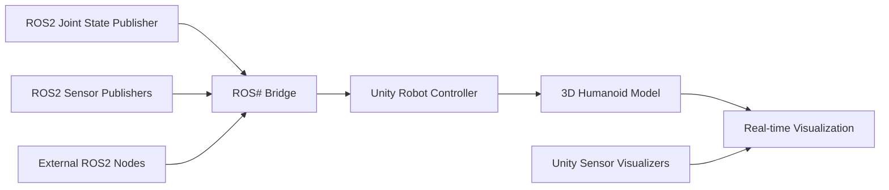

# Unity Visualization for Humanoid Robotics

Modern humanoid robotics development requires sophisticated visualization capabilities to understand robot behavior, sensor data, and environmental interactions. Unity, with its powerful graphics engine and physics simulation, provides an excellent platform for creating immersive 3D visualizations of humanoid robots. This chapter explores the integration of Unity with ROS2 for real-time visualization, focusing on humanoid-specific applications.

## Learning Objectives

By the end of this chapter, you will be able to:

1. Understand the architecture and components of Unity-ROS2 integration for humanoid robotics
2. Set up and configure the Unity Robotics Package and ROS# bridge for real-time communication
3. Implement C# scripts in Unity to visualize humanoid robot poses, joint angles, and sensor data
4. Create realistic humanoid robot models with proper kinematic chains in Unity
5. Integrate sensor visualization including cameras, LiDAR, and IMU data in Unity
6. Deploy Unity visualization applications that communicate with ROS2 nodes

## Introduction

Visualization plays a crucial role in humanoid robotics development, enabling researchers and engineers to observe robot behavior, debug control algorithms, and demonstrate capabilities to stakeholders. While traditional simulation tools like Gazebo provide functional visualization, Unity offers superior graphics quality, interactive capabilities, and cross-platform deployment options.

Unity's real-time rendering capabilities, combined with its extensive asset ecosystem and physics engine, make it ideal for creating photorealistic humanoid robot visualizations. The Unity Robotics Package and ROS# bridge facilitate seamless communication between Unity and ROS2, allowing for synchronized visualization of robot states, sensor data, and environmental interactions.

Humanoid robots present unique visualization challenges due to their complex kinematic structures, multiple degrees of freedom, and anthropomorphic appearance. Unity excels at rendering these complex articulated systems with smooth animations and realistic physics interactions.

## Theory and Concepts

### Unity-ROS2 Integration Architecture

The integration between Unity and ROS2 involves several key components that enable bidirectional communication and real-time synchronization. The architecture consists of:

- **ROS# Bridge**: A communication layer that enables direct ROS2 communication within Unity
- **Unity Robotics Package (URP)**: Official Unity package for robotics integration
- **Custom C# Scripts**: Application-specific logic for handling ROS2 messages
- **ROS2 Nodes**: External nodes publishing robot state and sensor data

The communication flow typically involves ROS2 nodes publishing joint states, sensor data, and robot transforms, which are received by Unity scripts and applied to the 3D robot model in real-time.



### ROS# Bridge Fundamentals

ROS# (pronounced "ROS Sharp") is a Unity plugin that enables direct communication between Unity and ROS2. It provides:

- **Message Types**: Predefined ROS2 message structures for Unity
- **Publisher/Subscriber System**: Native Unity interfaces for ROS2 communication
- **TF Transform Handling**: Coordinate system conversion between ROS2 and Unity
- **Service Calls**: Support for ROS2 service requests from Unity

The bridge handles the complexity of network communication, serialization, and deserialization of ROS2 messages, allowing Unity developers to focus on visualization logic rather than communication protocols.

### Unity Robotics Package Features

The Unity Robotics Package extends Unity's capabilities for robotics applications:

- **Robotics Library**: Pre-built components for common robotics tasks
- **Sensor Simulation**: Virtual sensors that can publish data to ROS2
- **TF Tree Management**: Automated transform hierarchy management
- **Physics Integration**: Enhanced collision detection and physics simulation
- **ROS2 Message Generators**: Tools for creating custom message types

For humanoid robotics, the package provides specialized components for managing complex kinematic chains and inverse kinematics solvers.

## Prerequisites

Before implementing Unity visualization for humanoid robots, ensure you have:

- Unity Hub and Unity 2021.3 LTS or later installed
- ROS2 Humble Hawksbill or newer with colcon build system
- Basic knowledge of C# programming and Unity development
- Understanding of ROS2 concepts (topics, services, messages)
- A humanoid robot URDF model or 3D mesh files
- Ubuntu 22.04 or Windows with WSL2 for ROS2 development

Install the following packages:

```bash
pip install ros2-unity-bridge
```

In Unity, install the Unity Robotics Package through the Package Manager.

## Practical Implementation

### Setting Up the Unity Environment

First, create a new Unity project and import the necessary packages. Create the following folder structure in your Unity project:

```
Assets/
├── Scripts/
│   ├── ROS2/
│   │   ├── ROS2Manager.cs
│   │   ├── JointStateSubscriber.cs
│   │   └── RobotVisualizer.cs
│   └── Sensors/
│       ├── CameraVisualizer.cs
│       └── PointCloudVisualizer.cs
├── Models/
│   └── HumanoidRobot/
└── Prefabs/
    └── HumanoidRobot.prefab
```

### ROS2 Manager Script

Create the main ROS2 manager script that handles connection and initialization:

```csharp
using UnityEngine;
using Unity.Robotics.ROSTCPConnector;
using Unity.Robotics.ROSTCPConnector.MessageTypes.Sensor;
using Unity.Robotics.ROSTCPConnector.MessageTypes.Std;

public class ROS2Manager : MonoBehaviour
{
    [Header("ROS2 Connection")]
    public string rosIPAddress = "127.0.0.1";
    public int rosPort = 10000;

    [Header("Topics")]
    public string jointStatesTopic = "/joint_states";
    public string cameraImageTopic = "/camera/image_raw";

    private RosConnection ros;

    void Start()
    {
        // Connect to ROS2
        ros = RosConnection.GetOrCreateInstance();
        ros.RegisterTCPConnectionListener(OnConnected);
        ros.Connect(rosIPAddress, rosPort);

        Debug.Log($"Connecting to ROS2 at {rosIPAddress}:{rosPort}");
    }

    void OnConnected(RosConnection connection)
    {
        Debug.Log("Successfully connected to ROS2!");
    }

    void OnDestroy()
    {
        if (ros != null)
        {
            ros.Disconnect();
        }
    }
}
```

### Joint State Subscriber for Humanoid Robots

Create a specialized joint state subscriber that handles humanoid robot kinematics:

```csharp
using UnityEngine;
using Unity.Robotics.ROSTCPConnector;
using Unity.Robotics.ROSTCPConnector.MessageTypes.Sensor;
using System.Collections.Generic;

public class JointStateSubscriber : MonoBehaviour
{
    [Header("Robot Configuration")]
    public string[] jointNames; // Array of joint names matching ROS2
    public Transform[] jointTransforms; // Corresponding Unity transforms

    [Header("Visualization Settings")]
    public bool applyJointStates = true;
    public float jointSpeedMultiplier = 1.0f;

    private Dictionary<string, Transform> jointMap;
    private RosConnection ros;

    void Start()
    {
        ros = RosConnection.GetOrCreateInstance();

        // Initialize joint mapping dictionary
        jointMap = new Dictionary<string, Transform>();
        for (int i = 0; i < jointNames.Length && i < jointTransforms.Length; i++)
        {
            jointMap[jointNames[i]] = jointTransforms[i];
        }

        // Subscribe to joint states topic
        ros.Subscribe<JointStateMsg>(jointStatesTopic, OnJointStateReceived);

        Debug.Log($"Subscribed to joint states topic: {jointStatesTopic}");
    }

    void OnJointStateReceived(JointStateMsg jointState)
    {
        if (!applyJointStates || jointState.name == null || jointState.position == null)
            return;

        // Update each joint position
        for (int i = 0; i < jointState.name.Count && i < jointState.position.Count; i++)
        {
            string jointName = jointState.name[i];
            double jointPosition = jointState.position[i];

            if (jointMap.ContainsKey(jointName))
            {
                Transform jointTransform = jointMap[jointName];

                // Apply rotation based on joint type (assuming revolute joints)
                // Convert radians to degrees for Unity
                float angleDegrees = (float)(jointPosition * Mathf.Rad2Deg);

                // Apply rotation - adjust axis based on joint configuration
                jointTransform.localRotation = Quaternion.Euler(0, angleDegrees, 0);
            }
        }
    }

    public void SetJointPositions(Dictionary<string, double> positions)
    {
        foreach (var pair in positions)
        {
            if (jointMap.ContainsKey(pair.Key))
            {
                Transform jointTransform = jointMap[pair.Key];
                float angleDegrees = (float)(pair.Value * Mathf.Rad2Deg);
                jointTransform.localRotation = Quaternion.Euler(0, angleDegrees, 0);
            }
        }
    }
}
```

### Humanoid Robot Visualizer

Create the main visualizer script that manages the complete robot model:

```csharp
using UnityEngine;
using System.Collections.Generic;

public class RobotVisualizer : MonoBehaviour
{
    [Header("Robot Components")]
    public GameObject robotModel;
    public Transform rootTransform;
    public Material[] materials;

    [Header("Visualization Settings")]
    public bool showTrajectory = true;
    public bool showSensorData = true;
    public Color trajectoryColor = Color.blue;

    [Header("Performance")]
    public int maxTrajectoryPoints = 100;
    public float trajectoryUpdateInterval = 0.1f;

    private LineRenderer trajectoryLine;
    private List<Vector3> trajectoryPoints;
    private float lastTrajectoryUpdate;

    void Start()
    {
        InitializeTrajectory();
        SetupRobotMaterials();
    }

    void Update()
    {
        UpdateTrajectory();
    }

    void InitializeTrajectory()
    {
        if (showTrajectory)
        {
            trajectoryLine = gameObject.AddComponent<LineRenderer>();
            trajectoryLine.material = new Material(Shader.Find("Sprites/Default"));
            trajectoryLine.color = trajectoryColor;
            trajectoryLine.startWidth = 0.05f;
            trajectoryLine.endWidth = 0.05f;
            trajectoryPoints = new List<Vector3>();
        }
    }

    void SetupRobotMaterials()
    {
        if (materials.Length > 0 && robotModel != null)
        {
            Renderer[] renderers = robotModel.GetComponentsInChildren<Renderer>();
            foreach (Renderer renderer in renderers)
            {
                renderer.material = materials[Random.Range(0, materials.Length)];
            }
        }
    }

    void UpdateTrajectory()
    {
        if (!showTrajectory || Time.time - lastTrajectoryUpdate < trajectoryUpdateInterval)
            return;

        lastTrajectoryUpdate = Time.time;

        Vector3 currentPosition = rootTransform.position;

        if (trajectoryPoints.Count == 0)
        {
            trajectoryPoints.Add(currentPosition);
        }
        else
        {
            Vector3 lastPoint = trajectoryPoints[trajectoryPoints.Count - 1];
            if (Vector3.Distance(currentPosition, lastPoint) > 0.1f) // Only add if moved significantly
            {
                trajectoryPoints.Add(currentPosition);

                if (trajectoryPoints.Count > maxTrajectoryPoints)
                {
                    trajectoryPoints.RemoveAt(0);
                }
            }
        }

        UpdateTrajectoryLine();
    }

    void UpdateTrajectoryLine()
    {
        if (trajectoryLine != null && trajectoryPoints.Count > 1)
        {
            trajectoryLine.positionCount = trajectoryPoints.Count;
            trajectoryLine.SetPositions(trajectoryPoints.ToArray());
        }
    }

    public void SetRobotPosition(Vector3 position)
    {
        rootTransform.position = position;
    }

    public void SetRobotRotation(Quaternion rotation)
    {
        rootTransform.rotation = rotation;
    }

    public void HighlightRobot(bool highlight)
    {
        Renderer[] renderers = robotModel.GetComponentsInChildren<Renderer>();
        foreach (Renderer renderer in renderers)
        {
            if (highlight)
            {
                renderer.material.color = Color.yellow;
            }
            else
            {
                renderer.material.color = Color.white; // Reset to original
            }
        }
    }
}
```

### Camera Sensor Visualization

Create a script to visualize camera data from ROS2:

```csharp
using UnityEngine;
using Unity.Robotics.ROSTCPConnector;
using Unity.Robotics.ROSTCPConnector.MessageTypes.Sensor;
using System.Collections.Generic;

public class CameraVisualizer : MonoBehaviour
{
    [Header("Camera Configuration")]
    public string cameraTopic = "/camera/image_raw";
    public int imageWidth = 640;
    public int imageHeight = 480;

    [Header("Display")]
    public Renderer displayRenderer;
    public Camera displayCamera;

    private Texture2D cameraTexture;
    private RosConnection ros;
    private bool textureInitialized = false;

    void Start()
    {
        ros = RosConnection.GetOrCreateInstance();
        ros.Subscribe<ImageMsg>(cameraTopic, OnImageReceived);

        Debug.Log($"Subscribed to camera topic: {cameraTopic}");
    }

    void OnImageReceived(ImageMsg imageMsg)
    {
        if (!textureInitialized)
        {
            InitializeTexture(imageMsg.width, imageMsg.height);
        }

        if (imageMsg.encoding == "rgb8" || imageMsg.encoding == "bgr8")
        {
            UpdateRGBTexture(imageMsg.data);
        }
        else if (imageMsg.encoding == "mono8")
        {
            UpdateMonoTexture(imageMsg.data);
        }
    }

    void InitializeTexture(uint width, uint height)
    {
        cameraTexture = new Texture2D((int)width, (int)height, TextureFormat.RGB24, false);
        textureInitialized = true;

        if (displayRenderer != null)
        {
            displayRenderer.material.mainTexture = cameraTexture;
        }
    }

    void UpdateRGBTexture(byte[] imageData)
    {
        if (cameraTexture == null) return;

        Color32[] colors = new Color32[imageData.Length / 3];

        for (int i = 0; i < colors.Length; i++)
        {
            int pixelIndex = i * 3;
            // ROS uses BGR, Unity expects RGB
            byte r = imageData[pixelIndex + 2]; // B -> R
            byte g = imageData[pixelIndex + 1]; // G -> G
            byte b = imageData[pixelIndex];     // R -> B
            colors[i] = new Color32(r, g, b, 255);
        }

        cameraTexture.SetPixels32(colors);
        cameraTexture.Apply();
    }

    void UpdateMonoTexture(byte[] imageData)
    {
        if (cameraTexture == null) return;

        Color32[] colors = new Color32[imageData.Length];

        for (int i = 0; i < colors.Length; i++)
        {
            byte gray = imageData[i];
            colors[i] = new Color32(gray, gray, gray, 255);
        }

        cameraTexture.SetPixels32(colors);
        cameraTexture.Apply();
    }
}
```

### Point Cloud Visualization

Create a script to visualize 3D point cloud data:

```csharp
using UnityEngine;
using Unity.Robotics.ROSTCPConnector;
using Unity.Robotics.ROSTCPConnector.MessageTypes.Sensor;
using System.Collections.Generic;

public class PointCloudVisualizer : MonoBehaviour
{
    [Header("Point Cloud Configuration")]
    public string pointCloudTopic = "/laser_scan_cloud";
    public GameObject pointPrefab;
    public float pointSize = 0.01f;
    public int maxPoints = 10000;

    [Header("Visualization")]
    public Color pointColor = Color.green;
    public bool dynamicUpdate = true;

    private RosConnection ros;
    private List<GameObject> pointObjects;
    private int pointCounter = 0;

    void Start()
    {
        ros = RosConnection.GetOrCreateInstance();
        ros.Subscribe<PointCloud2Msg>(pointCloudTopic, OnPointCloudReceived);

        pointObjects = new List<GameObject>();

        Debug.Log($"Subscribed to point cloud topic: {pointCloudTopic}");
    }

    void OnPointCloudReceived(PointCloud2Msg pointCloud)
    {
        if (!dynamicUpdate) return;

        ClearPreviousPoints();
        VisualizePointCloud(pointCloud);
    }

    void ClearPreviousPoints()
    {
        foreach (GameObject pointObj in pointObjects)
        {
            if (pointObj != null)
            {
                DestroyImmediate(pointObj);
            }
        }
        pointObjects.Clear();
    }

    void VisualizePointCloud(PointCloud2Msg pointCloud)
    {
        if (pointCloud.data == null || pointCloud.fields == null) return;

        // Find field indices
        int xIndex = -1, yIndex = -1, zIndex = -1;
        for (int i = 0; i < pointCloud.fields.Count; i++)
        {
            if (pointCloud.fields[i].name == "x") xIndex = i;
            else if (pointCloud.fields[i].name == "y") yIndex = i;
            else if (pointCloud.fields[i].name == "z") zIndex = i;
        }

        if (xIndex == -1 || yIndex == -1 || zIndex == -1) return;

        int pointStep = pointCloud.point_step;
        int numPoints = (int)(pointCloud.row_step / pointStep);

        for (int i = 0; i < Mathf.Min(numPoints, maxPoints); i++)
        {
            int offset = i * pointStep;

            // Extract coordinates (assuming float32 format)
            float x = System.BitConverter.ToSingle(pointCloud.data, offset + (xIndex * 4));
            float y = System.BitConverter.ToSingle(pointCloud.data, offset + (yIndex * 4));
            float z = System.BitConverter.ToSingle(pointCloud.data, offset + (zIndex * 4));

            Vector3 pointPos = new Vector3(x, y, z);

            GameObject pointObj = CreatePointObject(pointPos);
            pointObjects.Add(pointObj);
        }
    }

    GameObject CreatePointObject(Vector3 position)
    {
        GameObject pointObj;

        if (pointPrefab != null)
        {
            pointObj = Instantiate(pointPrefab, position, Quaternion.identity);
        }
        else
        {
            pointObj = GameObject.CreatePrimitive(PrimitiveType.Sphere);
            pointObj.transform.localScale = Vector3.one * pointSize;
            pointObj.GetComponent<Renderer>().material.color = pointColor;
        }

        pointObj.name = $"Point_{pointCounter++}";
        return pointObj;
    }
}
```

### ROS2 Publisher for Unity

Create a script to publish Unity-transformed data back to ROS2:

```csharp
using UnityEngine;
using Unity.Robotics.ROSTCPConnector;
using Unity.Robotics.ROSTCPConnector.MessageTypes.Geometry;
using Unity.Robotics.ROSTCPConnector.MessageTypes.Std;

public class UnityROSPublisher : MonoBehaviour
{
    [Header("Publishing Topics")]
    public string tfTopic = "/tf";
    public string poseTopic = "/robot_pose";
    public string twistTopic = "/cmd_vel";

    [Header("Robot Configuration")]
    public Transform robotTransform;
    public string frameId = "humanoid_base";
    public string childFrameId = "humanoid_odom";

    private RosConnection ros;
    private float publishRate = 0.1f; // 10 Hz
    private float lastPublishTime;

    void Start()
    {
        ros = RosConnection.GetOrCreateInstance();
        lastPublishTime = Time.time;
    }

    void Update()
    {
        if (Time.time - lastPublishTime >= publishRate)
        {
            PublishRobotPose();
            PublishTFTransform();
            lastPublishTime = Time.time;
        }
    }

    void PublishRobotPose()
    {
        if (ros == null) return;

        var poseMsg = new PoseStampedMsg
        {
            header = new HeaderMsg
            {
                stamp = new TimeMsg { sec = (int)Time.time, nanosec = (uint)((Time.time % 1) * 1e9) },
                frame_id = frameId
            },
            pose = new PoseMsg
            {
                position = new PointMsg
                {
                    x = robotTransform.position.x,
                    y = robotTransform.position.z, // Unity Y -> ROS Z
                    z = robotTransform.position.y  // Unity Z -> ROS Y
                },
                orientation = new QuaternionMsg
                {
                    x = robotTransform.rotation.x,
                    y = robotTransform.rotation.z,
                    z = robotTransform.rotation.y,
                    w = robotTransform.rotation.w
                }
            }
        };

        ros.Publish(poseTopic, poseMsg);
    }

    void PublishTFTransform()
    {
        if (ros == null) return;

        var tfMsg = new TFMessageMsg();
        var transformStamped = new TransformStampedMsg
        {
            header = new HeaderMsg
            {
                stamp = new TimeMsg { sec = (int)Time.time, nanosec = (uint)((Time.time % 1) * 1e9) },
                frame_id = frameId
            },
            child_frame_id = childFrameId,
            transform = new TransformMsg
            {
                translation = new Vector3Msg
                {
                    x = robotTransform.position.x,
                    y = robotTransform.position.z,
                    z = robotTransform.position.y
                },
                rotation = new QuaternionMsg
                {
                    x = robotTransform.rotation.x,
                    y = robotTransform.rotation.z,
                    z = robotTransform.rotation.y,
                    w = robotTransform.rotation.w
                }
            }
        };

        tfMsg.transforms.Add(transformStamped);
        ros.Publish(tfTopic, tfMsg);
    }
}
```

### Unity Scene Setup

Create a main scene with the following hierarchy:

```
Scene Root
├── ROS2Manager (with ROS2Manager.cs)
├── HumanoidRobot
│   ├── BaseLink
│   ├── Torso
│   ├── Head
│   ├── LeftArm
│   ├── RightArm
│   ├── LeftLeg
│   └── RightLeg
├── CameraVisualizer (with CameraVisualizer.cs)
├── PointCloudVisualizer (with PointCloudVisualizer.cs)
└── Environment
    ├── Ground
    ├── Obstacles
    └── Lighting
```

### Testing the Integration

Create a simple ROS2 publisher to test the visualization:

```python
#!/usr/bin/env python3
import rclpy
from rclpy.node import Node
from sensor_msgs.msg import JointState
from geometry_msgs.msg import Twist
import math
import numpy as np

class UnityTestPublisher(Node):
    def __init__(self):
        super().__init__('unity_test_publisher')

        # Joint state publisher
        self.joint_pub = self.create_publisher(JointState, '/joint_states', 10)

        # Timer for publishing
        self.timer = self.create_timer(0.1, self.publish_joint_states)

        self.time = 0.0

        self.get_logger().info('Unity test publisher started')

    def publish_joint_states(self):
        msg = JointState()
        msg.header.stamp = self.get_clock().now().to_msg()
        msg.header.frame_id = 'humanoid_base'

        # Define joint names for a simple humanoid
        joint_names = [
            'left_hip_joint', 'left_knee_joint', 'left_ankle_joint',
            'right_hip_joint', 'right_knee_joint', 'right_ankle_joint',
            'left_shoulder_joint', 'left_elbow_joint', 'left_wrist_joint',
            'right_shoulder_joint', 'right_elbow_joint', 'right_wrist_joint',
            'head_joint'
        ]

        positions = []
        for i, joint_name in enumerate(joint_names):
            # Create oscillating motion for demonstration
            pos = math.sin(self.time + i * 0.5) * 0.5
            positions.append(pos)

        msg.name = joint_names
        msg.position = positions
        msg.velocity = [0.0] * len(positions)
        msg.effort = [0.0] * len(positions)

        self.joint_pub.publish(msg)
        self.time += 0.1

def main(args=None):
    rclpy.init(args=args)
    node = UnityTestPublisher()

    try:
        rclpy.spin(node)
    except KeyboardInterrupt:
        pass
    finally:
        node.destroy_node()
        rclpy.shutdown()

if __name__ == '__main__':
    main()
```

Create a launch file for the test publisher:

```python
from launch import LaunchDescription
from launch_ros.actions import Node

def generate_launch_description():
    return LaunchDescription([
        Node(
            package='my_robot_bringup',
            executable='unity_test_publisher',
            name='unity_test_publisher',
            output='screen'
        ),
    ])
```

:::tip
When setting up Unity-ROS2 integration, start with simple joint state visualization before moving to complex sensor data. This helps isolate issues and ensures the basic communication pipeline is working correctly.
:::

:::warning
Unity uses a left-handed coordinate system while ROS2 uses right-handed coordinates. Pay special attention to coordinate transformations, especially when dealing with rotations and positions.
:::

## Advanced Features

### Custom Humanoid Animation System

For more sophisticated humanoid visualization, create an animation system that blends between different motion states:

```csharp
using UnityEngine;
using System.Collections.Generic;

public class HumanoidAnimationController : MonoBehaviour
{
    [Header("Animation States")]
    public AnimationClip idleClip;
    public AnimationClip walkClip;
    public AnimationClip runClip;
    public AnimationClip jumpClip;

    [Header("Motion Control")]
    public float walkSpeedThreshold = 0.5f;
    public float runSpeedThreshold = 2.0f;

    private Animator animator;
    private float currentSpeed;
    private bool isGrounded = true;

    void Start()
    {
        animator = GetComponent<Animator>();
        if (animator == null)
        {
            animator = gameObject.AddComponent<Animator>();
        }
    }

    void Update()
    {
        UpdateAnimationParameters();
    }

    void UpdateAnimationParameters()
    {
        if (animator != null)
        {
            animator.SetFloat("Speed", currentSpeed);
            animator.SetBool("IsGrounded", isGrounded);
            animator.SetFloat("Direction", 0f); // Update based on movement direction
        }
    }

    public void SetMovementSpeed(float speed)
    {
        currentSpeed = speed;

        // Determine animation state based on speed
        if (speed < walkSpeedThreshold)
        {
            animator.CrossFade("Idle", 0.2f);
        }
        else if (speed < runSpeedThreshold)
        {
            animator.CrossFade("Walk", 0.2f);
        }
        else
        {
            animator.CrossFade("Run", 0.2f);
        }
    }

    public void TriggerJump()
    {
        if (isGrounded && animator != null)
        {
            animator.SetTrigger("Jump");
            isGrounded = false;
        }
    }
}
```

### Multi-Robot Visualization

Extend the system to handle multiple humanoid robots simultaneously:

```csharp
using UnityEngine;
using System.Collections.Generic;

public class MultiRobotVisualizer : MonoBehaviour
{
    [System.Serializable]
    public class RobotConfiguration
    {
        public string robotName;
        public string jointStatesTopic;
        public GameObject robotPrefab;
        public Color robotColor;
    }

    public List<RobotConfiguration> robotConfigs;
    private Dictionary<string, GameObject> robotInstances;
    private Dictionary<string, JointStateSubscriber> robotControllers;

    void Start()
    {
        robotInstances = new Dictionary<string, GameObject>();
        robotControllers = new Dictionary<string, JointStateSubscriber>();

        SpawnRobots();
    }

    void SpawnRobots()
    {
        foreach (var config in robotConfigs)
        {
            GameObject robot = Instantiate(config.robotPrefab);
            robot.name = config.robotName;

            // Apply color to robot materials
            Renderer[] renderers = robot.GetComponentsInChildren<Renderer>();
            foreach (Renderer renderer in renderers)
            {
                renderer.material.color = config.robotColor;
            }

            robotInstances[config.robotName] = robot;

            // Configure joint state subscriber
            JointStateSubscriber controller = robot.GetComponent<JointStateSubscriber>();
            if (controller != null)
            {
                controller.jointStatesTopic = config.jointStatesTopic;
                robotControllers[config.robotName] = controller;
            }
        }
    }

    public void MoveRobot(string robotName, Vector3 position, Quaternion rotation)
    {
        if (robotInstances.ContainsKey(robotName))
        {
            robotInstances[robotName].transform.position = position;
            robotInstances[robotName].transform.rotation = rotation;
        }
    }
}
```

## Troubleshooting

### Common Issues and Solutions

#### 1. Connection Problems
**Issue**: Unity cannot connect to ROS2.
**Solution**: Verify that:
- ROS2 daemon is running (`ros2 daemon start`)
- IP address and port match between Unity and ROS2
- Network firewall allows connections on the specified port
- Both Unity and ROS2 are on the same network

#### 2. Coordinate System Mismatches
**Issue**: Robot appears rotated or positioned incorrectly.
**Solution**:
- Check coordinate system conversions between ROS2 (right-handed) and Unity (left-handed)
- Verify quaternion multiplication order
- Adjust joint axis orientations in Unity to match ROS2 URDF

#### 3. Performance Issues
**Issue**: Low frame rate when visualizing many points or complex scenes.
**Solution**:
- Reduce point cloud resolution or maximum points
- Use object pooling for frequently instantiated objects
- Optimize shaders and reduce draw calls
- Consider LOD (Level of Detail) systems

#### 4. Joint State Synchronization
**Issue**: Joint movements appear jerky or delayed.
**Solution**:
- Increase ROS2 publisher frequency
- Implement interpolation between received joint states
- Check network latency between Unity and ROS2 nodes

#### 5. Memory Leaks
**Issue**: Unity application memory usage increases over time.
**Solution**:
- Properly dispose of unused textures and objects
- Implement object pooling for frequently created/destroyed objects
- Monitor garbage collection patterns

### Debugging Tips

```csharp
// Add debug logging to track message reception
void OnJointStateReceived(JointStateMsg jointState)
{
    Debug.Log($"Received joint state with {jointState.name.Count} joints at time {Time.time}");

    // Log individual joint values
    for (int i = 0; i < Mathf.Min(jointState.name.Count, jointState.position.Count); i++)
    {
        Debug.Log($"{jointState.name[i]}: {jointState.position[i]}");
    }
}
```

:::danger
Always ensure proper cleanup of ROS2 connections when Unity applications close to prevent hanging connections that could affect other ROS2 nodes.
:::

## Summary

This chapter covered the essential aspects of Unity visualization for humanoid robotics:

1. **Architecture**: Understanding the ROS# bridge and Unity Robotics Package integration layers that enable real-time communication between Unity and ROS2.

2. **Implementation**: Developing C# scripts for joint state visualization, sensor data display, and real-time robot pose updates with proper coordinate system handling.

3. **Sensor Integration**: Implementing camera and point cloud visualization systems that can display live sensor data from ROS2 nodes.

4. **Humanoid-Specific Features**: Creating specialized components for complex humanoid kinematics and multi-robot scenarios.

5. **Performance Optimization**: Techniques for maintaining smooth visualization performance with large datasets and complex scenes.

6. **Coordinate Systems**: Critical considerations for converting between ROS2's right-handed and Unity's left-handed coordinate systems.

The Unity-ROS2 integration provides powerful visualization capabilities that enhance the development and debugging experience for humanoid robotics projects, offering high-quality graphics and interactive environments that complement traditional simulation tools.

## Further Reading

1. [Unity Robotics Package Documentation](https://github.com/Unity-Technologies/Unity-Robotics-Hub) - Official documentation for the Unity Robotics Package with examples and best practices.

2. [ROS# Unity Plugin Guide](https://github.com/siemens/ros-sharp) - Comprehensive guide to the ROS# bridge for Unity integration.

3. [Humanoid Robot Kinematics in Unity](https://docs.unity3d.com/Manual/InverseKinematics.html) - Unity's documentation on implementing inverse kinematics for humanoid robots.

4. [Real-time Robot Visualization Techniques](https://ieeexplore.ieee.org/document/9421834) - Research paper on advanced visualization methods for robotics applications.

5. [Unity Performance Optimization for Robotics](https://docs.unity3d.com/Manual/OptimizingGraphicsPerformance.html) - Unity's guide to optimizing graphics performance, particularly relevant for complex robotic visualizations.