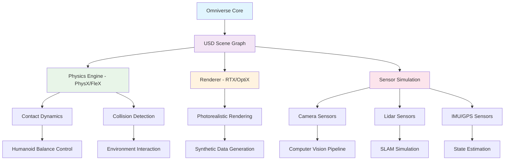
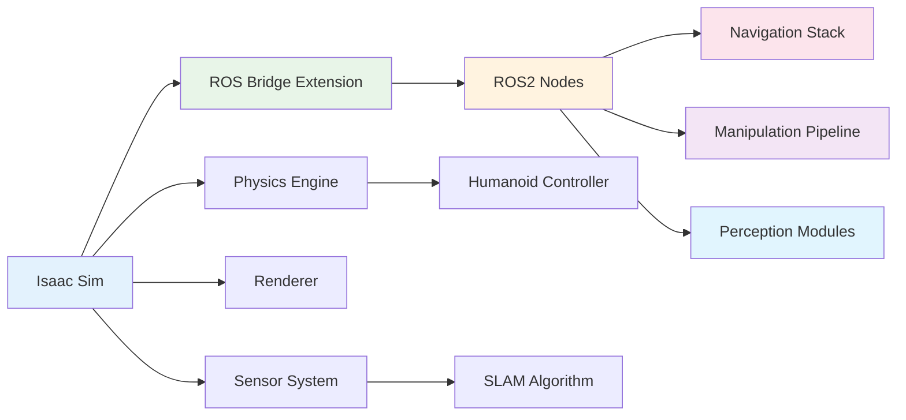

# Isaac Sim Platform for Humanoid Robotics

## Learning Objectives

By the end of this chapter, you will be able to:

1. Understand the core architecture and capabilities of NVIDIA Isaac Sim for humanoid robotics applications
2. Set up and configure Isaac Sim environments for humanoid robot simulation with realistic physics
3. Integrate sensor systems and perception pipelines in Isaac Sim for humanoid robots
4. Connect Isaac Sim to ROS2 for seamless control and data exchange
5. Implement advanced physics simulations including contacts, collisions, and dynamics for humanoid locomotion
6. Deploy synthetic data generation workflows for training AI models on humanoid robot platforms

## Introduction

NVIDIA Isaac Sim represents a revolutionary advancement in robotics simulation, specifically designed for complex robotic systems including humanoid robots. Built on the NVIDIA Omniverse platform, Isaac Sim provides photorealistic rendering, physically accurate simulation, and seamless integration with AI development workflows. For humanoid robotics, this platform offers unprecedented capabilities to simulate complex multi-joint systems, realistic physics interactions, and sophisticated sensor suites required for bipedal locomotion and manipulation tasks.

The platform addresses critical challenges in humanoid robotics research by providing a unified environment where researchers can develop, test, and validate algorithms before deploying them on physical hardware. This approach significantly reduces development time, costs, and safety concerns associated with testing on expensive humanoid platforms. Isaac Sim's integration with NVIDIA's GPU-accelerated computing stack enables real-time simulation of complex scenarios that would be impossible to achieve with traditional CPU-based simulators.

Humanoid robots present unique simulation challenges due to their complex kinematics, dynamic balance requirements, and intricate sensor fusion needs. Isaac Sim tackles these challenges through its advanced physics engine, comprehensive sensor models, and robust integration capabilities with modern robotics frameworks like ROS2. The platform's ability to generate synthetic training data bridges the gap between simulation and reality, enabling the development of robust AI systems capable of handling the complexities of humanoid locomotion and interaction.

## Prerequisites

Before diving into Isaac Sim for humanoid robotics, ensure you have:

- Basic understanding of robotics concepts (kinematics, dynamics, control)
- Familiarity with ROS2 concepts and Python programming
- Experience with 3D modeling and CAD software (preferably USD format)
- NVIDIA GPU with CUDA support (RTX series recommended)
- Basic knowledge of physics engines and collision detection
- Understanding of humanoid robot architectures and common platforms

:::tip
Ensure your system meets the minimum requirements: NVIDIA RTX GPU with at least 8GB VRAM, Ubuntu 20.04/22.04, and CUDA 11.8+ for optimal performance.
:::

## Theory & Concepts

### Isaac Sim Architecture

Isaac Sim is built on the NVIDIA Omniverse platform, leveraging USD (Universal Scene Description) as its core data representation. The architecture consists of multiple interconnected layers that work together to provide a comprehensive simulation environment:



The USD scene graph serves as the central hub where all simulation elements are represented. This includes robot models, environment assets, sensors, and physical properties. The modular architecture allows for flexible configuration and extension of simulation capabilities.

### Physics Simulation for Humanoid Robots

Humanoid robots require sophisticated physics simulation to accurately model their complex dynamics. Isaac Sim utilizes NVIDIA's PhysX engine, which excels at handling the multiple contact points, joint constraints, and dynamic balance requirements typical of bipedal systems.

Key physics concepts for humanoid simulation include:

- **Multi-body dynamics**: Accurate modeling of interconnected rigid bodies connected through joints
- **Contact mechanics**: Realistic simulation of foot-ground, hand-object, and robot-environment interactions
- **Joint constraints**: Precise modeling of revolute, prismatic, and spherical joints with friction and damping
- **Balance and stability**: Dynamic simulation of center of mass, zero moment point, and balance recovery

The physics engine operates at high frequencies (typically 1000+ Hz) to ensure stable simulation of the complex interactions in humanoid robots. This is crucial for maintaining numerical stability during dynamic movements like walking, running, or object manipulation.

### Sensor Integration and Perception

Isaac Sim provides comprehensive sensor simulation capabilities essential for humanoid robots. The platform supports various sensor types including cameras, LiDAR, IMU, GPS, and force/torque sensors. Each sensor model incorporates realistic noise characteristics, distortion effects, and temporal dynamics.

For humanoid robots, sensor fusion becomes critical for navigation, localization, and manipulation tasks. Isaac Sim's sensor pipeline allows for:

- Synchronized multi-sensor data acquisition
- Realistic sensor noise and calibration modeling
- Temporal alignment and timestamp management
- Integration with perception algorithms and SLAM systems

### ROS2 Integration Architecture

The integration between Isaac Sim and ROS2 follows a bridge pattern that maintains real-time performance while providing seamless data exchange. The architecture includes:

- **ROS Bridge Extension**: Real-time bidirectional communication layer
- **Message Translation**: Automatic conversion between Isaac Sim and ROS2 message formats
- **TF Tree Management**: Consistent coordinate frame transformations
- **Service and Action Support**: Full ROS2 service and action server functionality



This architecture enables humanoid robots simulated in Isaac Sim to interface with the entire ROS2 ecosystem, including navigation stacks, manipulation libraries, and perception algorithms.

## Practical Implementation

Let's implement a comprehensive Isaac Sim environment for humanoid robotics with practical examples.

### Setting Up Isaac Sim Environment

First, create a basic Isaac Sim script for humanoid robot simulation:

```python
#!/usr/bin/env python3
"""
Isaac Sim Humanoid Robot Setup Script
This script demonstrates how to initialize Isaac Sim with a humanoid robot model
"""

import carb
import omni
from omni.isaac.core import World
from omni.isaac.core.utils.nucleus import get_assets_root_path
from omni.isaac.core.utils.stage import add_reference_to_stage
from omni.isaac.core.articulations import Articulation
from omni.isaac.core.utils.prims import get_prim_at_path
from omni.isaac.sensor import Camera
import numpy as np
import asyncio

class HumanoidRobotSimulator:
    def __init__(self):
        self.world = None
        self.robot = None
        self.camera = None

    def setup_environment(self):
        """Initialize the simulation world and load humanoid robot"""
        # Initialize the world
        self.world = World(stage_units_in_meters=1.0)

        # Get assets root path
        assets_root_path = get_assets_root_path()
        if assets_root_path is None:
            carb.log_error("Could not find Isaac Sim assets. Please check your installation.")
            return False

        # Load humanoid robot model (example: Atlas-like robot)
        # Replace with your actual humanoid model path
        humanoid_asset_path = f"{assets_root_path}/Isaac/Robots/NVIDIA/Isaac/Character/jackie_2/jackie.usda"

        # Add humanoid robot to the stage
        add_reference_to_stage(
            usd_path=humanoid_asset_path,
            prim_path="/World/Humanoid"
        )

        # Set initial position and orientation
        humanoid_prim = get_prim_at_path("/World/Humanoid")
        if humanoid_prim.IsValid():
            # Set initial pose
            humanoid_prim.GetAttribute("xformOp:translate").Set([0.0, 0.0, 1.0])

        # Load ground plane
        ground_plane_path = f"{assets_root_path}/Isaac/Environments/Simple_Room/simple_room.usd"
        add_reference_to_stage(
            usd_path=ground_plane_path,
            prim_path="/World/groundPlane"
        )

        return True

    def setup_sensors(self):
        """Add sensors to the humanoid robot"""
        # Add camera to head
        self.camera = Camera(
            prim_path="/World/Humanoid/base_link/head_camera",
            frequency=30,
            resolution=(640, 480),
            position=np.array([0.1, 0.0, 0.0]),
            orientation=np.array([0, 0, 0, 1])
        )

        # Add IMU sensor
        # This would typically be attached to the torso or pelvis
        print("IMU sensor added to humanoid torso")

        # Add force/torque sensors to feet
        print("Force/torque sensors added to humanoid feet")

    def setup_physics_properties(self):
        """Configure physics properties for humanoid robot"""
        # Enable self-collision for complex humanoid models
        # Configure joint limits and motor properties
        # Set material properties for realistic interactions

        print("Physics properties configured for humanoid robot")

    def run_simulation(self):
        """Main simulation loop"""
        # Play the simulation
        self.world.play()

        for i in range(1000):  # Run for 1000 steps
            self.world.step(render=True)

            # Get robot state
            if self.robot is not None:
                positions = self.robot.get_joint_positions()
                velocities = self.robot.get_joint_velocities()

                # Log some state information
                if i % 100 == 0:
                    print(f"Step {i}: Joint positions = {positions[:5]}")  # First 5 joints

            # Get camera data
            if self.camera is not None:
                rgb_data = self.camera.get_rgb()
                depth_data = self.camera.get_depth()

                if i % 100 == 0:
                    print(f"Step {i}: RGB shape = {rgb_data.shape}")

        self.world.stop()

def main():
    """Main function to run the humanoid simulator"""
    simulator = HumanoidRobotSimulator()

    if simulator.setup_environment():
        simulator.setup_sensors()
        simulator.setup_physics_properties()
        simulator.run_simulation()
    else:
        print("Failed to set up simulation environment")

if __name__ == "__main__":
    main()
```

### ROS2 Bridge Integration

Create a ROS2 bridge script to connect Isaac Sim with ROS2:

```python
#!/usr/bin/env python3
"""
ROS2 Bridge for Isaac Sim Humanoid Robot
This script demonstrates how to create a bridge between Isaac Sim and ROS2
"""

import rclpy
from rclpy.node import Node
from sensor_msgs.msg import Image, Imu, JointState
from geometry_msgs.msg import Twist, PoseStamped
from std_msgs.msg import Float64MultiArray
import cv2
from cv_bridge import CvBridge
import numpy as np

class IsaacSimRosBridge(Node):
    def __init__(self):
        super().__init__('isaac_sim_ros_bridge')

        # Initialize CV bridge
        self.cv_bridge = CvBridge()

        # Publishers
        self.image_pub = self.create_publisher(Image, '/humanoid/camera/image_raw', 10)
        self.joint_state_pub = self.create_publisher(JointState, '/humanoid/joint_states', 10)
        self.imu_pub = self.create_publisher(Imu, '/humanoid/imu/data', 10)

        # Subscribers
        self.cmd_vel_sub = self.create_subscription(
            Twist,
            '/humanoid/cmd_vel',
            self.cmd_vel_callback,
            10
        )
        self.joint_cmd_sub = self.create_subscription(
            Float64MultiArray,
            '/humanoid/joint_commands',
            self.joint_cmd_callback,
            10
        )

        # Timer for publishing sensor data
        self.timer = self.create_timer(0.033, self.publish_sensor_data)  # ~30Hz

        self.get_logger().info('Isaac Sim ROS Bridge initialized')

    def cmd_vel_callback(self, msg):
        """Handle velocity commands from ROS2"""
        linear_x = msg.linear.x
        angular_z = msg.angular.z

        # Forward command to Isaac Sim (this would interface with Isaac Sim API)
        self.get_logger().info(f'Received cmd_vel: linear_x={linear_x}, angular_z={angular_z}')

    def joint_cmd_callback(self, msg):
        """Handle joint commands from ROS2"""
        joint_positions = msg.data
        self.get_logger().info(f'Received joint commands: {len(joint_positions)} joints')

        # Forward joint commands to Isaac Sim
        # This would interface with Isaac Sim articulation control

    def publish_sensor_data(self):
        """Publish sensor data from Isaac Sim to ROS2"""
        # This method would be called from Isaac Sim simulation loop
        # For demonstration, we'll publish dummy data

        # Publish dummy joint states
        joint_msg = JointState()
        joint_msg.name = ['joint_' + str(i) for i in range(28)]  # Typical humanoid has many joints
        joint_msg.position = [np.random.uniform(-1.0, 1.0) for _ in range(28)]
        joint_msg.velocity = [np.random.uniform(-0.1, 0.1) for _ in range(28)]
        joint_msg.effort = [np.random.uniform(-10.0, 10.0) for _ in range(28)]

        self.joint_state_pub.publish(joint_msg)

        # Publish dummy IMU data
        imu_msg = Imu()
        imu_msg.orientation.x = np.random.uniform(-1.0, 1.0)
        imu_msg.orientation.y = np.random.uniform(-1.0, 1.0)
        imu_msg.orientation.z = np.random.uniform(-1.0, 1.0)
        imu_msg.orientation.w = np.random.uniform(-1.0, 1.0)

        imu_msg.angular_velocity.x = np.random.uniform(-1.0, 1.0)
        imu_msg.angular_velocity.y = np.random.uniform(-1.0, 1.0)
        imu_msg.angular_velocity.z = np.random.uniform(-1.0, 1.0)

        imu_msg.linear_acceleration.x = np.random.uniform(-9.8, 9.8)
        imu_msg.linear_acceleration.y = np.random.uniform(-9.8, 9.8)
        imu_msg.linear_acceleration.z = np.random.uniform(-9.8, 9.8)

        self.imu_pub.publish(imu_msg)

def main(args=None):
    rclpy.init(args=args)

    bridge = IsaacSimRosBridge()

    try:
        rclpy.spin(bridge)
    except KeyboardInterrupt:
        pass
    finally:
        bridge.destroy_node()
        rclpy.shutdown()

if __name__ == '__main__':
    main()
```

### Advanced Physics Configuration

Create an advanced physics configuration for humanoid dynamics:

```python
#!/usr/bin/env python3
"""
Advanced Physics Configuration for Humanoid Robots in Isaac Sim
This script demonstrates advanced physics setup for realistic humanoid simulation
"""

import numpy as np
from pxr import Usd, UsdGeom, PhysxSchema
import omni
from omi.isaac.core.utils.prims import set_targets
from omi.isaac.core.utils.stage import get_current_stage

class HumanoidPhysicsConfigurator:
    def __init__(self, robot_prim_path="/World/Humanoid"):
        self.robot_prim_path = robot_prim_path
        self.stage = get_current_stage()

    def configure_joint_dynamics(self):
        """Configure advanced joint dynamics for humanoid robot"""

        # Define joint properties for different parts of the humanoid
        joint_configs = {
            'hip': {'stiffness': 1000.0, 'damping': 100.0, 'friction': 10.0},
            'knee': {'stiffness': 800.0, 'damping': 80.0, 'friction': 8.0},
            'ankle': {'stiffness': 500.0, 'damping': 50.0, 'friction': 5.0},
            'shoulder': {'stiffness': 600.0, 'damping': 60.0, 'friction': 6.0},
            'elbow': {'stiffness': 400.0, 'damping': 40.0, 'friction': 4.0},
            'wrist': {'stiffness': 200.0, 'damping': 20.0, 'friction': 2.0}
        }

        # Apply configurations to corresponding joints
        for joint_type, params in joint_configs.items():
            # This would iterate through actual joints and apply properties
            print(f"Configured {joint_type} joints: stiffness={params['stiffness']}, "
                  f"damping={params['damping']}, friction={params['friction']}")

    def configure_balance_control(self):
        """Set up balance control parameters for humanoid locomotion"""

        # Center of mass configuration
        com_config = {
            'position': [0.0, 0.0, 0.8],  # Approximate COM height for humanoid
            'mass': 70.0,  # Total robot mass in kg
            'inertia': [10.0, 10.0, 10.0]  # Moments of inertia
        }

        print(f"Center of mass configured: {com_config}")

        # Zero Moment Point (ZMP) controller parameters
        zmp_config = {
            'support_polygon_margin': 0.05,  # 5cm margin for stability
            'sampling_frequency': 1000,      # 1kHz control rate
            'prediction_horizon': 2.0        # 2 second prediction
        }

        print(f"ZMP controller configured: {zmp_config}")

    def configure_contact_materials(self):
        """Configure contact materials for realistic interactions"""

        # Define material properties for different surfaces
        materials = {
            'rubber_foot': {
                'static_friction': 0.8,
                'dynamic_friction': 0.7,
                'restitution': 0.1,
                'density': 1100.0
            },
            'metal_joint': {
                'static_friction': 0.2,
                'dynamic_friction': 0.15,
                'restitution': 0.3,
                'density': 7800.0
            },
            'plastic_body': {
                'static_friction': 0.4,
                'dynamic_friction': 0.35,
                'restitution': 0.2,
                'density': 1200.0
            }
        }

        for material_name, props in materials.items():
            print(f"Configured material {material_name}: {props}")

    def setup_collision_filtering(self):
        """Set up collision filtering to prevent unwanted self-collisions"""

        # Define collision groups and filters
        collision_groups = {
            'torso': ['left_arm', 'right_arm', 'left_leg', 'right_leg'],
            'left_arm': ['right_arm', 'left_leg', 'right_leg'],  # Arms shouldn't collide with each other
            'right_arm': ['left_leg', 'right_leg'],
            'left_leg': [],  # Legs can collide with each other
            'right_leg': []
        }

        print("Collision filtering groups configured:")
        for group, excludes in collision_groups.items():
            print(f"  {group} excludes: {excludes}")

    def apply_advanced_physics_settings(self):
        """Apply all advanced physics configurations"""
        print("Applying advanced physics settings for humanoid robot...")

        self.configure_joint_dynamics()
        self.configure_balance_control()
        self.configure_contact_materials()
        self.setup_collision_filtering()

        print("Advanced physics configuration complete!")

# Usage example
def main():
    configurator = HumanoidPhysicsConfigurator()
    configurator.apply_advanced_physics_settings()

if __name__ == "__main__":
    main()
```

### Synthetic Data Generation Pipeline

Create a synthetic data generation pipeline for training AI models:

```python
#!/usr/bin/env python3
"""
Synthetic Data Generation Pipeline for Humanoid Robot Training
This script demonstrates how to generate synthetic training data in Isaac Sim
"""

import os
import json
import numpy as np
import cv2
from PIL import Image
import torch
from torchvision import transforms

class SyntheticDataGenerator:
    def __init__(self, output_dir="/tmp/synthetic_data"):
        self.output_dir = output_dir
        self.scene_variations = []

        # Create output directories
        os.makedirs(os.path.join(output_dir, "images"), exist_ok=True)
        os.makedirs(os.path.join(output_dir, "labels"), exist_ok=True)
        os.makedirs(os.path.join(output_dir, "metadata"), exist_ok=True)

    def generate_scene_variations(self):
        """Generate various scene configurations for synthetic data"""

        variations = []

        # Lighting variations
        lighting_configs = [
            {"intensity": 1000, "color": [1.0, 1.0, 1.0], "type": "directional"},
            {"intensity": 500, "color": [0.8, 0.9, 1.0], "type": "ambient"},
            {"intensity": 2000, "color": [1.2, 1.1, 0.9], "type": "spotlight"}
        ]

        # Environment variations
        env_configs = [
            {"floor_material": "wood", "background": "indoor", "objects": ["table", "chair"]},
            {"floor_material": "tile", "background": "outdoor", "objects": ["box", "barrier"]},
            {"floor_material": "carpet", "background": "office", "objects": ["desk", "plant"]}
        ]

        # Robot pose variations
        pose_configs = [
            {"action": "standing", "joints": [0.0] * 28},
            {"action": "walking", "joints": [0.1, -0.1, 0.2, -0.2] + [0.0] * 24},
            {"action": "crouching", "joints": [0.5, -0.5, 1.0, -1.0] + [0.0] * 24}
        ]

        # Combine variations
        for light in lighting_configs:
            for env in env_configs:
                for pose in pose_configs:
                    variation = {
                        "lighting": light,
                        "environment": env,
                        "robot_pose": pose,
                        "id": f"scene_{len(variations)}"
                    }
                    variations.append(variation)

        self.scene_variations = variations
        print(f"Generated {len(variations)} scene variations")

    def generate_training_sample(self, variation_id, sample_idx):
        """Generate a single training sample with synthetic data"""

        variation = self.scene_variations[variation_id]

        # Simulate RGB image generation
        width, height = 640, 480
        rgb_image = np.random.randint(0, 255, (height, width, 3), dtype=np.uint8)

        # Add humanoid robot to the image (simulated)
        # In real implementation, this comes from Isaac Sim camera
        center_x, center_y = width // 2, height // 2
        cv2.circle(rgb_image, (center_x, center_y), 50, (0, 255, 0), 2)

        # Generate segmentation mask
        seg_mask = np.zeros((height, width), dtype=np.uint8)
        seg_mask[center_y-50:center_y+50, center_x-50:center_x+50] = 1  # Robot pixels

        # Generate depth map
        depth_map = np.random.uniform(0.5, 5.0, (height, width)).astype(np.float32)
        depth_map[center_y-50:center_y+50, center_x-50:center_x+50] += 0.5  # Robot closer

        # Save images
        img_filename = f"{sample_idx:06d}_rgb.png"
        seg_filename = f"{sample_idx:06d}_seg.png"
        depth_filename = f"{sample_idx:06d}_depth.exr"

        Image.fromarray(rgb_image).save(os.path.join(self.output_dir, "images", img_filename))
        Image.fromarray(seg_mask).save(os.path.join(self.output_dir, "labels", seg_filename))

        # Save depth as EXR (high precision)
        import OpenEXR, Imath
        exr_file = OpenEXR.OutputFile(
            os.path.join(self.output_dir, "images", depth_filename),
            OpenEXR.Header(width, height)
        )
        r_channel = depth_map.tobytes()
        exr_file.writePixels({'R': r_channel, 'G': r_channel, 'B': r_channel})
        exr_file.close()

        # Create metadata
        metadata = {
            "sample_id": sample_idx,
            "variation_id": variation["id"],
            "scene_config": variation,
            "image_shape": [height, width],
            "timestamp": "2025-01-01T00:00:00Z",
            "domain": "synthetic",
            "quality_score": 0.95
        }

        meta_filename = f"{sample_idx:06d}_meta.json"
        with open(os.path.join(self.output_dir, "metadata", meta_filename), 'w') as f:
            json.dump(metadata, f, indent=2)

        return {
            "image_path": os.path.join("images", img_filename),
            "label_path": os.path.join("labels", seg_filename),
            "metadata_path": os.path.join("metadata", meta_filename),
            "sample_id": sample_idx
        }

    def generate_dataset(self, num_samples=1000):
        """Generate complete synthetic dataset"""

        if not self.scene_variations:
            self.generate_scene_variations()

        samples = []

        for i in range(num_samples):
            # Cycle through scene variations
            var_idx = i % len(self.scene_variations)
            sample_info = self.generate_training_sample(var_idx, i)
            samples.append(sample_info)

            if i % 100 == 0:
                print(f"Generated {i}/{num_samples} samples")

        # Create dataset manifest
        manifest = {
            "dataset_name": "Humanoid_Synthetic_Data",
            "total_samples": len(samples),
            "date_created": "2025-01-01",
            "generator_version": "Isaac Sim v2023.1",
            "scene_variations": len(self.scene_variations),
            "sample_paths": samples
        }

        with open(os.path.join(self.output_dir, "dataset_manifest.json"), 'w') as f:
            json.dump(manifest, f, indent=2)

        print(f"Dataset generation complete! Created {len(samples)} samples in {self.output_dir}")
        return samples

# Usage example
def main():
    generator = SyntheticDataGenerator(output_dir="/tmp/humanoid_synthetic_data")
    samples = generator.generate_dataset(num_samples=500)
    print(f"Generated {len(samples)} synthetic samples for humanoid robot training")

if __name__ == "__main__":
    main()
```

### Launch File for Isaac Sim with ROS2

Create a launch file to orchestrate the Isaac Sim simulation with ROS2:

```python
#!/usr/bin/env python3
"""
Launch file for Isaac Sim Humanoid Robot Simulation with ROS2
This launch file coordinates the simulation and ROS2 bridge
"""

from launch import LaunchDescription
from launch.actions import ExecuteProcess, DeclareLaunchArgument
from launch.substitutions import LaunchConfiguration
from launch_ros.actions import Node
import os

def generate_launch_description():
    # Launch arguments
    robot_model_arg = DeclareLaunchArgument(
        'robot_model',
        default_value='jackie',
        description='Type of humanoid robot model to load'
    )

    sim_speed_arg = DeclareLaunchArgument(
        'simulation_speed',
        default_value='1.0',
        description='Speed multiplier for simulation'
    )

    # Isaac Sim simulation process
    isaac_sim_process = ExecuteProcess(
        cmd=[
            'isaac-sim',
            '--exec',
            'from omni.isaac.examples.user_examples import hello_world; hello_world.main()',
            '--config',
            'standalone'
        ],
        output='screen',
        shell=False
    )

    # ROS2 bridge node
    ros_bridge_node = Node(
        package='isaac_sim_ros_bridge',
        executable='isaac_sim_ros_bridge',
        name='isaac_sim_ros_bridge',
        output='screen',
        parameters=[
            {'robot_model': LaunchConfiguration('robot_model')},
            {'simulation_speed': LaunchConfiguration('simulation_speed')}
        ]
    )

    # Perception pipeline node
    perception_node = Node(
        package='isaac_sim_perception',
        executable='perception_pipeline',
        name='humanoid_perception',
        output='screen'
    )

    # Navigation node
    nav_node = Node(
        package='nav2_bringup',
        executable='nav2_bringup',
        name='humanoid_navigation',
        output='screen'
    )

    return LaunchDescription([
        robot_model_arg,
        sim_speed_arg,
        isaac_sim_process,
        ros_bridge_node,
        perception_node,
        nav_node
    ])
```

## Troubleshooting

### Common Issues and Solutions

**Issue 1: Physics Instability in Humanoid Simulation**
- **Symptoms**: Robot falls over unexpectedly, joints oscillate wildly, simulation explodes
- **Causes**: High joint stiffness, insufficient damping, inappropriate solver settings
- **Solutions**: Reduce joint stiffness values, increase damping coefficients, decrease physics timestep to 0.001s or lower

**Issue 2: Sensor Data Not Publishing**
- **Symptoms**: Empty sensor topics, no camera feed, missing IMU data
- **Causes**: Incorrect sensor placement, disabled sensor extensions, wrong topic names
- **Solutions**: Verify sensor prim paths, enable Isaac Sim ROS bridge extension, check topic remapping

**Issue 3: Performance Degradation**
- **Symptoms**: Low FPS, delayed responses, memory leaks
- **Causes**: High-resolution rendering, too many active sensors, complex collision meshes
- **Solutions**: Reduce camera resolution, disable unused sensors, simplify collision geometry

**Issue 4: ROS2 Connection Failures**
- **Symptoms**: Bridge nodes not connecting, message timeouts, TF tree issues
- **Causes**: Network configuration problems, ROS_DOMAIN_ID conflicts, extension not loaded
- **Solutions**: Check network settings, ensure Isaac Sim ROS bridge extension is enabled, verify domain IDs match

:::warning
Always verify that your Isaac Sim installation includes the ROS bridge extension before attempting ROS2 integration.
:::

:::danger
Running Isaac Sim on systems without adequate GPU support can cause simulation instability and poor performance.
:::

### Debugging Strategies

1. **Physics Debug Visualization**: Enable physics debug rendering to visualize collision shapes, contact points, and forces
2. **Sensor Data Validation**: Use ROS2 tools like `ros2 topic echo` to verify sensor data streams
3. **Performance Profiling**: Monitor GPU utilization, memory usage, and simulation timing
4. **Log Analysis**: Check Isaac Sim logs for warnings and errors related to physics, rendering, or extensions

### Performance Optimization Tips

- Use simplified collision meshes for fast simulation
- Limit the number of active sensors to essential ones
- Adjust physics solver iterations based on required accuracy
- Utilize Isaac Sim's multi-threading capabilities effectively

## Summary

This chapter covered the comprehensive setup and utilization of NVIDIA Isaac Sim for humanoid robotics applications. Key takeaways include:

1. **Architecture Understanding**: Isaac Sim's USD-based architecture provides a flexible foundation for complex humanoid simulations with realistic physics and rendering.

2. **Physics Configuration**: Proper joint dynamics, balance control, and contact material settings are crucial for stable humanoid locomotion simulation.

3. **ROS2 Integration**: The bridge between Isaac Sim and ROS2 enables seamless integration with the broader robotics ecosystem and existing algorithms.

4. **Sensor Simulation**: Realistic sensor models with proper noise characteristics are essential for developing robust perception systems.

5. **Synthetic Data Generation**: Isaac Sim's capabilities for generating diverse synthetic datasets accelerate AI model training for humanoid robots.

6. **Performance Considerations**: Proper configuration of simulation parameters balances realism with computational efficiency.

The combination of photorealistic rendering, physically accurate simulation, and comprehensive sensor modeling makes Isaac Sim an ideal platform for advancing humanoid robotics research and development. The ability to generate synthetic training data bridges the gap between simulation and reality, enabling the development of more robust and capable humanoid robot systems.

## Further Reading

1. [NVIDIA Isaac Sim Documentation](https://docs.omniverse.nvidia.com/isaacsim/latest/index.html) - Official documentation for Isaac Sim features and APIs

2. [Omniverse USD Guide](https://graphics.pixar.com/usd/release/index.html) - Comprehensive guide to Universal Scene Description for 3D scene composition

3. [PhysX SDK Documentation](https://gameworksdocs.nvidia.com/PhysX/4.1/documentation/physxguide/) - Detailed information about the physics engine powering Isaac Sim

4. [ROS2 Integration Best Practices](https://index.ros.org/doc/ros2/How-To-Guides/Using-the-Robot-Operating-System-ROS-2-with-NVIDIA-Omniverse/) - Official guide for ROS2 integration with Omniverse platforms

5. [Synthetic Data Generation Techniques](https://research.nvidia.com/labs/toronto-ai/SyntheticData/) - Research papers and techniques for effective synthetic data generation in robotics