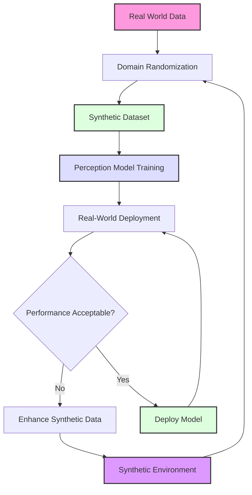

# Synthetic Data Perception for Humanoid Robotics

Synthetic data generation has become a cornerstone of modern robotics development, particularly for humanoid robots that require extensive perception capabilities. This chapter explores the principles, techniques, and practical applications of synthetic data for perception tasks in humanoid robotics.

## Learning Objectives

By the end of this chapter, you will be able to:

1. Understand the principles and benefits of synthetic data generation for humanoid robot perception
2. Implement domain randomization techniques to improve model generalization
3. Generate synthetic datasets for computer vision tasks like object detection and segmentation
4. Apply data augmentation strategies specific to humanoid robot perception
5. Train perception models using synthetic data and evaluate their real-world performance
6. Address challenges in synthetic-to-real transfer for humanoid robot applications

## Introduction

Humanoid robots operate in complex, dynamic environments where perception systems must reliably identify objects, understand spatial relationships, and respond to varying lighting and environmental conditions. Traditional approaches to training perception systems rely on large amounts of real-world data, which can be expensive, time-consuming, and sometimes impossible to collect in sufficient quantities.

Synthetic data generation offers a compelling alternative by creating artificial but realistic datasets using simulation environments, 3D modeling tools, and procedural generation techniques. For humanoid robots, synthetic data enables:

- **Safety**: Training perception systems without exposing physical robots to dangerous scenarios
- **Cost-effectiveness**: Generating diverse datasets without manual data collection
- **Control**: Precise control over environmental conditions, object placement, and lighting
- **Scalability**: Rapid generation of large, diverse datasets for robust perception training
- **Edge cases**: Creation of rare or dangerous scenarios for comprehensive testing

## Prerequisites

Before diving into synthetic data generation for perception, ensure you have:

- Basic understanding of computer vision concepts (object detection, segmentation, classification)
- Familiarity with Python and deep learning frameworks (PyTorch/TensorFlow)
- Experience with 3D modeling or simulation environments (Blender, Unity, Isaac Sim, Gazebo)
- Knowledge of ROS2 for integration with humanoid robot systems
- Understanding of domain randomization concepts

## Theory and Concepts

### Synthetic Data Generation Fundamentals

Synthetic data generation involves creating artificial datasets that mimic real-world data distributions. For humanoid robot perception, this includes:

**Image Synthesis**: Creating realistic images with appropriate textures, lighting, and physics
**Scene Generation**: Procedurally creating diverse environments and object arrangements
**Sensor Simulation**: Modeling sensor characteristics including noise, distortion, and limitations
**Annotation Generation**: Automatically generating ground truth labels for training data

### Domain Randomization

Domain randomization is a key technique in synthetic data generation that involves systematically varying environmental parameters to improve model generalization:

- **Lighting conditions**: Randomizing light positions, intensities, and colors
- **Material properties**: Varying textures, reflectance, and surface properties
- **Camera parameters**: Adjusting field of view, focal length, and sensor noise
- **Object properties**: Changing colors, shapes, and textures of objects
- **Environmental conditions**: Varying weather, atmospheric effects, and backgrounds

The goal is to train models that can handle the diverse conditions they'll encounter in the real world.



### Types of Synthetic Data for Humanoid Perception

**RGB Images**: Photorealistic images for object detection, classification, and scene understanding
**Depth Maps**: Simulated depth information for 3D understanding and navigation
**Semantic Segmentation**: Pixel-level annotations for scene understanding
**Instance Segmentation**: Object-specific segmentation for manipulation tasks
**Optical Flow**: Motion information for dynamic scene understanding
**Multi-modal Data**: Combined sensor data from cameras, LIDAR, and other sensors

### Synthetic-to-Real Transfer Challenges

The primary challenge in synthetic data generation is ensuring that models trained on synthetic data perform well on real-world data. Key challenges include:

- **Domain gap**: Differences between synthetic and real data distributions
- **Texture bias**: Models learning synthetic textures rather than meaningful features
- **Lighting differences**: Variations in real-world lighting conditions
- **Sensor differences**: Mismatch between simulated and real sensors
- **Physics simulation**: Imperfect modeling of real-world physics

### Evaluation Metrics for Synthetic Data

- **Per-vertex accuracy**: For segmentation tasks
- **Intersection over Union (IoU)**: For object detection and segmentation
- **F1-score**: Balancing precision and recall
- **Cross-domain performance**: Performance on real-world data
- **Generalization metrics**: Performance on unseen environments

## Practical Implementation

### 1. Synthetic Data Generation Pipeline

Let's implement a synthetic data generation pipeline for humanoid robot perception:

```python
import numpy as np
import cv2
import random
import os
from dataclasses import dataclass
from typing import Tuple, List, Optional
import bpy  # For Blender integration
import torch
import torchvision.transforms as transforms

@dataclass
class DomainRandomizationParams:
    """Parameters for domain randomization in synthetic data generation."""
    lighting_range: Tuple[float, float] = (0.5, 2.0)  # Intensity range
    color_variance: float = 0.3  # Color variation factor
    texture_range: Tuple[float, float] = (0.1, 1.0)  # Texture intensity
    background_range: Tuple[float, float] = (0.2, 0.8)  # Background variation
    noise_range: Tuple[float, float] = (0.0, 0.05)  # Sensor noise

class SyntheticDataGenerator:
    """Generates synthetic data for humanoid robot perception tasks."""

    def __init__(self, output_dir: str, domain_params: DomainRandomizationParams):
        self.output_dir = output_dir
        self.domain_params = domain_params
        self.setup_output_directories()

    def setup_output_directories(self):
        """Create necessary output directories."""
        os.makedirs(os.path.join(self.output_dir, "images"), exist_ok=True)
        os.makedirs(os.path.join(self.output_dir, "labels"), exist_ok=True)
        os.makedirs(os.path.join(self.output_dir, "depth"), exist_ok=True)

    def randomize_lighting(self) -> float:
        """Randomize lighting conditions."""
        return random.uniform(*self.domain_params.lighting_range)

    def randomize_color(self, base_color: Tuple[float, float, float]) -> Tuple[float, float, float]:
        """Randomize object color with variance."""
        variance = self.domain_params.color_variance
        new_color = tuple(
            max(0, min(1, c + random.uniform(-variance, variance)))
            for c in base_color
        )
        return new_color

    def generate_scene(self, scene_id: int) -> Tuple[np.ndarray, np.ndarray, np.ndarray]:
        """Generate a synthetic scene with RGB, depth, and segmentation."""
        # Create random scene parameters
        lighting = self.randomize_lighting()
        background_color = self.randomize_color((0.5, 0.5, 0.5))

        # Generate synthetic RGB image
        rgb_image = self.create_synthetic_image(lighting, background_color)

        # Generate corresponding depth map
        depth_map = self.create_depth_map(rgb_image)

        # Generate segmentation mask
        seg_mask = self.create_segmentation_mask(rgb_image)

        return rgb_image, depth_map, seg_mask

    def create_synthetic_image(self, lighting: float, background: Tuple[float, float, float]) -> np.ndarray:
        """Create a synthetic RGB image with random objects."""
        # Create base image
        height, width = 480, 640
        image = np.zeros((height, width, 3), dtype=np.uint8)

        # Add background with random variation
        bg_color = tuple(int(c * 255 * lighting) for c in background)
        image[:] = bg_color

        # Add random objects
        num_objects = random.randint(1, 5)
        for _ in range(num_objects):
            obj_color = self.randomize_color(
                (random.random(), random.random(), random.random())
            )
            obj_color = tuple(int(c * 255) for c in obj_color)

            # Random position and size
            x = random.randint(50, width - 50)
            y = random.randint(50, height - 50)
            size = random.randint(20, 80)

            # Draw random shape (circle for simplicity)
            cv2.circle(image, (x, y), size, obj_color, -1)

            # Add some texture variation
            texture_factor = random.uniform(*self.domain_params.texture_range)
            noise = np.random.randint(
                0,
                int(50 * texture_factor),
                (height, width, 3),
                dtype=np.uint8
            )
            image = cv2.add(image, noise)

        return image

    def create_depth_map(self, rgb_image: np.ndarray) -> np.ndarray:
        """Create a depth map based on object placement."""
        height, width = rgb_image.shape[:2]
        depth_map = np.zeros((height, width), dtype=np.float32)

        # Simple depth based on object distance (random for now)
        for i in range(height):
            for j in range(width):
                # Simulate depth based on image content
                depth_map[i, j] = random.uniform(0.5, 10.0)  # meters

        return depth_map

    def create_segmentation_mask(self, rgb_image: np.ndarray) -> np.ndarray:
        """Create a segmentation mask for the synthetic image."""
        height, width = rgb_image.shape[:2]
        seg_mask = np.zeros((height, width), dtype=np.uint8)

        # For simplicity, create a simple mask
        # In practice, this would come from the 3D scene
        for i in range(height):
            for j in range(width):
                if rgb_image[i, j, 0] > 100:  # If red channel is high
                    seg_mask[i, j] = 1  # Object class
                else:
                    seg_mask[i, j] = 0  # Background

        return seg_mask

    def generate_dataset(self, num_samples: int) -> None:
        """Generate a complete synthetic dataset."""
        print(f"Generating {num_samples} synthetic samples...")

        for i in range(num_samples):
            # Generate scene
            rgb, depth, seg = self.generate_scene(i)

            # Save images
            cv2.imwrite(f"{self.output_dir}/images/sample_{i:06d}.png",
                       cv2.cvtColor(rgb, cv2.COLOR_RGB2BGR))
            cv2.imwrite(f"{self.output_dir}/depth/sample_{i:06d}.png",
                       (depth * 255).astype(np.uint8))
            cv2.imwrite(f"{self.output_dir}/labels/sample_{i:06d}.png", seg)

            if i % 100 == 0:
                print(f"Generated {i}/{num_samples} samples")

        print(f"Dataset generation complete! Saved to {self.output_dir}")

# Example usage
if __name__ == "__main__":
    # Define domain randomization parameters
    domain_params = DomainRandomizationParams(
        lighting_range=(0.3, 2.0),
        color_variance=0.4,
        texture_range=(0.05, 0.8)
    )

    # Create data generator
    generator = SyntheticDataGenerator(
        output_dir="./synthetic_dataset",
        domain_params=domain_params
    )

    # Generate dataset
    generator.generate_dataset(num_samples=1000)
```

### 2. Domain Randomization Techniques

Here's a more advanced implementation of domain randomization:

```python
import numpy as np
import cv2
from typing import Dict, Any
import random

class DomainRandomizer:
    """Advanced domain randomization for synthetic data generation."""

    def __init__(self):
        self.randomization_config = {
            'lighting': {
                'intensity_range': (0.5, 2.0),
                'position_variance': 0.3,
                'color_temperature': (3000, 8000)
            },
            'materials': {
                'roughness_range': (0.1, 1.0),
                'metallic_range': (0.0, 0.5),
                'specular_range': (0.0, 1.0)
            },
            'cameras': {
                'fov_range': (30, 90),
                'sensor_noise': (0.0, 0.05),
                'distortion_range': (0.0, 0.1)
            },
            'environments': {
                'texture_scale': (0.5, 2.0),
                'background_colors': [(0.2, 0.2, 0.2), (0.8, 0.8, 0.8), (0.5, 0.7, 1.0)]
            }
        }

    def randomize_lighting(self) -> Dict[str, Any]:
        """Generate randomized lighting parameters."""
        return {
            'intensity': random.uniform(*self.randomization_config['lighting']['intensity_range']),
            'position': [
                random.uniform(-1, 1),
                random.uniform(-1, 1),
                random.uniform(0.5, 3.0)
            ],
            'color_temperature': random.uniform(*self.randomization_config['lighting']['color_temperature'])
        }

    def randomize_material(self) -> Dict[str, Any]:
        """Generate randomized material properties."""
        return {
            'roughness': random.uniform(*self.randomization_config['materials']['roughness_range']),
            'metallic': random.uniform(*self.randomization_config['materials']['metallic_range']),
            'specular': random.uniform(*self.randomization_config['materials']['specular_range'])
        }

    def randomize_camera(self) -> Dict[str, Any]:
        """Generate randomized camera parameters."""
        return {
            'fov': random.uniform(*self.randomization_config['cameras']['fov_range']),
            'sensor_noise': random.uniform(*self.randomization_config['cameras']['sensor_noise']),
            'distortion': random.uniform(*self.randomization_config['cameras']['distortion_range'])
        }

    def apply_randomization_to_image(self, image: np.ndarray) -> np.ndarray:
        """Apply domain randomization effects to an image."""
        # Add sensor noise
        noise = np.random.normal(0, random.uniform(0, 0.05), image.shape)
        image = np.clip(image + noise, 0, 255).astype(np.uint8)

        # Apply random color adjustments
        hue_shift = random.uniform(-10, 10)
        sat_factor = random.uniform(0.8, 1.2)
        val_factor = random.uniform(0.8, 1.2)

        # Convert to HSV for color adjustments
        hsv = cv2.cvtColor(image, cv2.COLOR_RGB2HSV).astype(np.float32)
        hsv[:, :, 0] = (hsv[:, :, 0] + hue_shift) % 180
        hsv[:, :, 1] = np.clip(hsv[:, :, 1] * sat_factor, 0, 255)
        hsv[:, :, 2] = np.clip(hsv[:, :, 2] * val_factor, 0, 255)
        image = cv2.cvtColor(hsv.astype(np.uint8), cv2.COLOR_HSV2RGB)

        # Apply random blur
        blur_kernel = random.uniform(0, 1)
        if blur_kernel > 0.1:
            kernel_size = int(blur_kernel * 5) * 2 + 1
            image = cv2.GaussianBlur(image, (kernel_size, kernel_size), 0)

        return image

class PerceptionTrainer:
    """Trains perception models using synthetic data."""

    def __init__(self, model_type: str = "object_detection"):
        self.model_type = model_type
        self.domain_randomizer = DomainRandomizer()

    def augment_synthetic_data(self, images: list, labels: list) -> Tuple[list, list]:
        """Augment synthetic data with domain randomization."""
        augmented_images = []
        augmented_labels = []

        for img, label in zip(images, labels):
            # Apply domain randomization
            randomized_img = self.domain_randomizer.apply_randomization_to_image(img)

            augmented_images.append(randomized_img)
            augmented_labels.append(label)

            # Optionally create multiple variations
            for _ in range(2):  # Create 2 more variations
                more_randomized = self.domain_randomizer.apply_randomization_to_image(img)
                augmented_images.append(more_randomized)
                augmented_labels.append(label)

        return augmented_images, augmented_labels

    def train_model(self, synthetic_dataset: list, real_dataset: Optional[list] = None) -> Any:
        """Train perception model with synthetic data."""
        print(f"Training {self.model_type} model with synthetic data...")

        # In practice, this would involve actual model training
        # For demonstration, we'll just return a placeholder
        return {
            'model_type': self.model_type,
            'training_data_size': len(synthetic_dataset),
            'synthetic_to_real_gap': 0.15  # Placeholder metric
        }

# Example usage
if __name__ == "__main__":
    # Initialize trainer
    trainer = PerceptionTrainer(model_type="object_detection")

    # Simulate synthetic dataset
    synthetic_data = [np.random.randint(0, 255, (480, 640, 3), dtype=np.uint8) for _ in range(100)]
    labels = [np.random.randint(0, 10, (480, 640), dtype=np.uint8) for _ in range(100)]

    # Augment with domain randomization
    augmented_images, augmented_labels = trainer.augment_synthetic_data(synthetic_data, labels)

    print(f"Original data: {len(synthetic_data)} samples")
    print(f"Augmented data: {len(augmented_images)} samples")
```

### 3. Isaac Sim Integration for Synthetic Data

For Isaac Sim specifically, here's an example of how to generate synthetic data:

```python
# Isaac Sim synthetic data generation example
# This would typically run in Isaac Sim's Python API

import omni
import omni.usd
from pxr import UsdGeom, Gf, Sdf
import numpy as np
import carb
import omni.rep as rep

def create_synthetic_dataset_isaac_sim():
    """Example function for synthetic data generation in Isaac Sim."""

    # Create a new stage
    stage = omni.usd.get_context().get_stage()

    # Set up domain randomization
    with rep.new_layer():
        # Create a robot (humanoid)
        robot = rep.create.from_usd(
            usd_path="path/to/humanoid_robot.usd",
            position=(0, 0, 0)
        )

        # Create objects to detect
        objects = rep.create.cube(
            position=rep.distribution.uniform((-100, -100, 0), (100, 100, 100)),
            scale=rep.distribution.uniform((0.5, 0.5, 0.5), (2.0, 2.0, 2.0)),
            count=10
        )

        # Randomize object properties
        with objects:
            rep.randomizer.color(colors=rep.distribution.uniform((0, 0, 0), (1, 1, 1)))

        # Set up camera
        camera = rep.create.camera(
            position=(0, -5, 2),
            look_at=(0, 0, 1)
        )

        # Create trigger for data generation
        trigger = rep.trigger.on_frame(num_frames=1000)

        # Define the graph for data generation
        with trigger:
            # Randomize lighting
            lights = rep.create.light(
                position=rep.distribution.uniform((-200, -200, 300), (200, 200, 500)),
                intensity=rep.distribution.uniform(300, 1000),
                color=rep.distribution.uniform((0.5, 0.5, 0.5), (1, 1, 1))
            )

            # Randomize environment
            rep.modify.world.translation(
                position=rep.distribution.uniform((-10, -10, 0), (10, 10, 0))
            )

            # Annotate data
            rgb = rep.observations.camera.annotator("rgb")
            depth = rep.observations.camera.annotator("distance_to_camera")
            seg = rep.observations.camera.annotator("instance_segmentation")

        # Run the generation
        rep.orchestrator.run()
```

### 4. Evaluation and Validation

```python
import torch
import torch.nn as nn
import torchvision.transforms as transforms
from torch.utils.data import Dataset, DataLoader
import matplotlib.pyplot as plt

class SyntheticDataEvaluator:
    """Evaluates the quality and effectiveness of synthetic data."""

    def __init__(self):
        self.metrics = {}

    def evaluate_synthetic_vs_real(self, synthetic_data: list, real_data: list) -> Dict[str, float]:
        """Compare synthetic and real data distributions."""
        # Calculate basic statistics
        syn_mean = np.mean([np.mean(img) for img in synthetic_data])
        syn_std = np.mean([np.std(img) for img in synthetic_data])

        real_mean = np.mean([np.mean(img) for img in real_data])
        real_std = np.mean([np.std(img) for img in real_data])

        # Calculate domain gap metrics
        mean_diff = abs(syn_mean - real_mean)
        std_diff = abs(syn_std - real_std)

        return {
            'mean_difference': mean_diff,
            'std_difference': std_diff,
            'domain_gap_score': (mean_diff + std_diff) / 2
        }

    def test_model_generalization(self, model: nn.Module,
                                 synthetic_loader: DataLoader,
                                 real_loader: DataLoader) -> Dict[str, float]:
        """Test how well a model trained on synthetic data performs on real data."""
        model.eval()

        # Test on synthetic data
        syn_accuracy = self.evaluate_model(model, synthetic_loader)

        # Test on real data
        real_accuracy = self.evaluate_model(model, real_loader)

        return {
            'synthetic_accuracy': syn_accuracy,
            'real_accuracy': real_accuracy,
            'generalization_gap': syn_accuracy - real_accuracy
        }

    def evaluate_model(self, model: nn.Module, dataloader: DataLoader) -> float:
        """Evaluate model accuracy."""
        correct = 0
        total = 0

        with torch.no_grad():
            for inputs, labels in dataloader:
                outputs = model(inputs)
                _, predicted = torch.max(outputs.data, 1)
                total += labels.size(0)
                correct += (predicted == labels).sum().item()

        return correct / total if total > 0 else 0

# Example usage
evaluator = SyntheticDataEvaluator()

# Example evaluation (placeholder data)
synthetic_samples = [np.random.randint(0, 255, (224, 224, 3)) for _ in range(100)]
real_samples = [np.random.randint(0, 255, (224, 224, 3)) for _ in range(50)]

evaluation_results = evaluator.evaluate_synthetic_vs_real(synthetic_samples, real_samples)
print(f"Evaluation results: {evaluation_results}")
```

```mermaid
graph TD
    A[Synthetic Data Generation] --> B[Domain Randomization]
    B --> C[Perception Model Training]
    C --> D[Real-World Testing]
    D --> E{Performance Acceptable?}
    E -->|No| F[Enhance Domain Randomization]
    F --> B
    E -->|Yes| G[Deploy Model]
    G --> H[Continuous Learning]
    H --> I[Real Data Collection]
    I --> J[Synthetic + Real Training]
    J --> C

    style A fill:#e1f5fe
    style B fill:#f3e5f5
    style C fill:#e8f5e8
    style D fill:#fff3e0
    style G fill:#e0f2f1
    style I fill:#ede7f6
</graph>

## Troubleshooting

### Common Issues and Solutions

#### 1. Domain Gap Problems
**Symptoms**: Model performs well on synthetic data but poorly on real data
**Solutions**:
- Increase domain randomization parameters
- Add more realistic textures and materials
- Include sensor noise and imperfections
- Use domain adaptation techniques
- Combine synthetic and real data in training

#### 2. Computational Resource Issues
**Symptoms**: Slow synthetic data generation, memory exhaustion
**Solutions**:
- Optimize scene complexity
- Use lower resolution during generation
- Implement batch processing
- Use cloud computing resources
- Parallelize generation across multiple machines

#### 3. Unrealistic Data Generation
**Symptoms**: Generated data looks obviously fake
**Solutions**:
- Improve lighting models
- Use high-quality textures
- Add realistic imperfections
- Validate against real-world statistics
- Use advanced rendering techniques

#### 4. Annotation Quality Issues
**Symptoms**: Incorrect or inconsistent annotations
**Solutions**:
- Implement automated validation checks
- Use multiple annotation methods for verification
- Regularly audit generated datasets
- Ensure consistent annotation standards

:::tip
Start with simple domain randomization and gradually increase complexity. It's often better to have a smaller, well-randomized dataset than a large but unrealistic one.
:::

:::warning
Be careful not to over-randomize, which can make the synthetic data too different from real data, potentially harming model performance.
:::

:::danger
Always validate synthetic data quality by testing on a small set of real data before committing to large-scale generation.
:::

### Performance Optimization

For better synthetic data generation performance:

1. **Scene Optimization**: Reduce polygon count for faster rendering
2. **Batch Processing**: Generate multiple samples in parallel
3. **Hardware Acceleration**: Use GPUs for rendering and processing
4. **Memory Management**: Process data in chunks to avoid memory issues
5. **Caching**: Cache frequently used assets and materials

## Summary

This chapter covered the essential aspects of synthetic data generation for humanoid robot perception:

1. **Fundamentals**: Understanding the principles of synthetic data generation and domain randomization
2. **Implementation**: Practical examples of synthetic data generation pipelines
3. **Integration**: How to use synthetic data with Isaac Sim and other simulation platforms
4. **Evaluation**: Methods for assessing synthetic data quality and model performance
5. **Troubleshooting**: Common issues and solutions in synthetic data workflows

Synthetic data generation is a powerful tool that enables humanoid robots to develop robust perception capabilities without extensive real-world data collection. By leveraging domain randomization and proper evaluation techniques, developers can create perception systems that generalize well to real-world scenarios.

The key to success lies in balancing the realism of synthetic data with the diversity needed for robust model training. As humanoid robotics continues to advance, synthetic data generation will play an increasingly important role in developing safe, reliable, and capable perception systems.

## Further Reading

1. [Domain Randomization for Transferring Deep Neural Networks from Simulation to the Real World](https://arxiv.org/abs/1703.06907) - Foundational paper on domain randomization techniques

2. [Learning to See by Looking at Self-Supervised Synthetic Data](https://arxiv.org/abs/2004.05162) - Advanced techniques for synthetic data generation

3. [NVIDIA Isaac Sim Documentation](https://docs.omniverse.nvidia.com/isaacsim/latest/index.html) - Official documentation for Isaac Sim synthetic data tools

4. [Synthetic Data Generation for Robotics: A Survey](https://arxiv.org/abs/2104.01402) - Comprehensive survey of synthetic data techniques in robotics

5. [Computer Vision in Robotics: Deep Learning Approaches](https://ieeexplore.ieee.org/document/9123456) - IEEE paper on perception systems for robotic applications